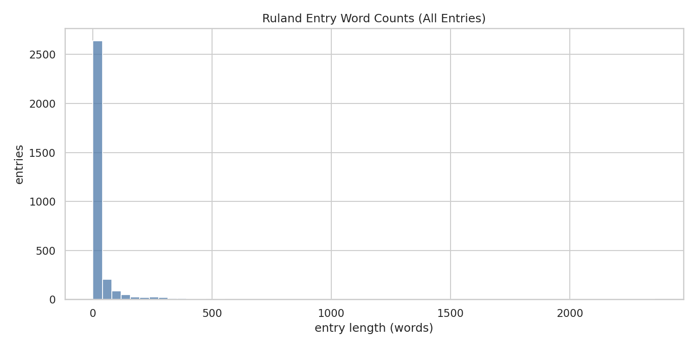
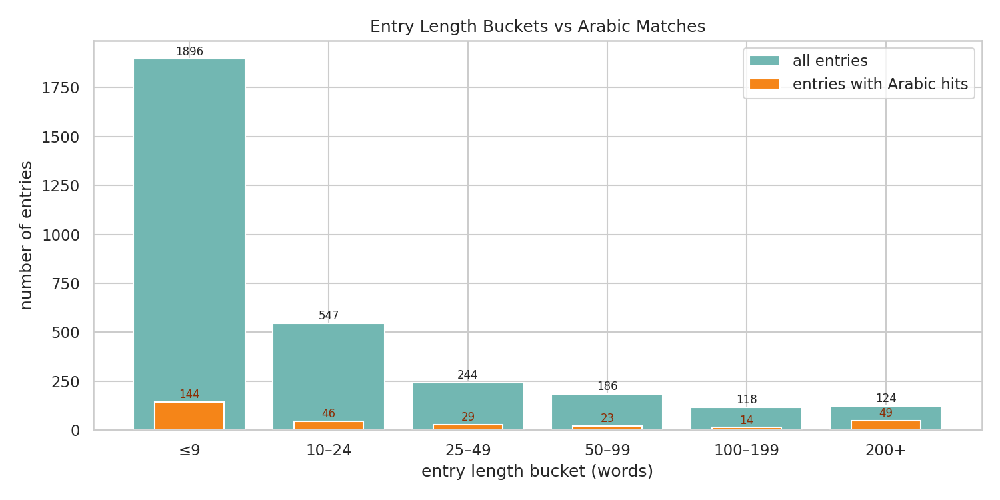
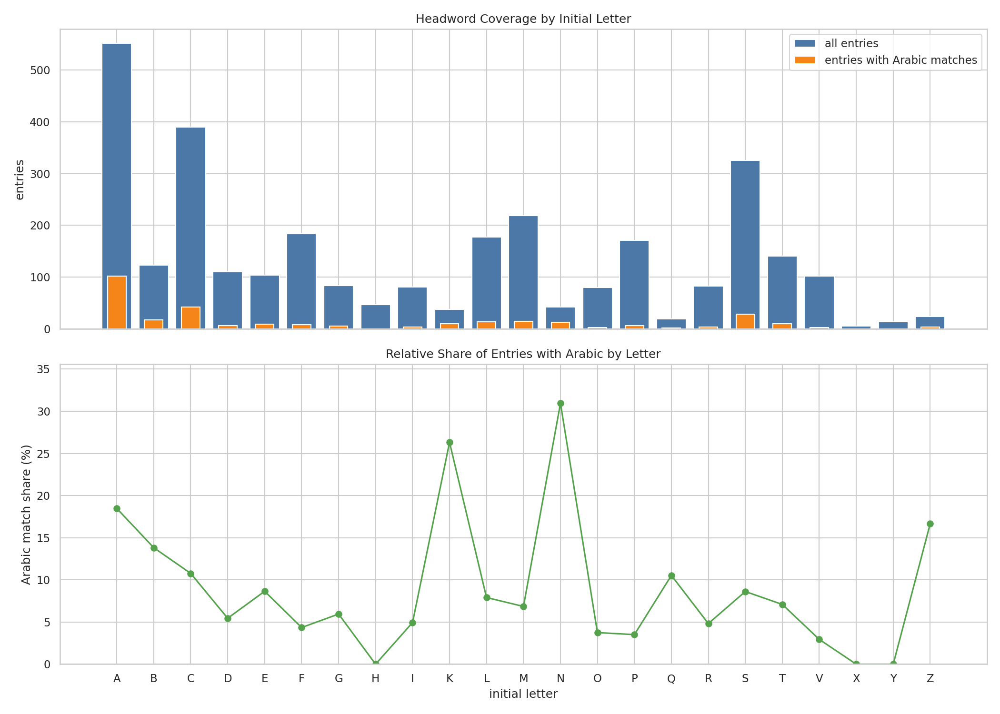

# Arabic-Origin Terms in Ruland's *Lexicon Alchemiae* (1612): Data and Analyses

This repository provides supplementary data and visualisations for two publications studying Arabic-origin terminology in Martin Ruland the Younger's (1569–1611) *Lexicon Alchemiae* (1612), one of the most renowned early modern alchemical reference works.

## Publications

This repository documents data and analyses presented in:

- Sarah Lang, Jonas Müller-Laackman, Hazem Lashen, and Farzad Mahootian, "Confabulated Transliterations? Managing the Lure of Plausibility in LLM-Detected Arabic Terms in an Early Modern Lexicon," in *Critical Approaches to Automated Text Recognition*, ed. Melissa Terras, Paul Gooding, Sarah Ames, and Joe Nockels (London: Facet Publishing, forthcoming 2026).

- Sarah Lang, Farzad Mahootian, and Hazem Lashen, "Mediating Alchemical Language across Terminologies and Cultures in Ruland's *Lexicon Alchemiae*: A Data-Driven Study of Arabic Terms," in the 2026 *Ambix* special issue *Computational Methods for the History of Alchemy and Chemistry*, co-edited by Guillermo Restrepo, Farzad Mahootian, and Sarah Lang.

### Acknowledgements

This research derives from the 2025 *Alchemy of Global Partnership* workshop (v.1), funded by New York University (NYU) Abu Dhabi's Arts+Humanities Research Platform, with additional support from the NYU Global Research Initiative and NYU Dean of Liberal Studies. A second *Alchemy of Global Partnership* workshop, scheduled for June 15–18, 2026 at NYU's Prague campus, is supported by a New York University Global Opportunity Grant, with additional support from NYU Dean of Liberal Studies.

The code and analyses were created by Hazem Lashen over a period of August 2025 to January 2026 (with the support of AI-coding tools like Codex). The LLMs used in the analysis are ChatGPT and Gemini. 
The human review was undertaken by Sarah Lang, Farzad Mahootian and supported in parts by other scholars from NYU. 

We are extremely grateful for the excellent project management support by Meenakshi Baker (NYU). 

## Repository Contents

```
├── README.md                                          # this file
├── 2026-01-27_reviewerCopy_reducedDatasheet.csv       # main results table (CSV)
├── README-basis-xml-data.md                           # documentation of the source TEI-XML data
└── graphics-docu/
    ├── entry_length_histogram.png                     # distribution of entry lengths
    ├── entry_length_histogram.txt                     # explanation of the histogram
    ├── entry_length_buckets.png                       # entry length buckets vs Arabic matches
    ├── entry_length_buckets.txt                       # explanation of the buckets chart
    ├── entry_length_summary.csv                       # summary table for entry length buckets
    ├── entry_length_summary.txt                       # explanation of the summary table
    ├── headword_letter_coverage.png                   # Arabic matches by initial letter
    ├── headword_letter_coverage.txt                   # explanation of the coverage chart
    └── headword_letter_coverage.csv                   # tabular data for letter coverage
```

## Source Data

The analyses are based on Ruland's *Lexicon Alchemiae* encoded in TEI-XML as part of a larger alchemical dictionaries dataset. The TEI-XML data was published under a CC-BY licence on Zenodo ([https://zenodo.org/records/14638445](https://zenodo.org/records/14638445)) and described in:

> Sarah Lang (2025). "Towards a Data-Driven History of Lexicography: Two Alchemical Dictionaries in TEI-XML." *Journal of Open Humanities Data*, 11: 20, pp. 1–6. DOI: [10.5334/johd.303](https://doi.org/10.5334/johd.303)

The TEI-XML encoding of Ruland contains approximately 3,200 dictionary entries. The text was produced via HTR (Handwritten Text Recognition) using the Noscemus GM OCR model in Transkribus, which has a very low character error rate but has not been fully proofread. For full details on the source data, its encoding, and contributors, see [`README.md`](https://github.com/sarahalang/alchemical-dictionaries/blob/main/README.md).

## LLM-Based Arabic Detection Workflow

### Motivation

We aimed to examine all entries of Ruland's *Lexicon Alchemiae* to automatically detect terms that may be Arabic or derived from Arabic. Many alchemical terms have Arabic origins. Well-known examples such as *alcohol* (from Arabic الكحول *al-kuḥūl*) are relatively straightforward to identify, but detection becomes increasingly difficult for more obscure or domain-specific terms. The challenge is compounded by the fact that Latin transcription of Arabic was non-standardised: Latinised Arabic terms often exhibit many variant forms, as Ruland's dictionary entries clearly show.

We leveraged an LLM's ability to handle noisy OCR outputs (the TEI-XML text was not fully clean) and to process Latin-script transliterations that may or may not relate to Arabic. We explored whether an LLM-based approach could help detect less frequent or more obscure instances of Arabic borrowings that might escape conventional search methods.

### Pipeline

We designed a multi-step LLM-based workflow:

1. **Initial detection.** Each of the 3,200+ dictionary entries was processed separately to avoid context rot — the tendency of LLMs to lose attention with increasing input token length (Hong, Troynikov, and Huber 2025). The LLM was tasked with identifying potential Arabic-origin terms and outputting structured results including the detected string, normalised Latin and Arabic forms, Arabic script equivalents, English translations, and a confidence score. This step produced approximately 1,000 candidate rows, with a single headword potentially appearing multiple times.

2. **Enrichment with external resources.** Candidate forms (in Arabic script, Latinised, or English variants) were searched in dedicated resources: web-scraped Wiktionary entries documenting Arabic-derived or -related terms, and the Arabic and Latin Glossary web resource (Hasse 2025). All retrieved evidence was stored alongside the LLM outputs.

3. **LLM-based re-evaluation.** In a second judging step, the model received each row together with the dictionary spelling, normalised and lemmatised Latin and Arabic equivalents, the headword, the full entry, and the external evidence gathered in step 2. This enrichment positions the method similarly to Retrieval-Augmented Generation (RAG), which has been shown to improve LLM output quality, including specifically for Arabic (Abdelazim, Tharwat, and Mohamed 2023; El-Beltagy and Abdallah 2024). The model produced an irrelevance probability score, enabling prioritisation for human review.

4. **Human verification.** Three human reviewers independently assessed the LLM outputs to produce a final verdict on each candidate term.

This multi-step process, in which LLMs evaluate each other's outputs (cf. Raina, Liusie, and Gales 2024), is a common strategy for refining LLM-generated results and reducing the verification burden on human reviewers. For the full prompts used at each stage, see the appendix of the publications listed above.

## Results Table

The file `2026-01-27_reviewerCopy_reducedDatasheet.csv` contains the reviewed extraction results. Each row represents a potential Arabic-origin term detected within a Ruland dictionary entry. Key columns include:

| Column | Description |
|---|---|
| `lemma /headword` | The headword of the Ruland dictionary entry |
| `confidence_score` | LLM confidence that the term is a plausible Arabic match (0–1) |
| `detected_string` | The Latin-script string identified as potentially Arabic-derived |
| `normalized_latin` | Normalised Latin form of the detected term |
| `lemmatized_latin` | Lemmatised Latin form |
| `arabic_script` | Arabic-script equivalent |
| `normalized_arabic` | Normalised Arabic form |
| `english_translation` | English translation of the term |
| `ruland_entry` | Full text of the Ruland dictionary entry |
| `wiki_match_flag` | Whether a match was found in Wiktionary resources |
| `wiki_direct_matches` | Direct Wiktionary matches |
| `wiki_candidate_suggestions` | Wiktionary candidate suggestions |
| `wiki_evidence_block` | Full Wiktionary evidence |
| `emlap_match_flag` | Whether a match was found in the EMLAP corpus |
| `emlap_total_occurrences` | Total EMLAP occurrences |
| `emlap_distinct_works` | Number of distinct EMLAP works containing the term |
| `emlap_ruland_occurrences` | EMLAP occurrences specifically in Ruland |
| `emlap_evidence_block` | Full EMLAP evidence |
| `irrelevance_probability` | LLM-estimated probability that the match is irrelevant (0–1) |
| `arabice_similarity` | Similarity metric for the Arabic match |
| `notes` | Etymological and other notes |
| `Etymology` | Etymology classification |
| `3 human reviewer comparison verdict` | Consensus category from three human reviewers |
| `Include (controled vocab, y/n)` | Final inclusion decision (yes/no) |
| `normalized control string (harmonized)` | Harmonised normalised form for analysis |

## Visualisations

The `graphics-docu/` directory contains figures and accompanying data characterising the Ruland dictionary and the distribution of Arabic detections. Each graphic is accompanied by a `.txt` file explaining what it shows, how it was generated, and the relevant code snippet.

### Entry Length Distribution



Distribution of entry lengths (in word tokens) across all ~3,200 Ruland dictionary entries. The majority of entries are very short (9 words or fewer), but a long tail of extensive entries exists, some exceeding 2,000 words.

### Entry Length Buckets vs Arabic Matches



Comparison of total entries per length bucket (cyan) against the subset containing at least one Arabic detection (orange). Notably, while most entries are short, longer entries (200+ words) have a substantially higher share of Arabic detections (39.5%) compared to short entries (7.6%).

| Length bucket | Total entries | With Arabic | Share (%) |
|---|---|---|---|
| ≤9 words | 1,896 | 144 | 7.6 |
| 10–24 | 547 | 46 | 8.4 |
| 25–49 | 244 | 29 | 11.9 |
| 50–99 | 186 | 23 | 12.4 |
| 100–199 | 118 | 14 | 11.9 |
| 200+ | 124 | 49 | 39.5 |

### Headword Coverage by Initial Letter



Absolute counts (top) and relative share (bottom) of dictionary entries containing Arabic detections, grouped by headword initial letter. Letters A (18.5%), K (26.3%), N (31.0%), and Z (16.7%) show the highest relative shares of Arabic-origin terms — consistent with the phonological characteristics of Arabic loanwords in Latin alchemical terminology.

## Licence

Please refer to the individual publications for terms of reuse of this data.

## References

- Lang, S. (2025). "Towards a Data-Driven History of Lexicography: Two Alchemical Dictionaries in TEI-XML." *Journal of Open Humanities Data*, 11: 20, pp. 1–6. DOI: [10.5334/johd.303](https://doi.org/10.5334/johd.303).

For references, please consult the publications listed above.
This documentation was created with the help of Claude Opus 4.6. 
