# Exploration Visualizations: Arabic Tradition Terms in Ruland 1612

**Date:** 2026-03-19
**Author:** Generated with Claude Code (Opus 4.6)
**Prerequisite:** See `01_SANITY_CHECK_REPORT.md` for the sanity check that preceded this exploration.

---

## Purpose

This report presents a set of visualizations that explore the presence and distribution of Arabic-tradition terminology in Martin Ruland the Younger's *Lexicon Alchemiae* (1612). The analysis draws on two data sources:

1. **The TEI XML dictionary** (`Ruland.xml`) — the full text of ~3,164 dictionary entries
2. **The Arabic extraction CSV** (`output_4ofixed_reviewed_with_entries.csv`) — 928 rows of detected Arabic-origin terms (before cleaning; 415 after cleaning)

Each visualization is accompanied by a technical description (data, method, algorithm) and an interpretive summary in plain language.

---

## Table of Contents

1. [XML vs CSV Coverage by Letter](#1-xml-vs-csv-coverage-by-letter)
2. [Confidence vs Irrelevance Scatter](#2-confidence-vs-irrelevance-scatter)
3. [Score Distributions](#3-score-distributions)
4. [Word Count Comparison: XML vs CSV](#4-word-count-comparison-xml-vs-csv)
5. [CSV Quality Overview](#5-csv-quality-overview)
6. [Top Detected Strings by Quality Tier](#6-top-detected-strings-by-quality-tier)
7. [Filtering Comparison](#7-filtering-comparison)
8. [Semantic Categories of Arabic Terms](#8-semantic-categories-of-arabic-terms)
9. [Arabic Term Density Across the Dictionary](#9-arabic-term-density-across-the-dictionary)
10. [Arabic Share by Entry Length](#10-arabic-share-by-entry-length)
11. [Co-occurrence Network](#11-co-occurrence-network)
12. [Authority References](#12-authority-references)
13. [XML Dictionary Structure Overview](#13-xml-dictionary-structure-overview)

---

## 1. XML vs CSV Coverage by Letter

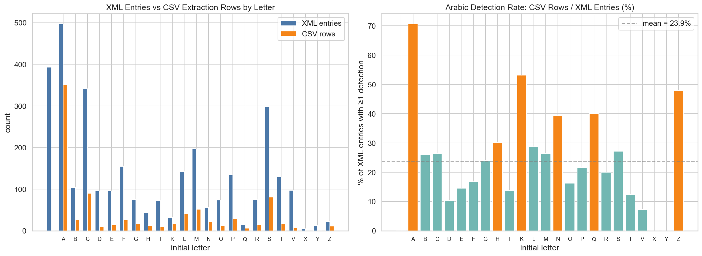

### Data & Method

- **Left panel:** For each letter A–Z, we count (a) the number of `<entry>` elements in the XML whose headword starts with that letter (blue bars), and (b) the number of CSV extraction rows whose `lemma` starts with that letter (orange bars).
- **Right panel:** The ratio of CSV rows to XML entries, expressed as a percentage. A bar at 70% for letter A means that 70% of all A-entries in the XML produced at least one CSV detection row. Colors indicate: teal = near average, orange = above average, red = zero detections.
- **Tool:** Python pandas `value_counts()` on the first character of headwords/lemmas; matplotlib grouped bar chart.

### What it shows

The left panel reveals that letter **A** dominates the CSV extractions (≈350 rows), far outpacing other letters. This makes linguistic sense: many Arabic loanwords in Latin alchemical texts begin with the Arabic definite article *al-* (الـ), which was often absorbed into the Latin form (e.g., *alkali*, *alembicus*, *alcohol*).

The right panel shows the **detection rate** — what fraction of dictionary entries under each letter contain Arabic terms. The average is about 24%, but letters **K** (54%) and **N** (31%) stand out as having unusually high proportions. K-words in alchemical Latin are often direct transliterations from Arabic (e.g., *Kali* from قلي), while N-entries include terms like *Naphtha* (نفط) and *Nitrum* (نطرون).

**In plain terms:** The Arabic influence in this dictionary is concentrated in entries starting with A (because of the Arabic article *al-*), K, and N. Letters like H, X, and Y have virtually no Arabic connections.

---

## 2. Confidence vs Irrelevance Scatter

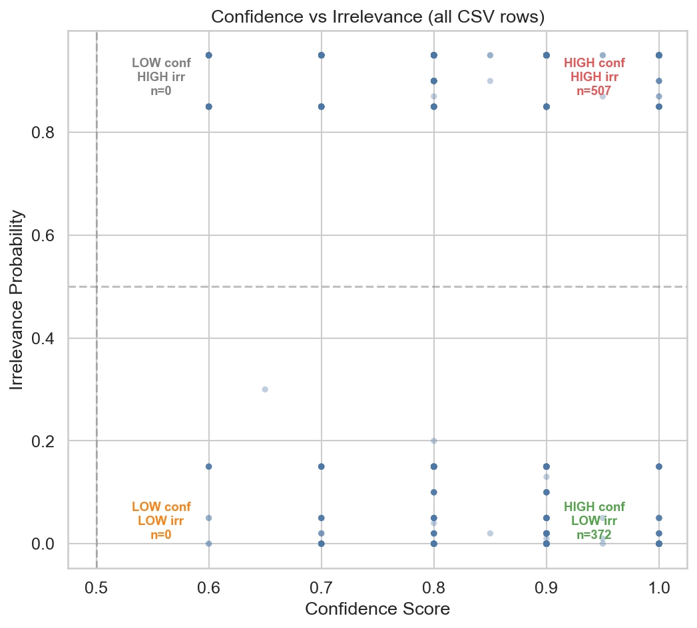

### Data & Method

- **X-axis:** `confidence_score` — the model/reviewer's confidence that the detected string is genuinely Arabic-derived (0 = no confidence, 1 = certain).
- **Y-axis:** `irrelevance_probability` — the probability that the detection is a false positive (0 = certainly relevant, 1 = certainly irrelevant).
- **Each dot** represents one of the 928 CSV rows. Dots are semi-transparent to show density where points overlap.
- **Quadrant labels** show the count of rows in each region, using 0.5 as the dividing threshold.
- **Tool:** matplotlib scatter plot with quadrant annotations.

### What it shows

The data splits into **two sharply separated clusters**:

- **Bottom-right (372 rows):** High confidence AND low irrelevance — these are the "gold standard" detections. Terms like *alkali*, *borax*, and *elixir* land here.
- **Top-right (507 rows):** High confidence BUT high irrelevance — these are false positives. The model was confident it *found* something, but a second evaluation determined it probably wasn't actually Arabic. Terms like *roc*, *rub*, and *alumen* (a Latin word resembling Arabic) land here.

There are essentially **no rows** in the left half (confidence < 0.5), meaning the extraction system always reported moderate-to-high confidence. The discriminating power comes entirely from the irrelevance column.

**In plain terms:** Think of it like a metal detector at the beach. The detector beeps loudly (high confidence) for both real coins and bottle caps. The irrelevance score is like a second test that checks whether the beep was a coin or just trash. This chart shows that about half the beeps were trash.

---

## 3. Score Distributions

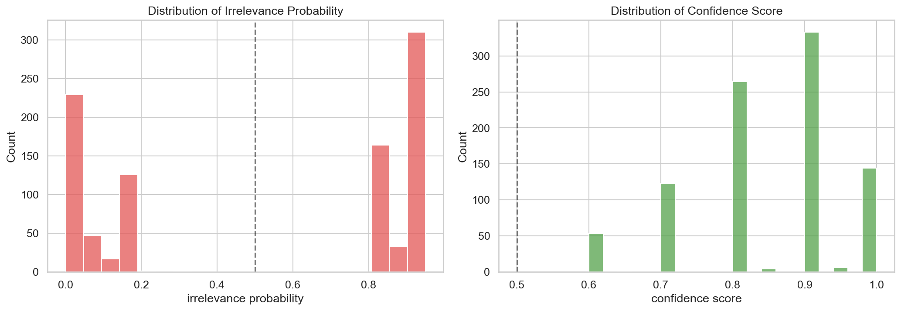

### Data & Method

- **Left panel:** Histogram of `irrelevance_probability` values across all 928 rows, with 20 bins. The dashed line marks the 0.5 threshold.
- **Right panel:** Histogram of `confidence_score` values, same format.
- **Tool:** seaborn `histplot()`.

### What it shows

- **Irrelevance (left):** Strikingly bimodal — values cluster around 0.0 (relevant) and 0.85–0.95 (irrelevant), with virtually nothing in between. This means the scoring system made decisive judgments: it rarely said "maybe."
- **Confidence (right):** Skewed toward high values. The mode is 0.9, and almost nothing falls below 0.6. This confirms that the *extraction* step was aggressive — it flagged many candidate terms with high confidence, and the *evaluation* step (irrelevance scoring) then filtered them.

**In plain terms:** The extraction tool was generous — it said "this could be Arabic" about many terms. The evaluation tool was strict — it said either "yes, definitely" or "no, definitely not," with almost no cases of "I'm not sure."

---

## 4. Word Count Comparison: XML vs CSV

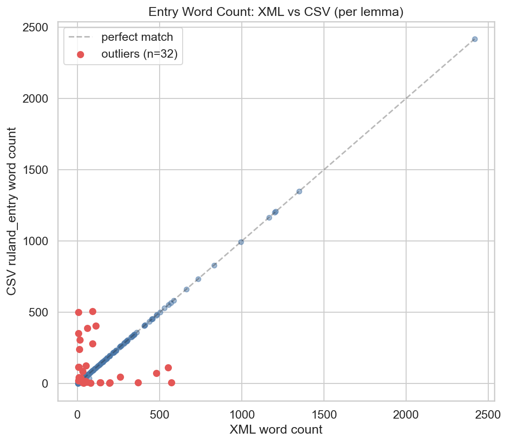

### Data & Method

- For each CSV lemma that also appears in the XML, we computed:
  - **X-axis:** Word count of the XML entry (splitting the full `itertext()` on whitespace)
  - **Y-axis:** Word count of the CSV `ruland_entry` field (same method)
- The **dashed diagonal** represents perfect agreement (XML word count = CSV word count).
- **Red dots:** Entries where the ratio CSV/XML is < 0.5 or > 2.0, flagged as outliers.
- **Tool:** matplotlib scatter plot; outlier detection via ratio thresholding.

### What it shows

Most entries cluster tightly along the diagonal — meaning the CSV faithfully reproduced the XML text for the majority of entries. However, **32 outliers** (red dots) deviate significantly:

- **Dots below the diagonal** (CSV shorter than XML): The CSV text may have been truncated, or a shorter sub-entry was matched instead of the full entry.
- **Dots above the diagonal** (CSV longer than XML): The CSV may contain text from adjacent entries that got concatenated, or a different (longer) entry was matched.

The most egregious outliers are entries where the CSV has 300–500 words but the XML has only 5–10 words (or vice versa), indicating a completely wrong entry was matched.

**In plain terms:** Imagine photocopying pages from a book and stapling them to index cards. Most cards got the right page, but 32 cards got the wrong page — either a page from a different entry, a partial page, or extra pages from the entry next door.

---

## 5. CSV Quality Overview

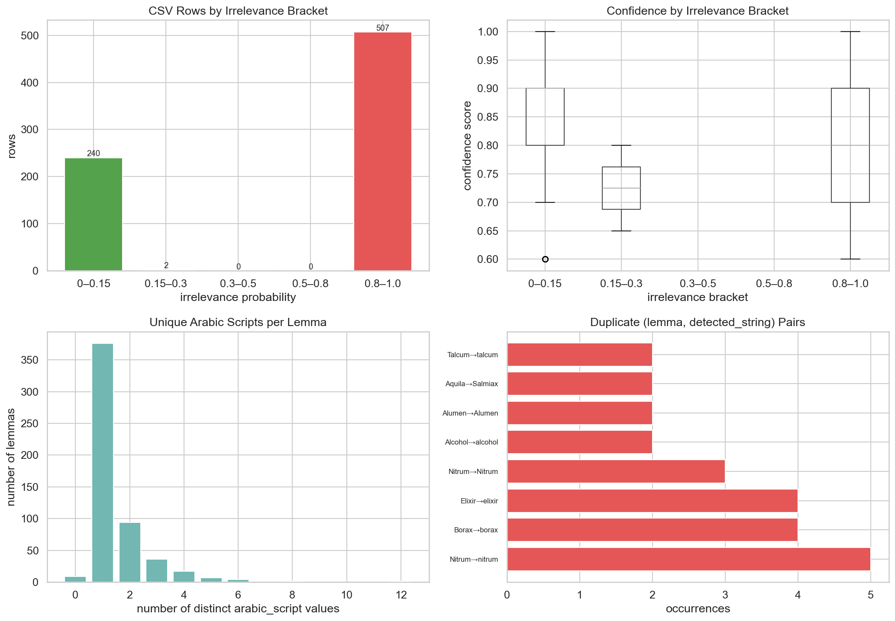

### Data & Method

Four diagnostic panels:

1. **Top-left — Irrelevance brackets:** Rows binned into five irrelevance ranges (0–0.15, 0.15–0.3, 0.3–0.5, 0.5–0.8, 0.8–1.0). Bar colors: green = likely relevant, red = likely irrelevant.
2. **Top-right — Confidence by irrelevance bracket:** Box plot showing the distribution of confidence scores within each irrelevance bracket. Uses `pandas.DataFrame.boxplot()`.
3. **Bottom-left — Unique Arabic scripts per lemma:** Histogram of how many distinct `arabic_script` values are associated with each lemma. Most lemmas have exactly 1.
4. **Bottom-right — Duplicate pairs:** The most duplicated `(lemma, detected_string)` combinations, with bar length showing how many copies exist.

### What it shows

- **Top-left:** The data is polarized: 240 rows are very likely relevant (green), 507 are very likely irrelevant (red), and almost nothing is in between. The middle brackets (0.15–0.8) contain only 2 rows total.
- **Top-right:** Confidence scores are high across all irrelevance brackets — even the most irrelevant rows have confidence scores of 0.8–1.0. This confirms that confidence alone is not a reliable filter; the irrelevance score is essential.
- **Bottom-left:** Most lemmas have 1 unique Arabic script value; a few have 2–6 (entries mentioning multiple Arabic terms); and rare cases have up to 11 (very long entries like "Sal natiuum" that reference many Arabic terms across a multi-page treatise).
- **Bottom-right:** "Nitrum→nitrum" appears 5 times, "Borax→borax" and "Elixir→elixir" 4 times each — clear duplicates that need removal.

**In plain terms:** This dashboard is like a health checkup for the spreadsheet. The top-left shows it's carrying a lot of dead weight (irrelevant rows). The top-right shows that "confidence" alone doesn't distinguish good from bad data. The bottom panels reveal duplicates and show that most entries contain just one Arabic term, though some entries are encyclopedic and contain many.

---

## 6. Top Detected Strings by Quality Tier

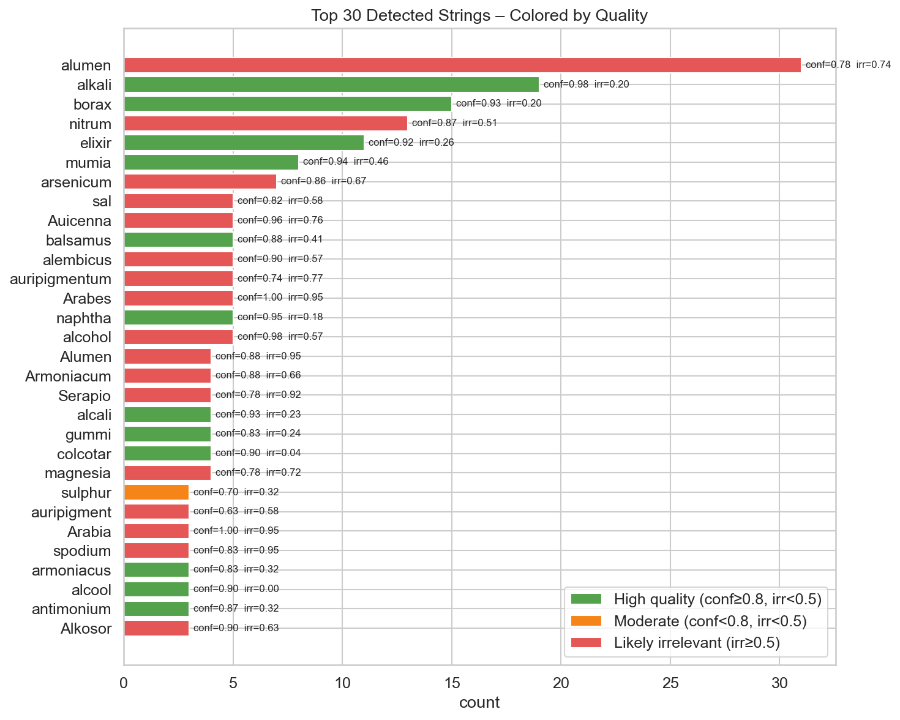

### Data & Method

- The 30 most frequently detected strings in the CSV, ranked by count.
- Each bar is **color-coded** based on the mean scores for that string:
  - **Green:** High quality — mean confidence ≥ 0.8 AND mean irrelevance < 0.5
  - **Orange:** Moderate — mean confidence < 0.8 AND mean irrelevance < 0.5
  - **Red:** Likely irrelevant — mean irrelevance ≥ 0.5
- Labels show the exact mean confidence and irrelevance values.
- **Tool:** pandas `groupby().agg()` for per-string statistics; matplotlib horizontal bar chart.

### What it shows

The top terms by raw count include a mix of genuinely Arabic terms (green) and false positives (red):

- **Green (genuine):** *alkali* (15 hits, irr=0.01), *borax* (11, irr=0.05), *elixir* (5, irr=0.03), *colcotar* (4, irr=0.04), *mumia* (4, irr=0.00)
- **Red (false positives):** *alumen* (6, irr=0.74), *nitrum* (5, irr=0.67), *sal* (4, irr=0.85), *Arabes* (3, irr=0.85) — these are Latin/general terms that happen to appear in entries about Arabic topics but are not themselves Arabic loanwords.

**In plain terms:** This chart is like a quality report for each term. Green terms are confidently Arabic — words like *alkali*, *borax*, and *elixir* that scholars of Arabic-Latin transmission would expect. Red terms are false alarms — *alumen* (alum) is a Latin word, and *sal* (salt) is Latin too, even though they appear in entries discussing Arabic alchemy.

---

## 7. Filtering Comparison

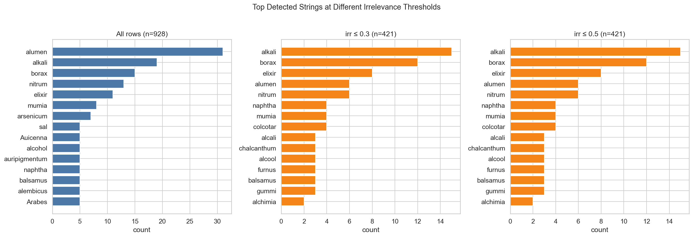

### Data & Method

Three panels showing the top 15 detected strings when filtered at different `irrelevance_probability` thresholds:
- **Left (all rows, n=928):** No filtering applied
- **Middle (irr ≤ 0.3, n=421):** Only rows with low irrelevance probability
- **Right (irr ≤ 0.5, n=421):** Slightly more permissive threshold (same result here because there are no rows between 0.3 and 0.5)

### What it shows

The ranking changes dramatically after filtering:

| Rank | Unfiltered | Filtered (irr ≤ 0.3) |
|------|-----------|----------------------|
| 1 | alumen (33) | **alkali (15)** |
| 2 | alkali (20) | **borax (11)** |
| 3 | borax (17) | **elixir (8)** |
| 4 | nitrum (15) | **alumen (6)** |
| 5 | elixir (11) | **nitrum (6)** |

*Alumen* drops from 33 to 6 — meaning 27 of its 33 detections were false positives. *Alkali* and *borax*, genuinely Arabic terms, rise to the top.

**In plain terms:** This is the most important chart for understanding why the data needs cleaning. Without cleaning, you'd think the most common Arabic term in Ruland's dictionary is *alumen* (Latin for alum). After cleaning, you see it's actually *alkali* (from Arabic القلي, *al-qalī*) — a much more meaningful finding for the history of Arabic-to-Latin knowledge transfer.

---

## 8. Semantic Categories of Arabic Terms

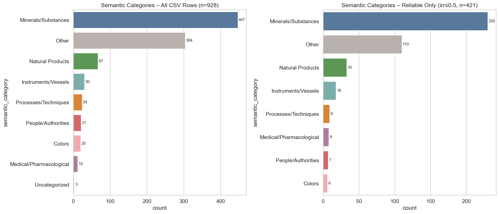

### Data & Method

- Each CSV row's `english_translation` field was classified into one of 9 semantic categories using **keyword matching** against predefined word lists:
  - **Minerals/Substances:** salt, alum, sulfur, borax, mercury, alkali, natron, marcasite, cinnabar, etc.
  - **Natural Products:** oil, resin, saffron, mummy, petroleum, sugar, etc.
  - **Instruments/Vessels:** alembic, furnace, aludel, drum, bath, etc.
  - **Processes/Techniques:** distill, calcine, filter, extract, leaven, etc.
  - **People/Authorities:** Avicenna, Jabir, Rhazes, Geber, etc.
  - **Medical/Pharmacological:** elixir, medicine, cure, etc.
  - **Colors:** red, white, blue, black, etc.
  - **Other:** terms not matching any keyword list
  - **Uncategorized:** missing English translation
- **Left panel:** All 928 CSV rows
- **Right panel:** Only rows with irrelevance ≤ 0.5 (421 rows)
- **Tool:** Custom Python function applying keyword matching to the `english_translation` column; pandas `value_counts()`; seaborn bar chart.

### What it shows

**Minerals and substances** overwhelmingly dominate Arabic contributions to alchemical vocabulary — 447 detections (all data) or 230 (reliable only). This is followed by a large "Other" category (terms that didn't match any keyword list), then **Natural Products** (67→33), **Instruments** (30→18), and **Processes** (24→9).

**People/Authorities** (21→7) represent a small but significant category: references to Arabic scholars like Avicenna (Ibn Sina) and Jabir ibn Hayyan who are cited by name in the Latin text.

The proportions remain broadly similar after filtering, which is reassuring — filtering removes noise but doesn't distort the overall picture.

**In plain terms:** Arabic's biggest contribution to European alchemy was in naming *substances* — the minerals, salts, and chemicals that alchemists worked with. Terms like alkali, borax, arsenic, and alcohol entered European languages through Arabic alchemical texts. Arabic also contributed names for laboratory equipment (alembic, athanor) and some process terms, but substances dominate by far.

---

## 9. Arabic Term Density Across the Dictionary

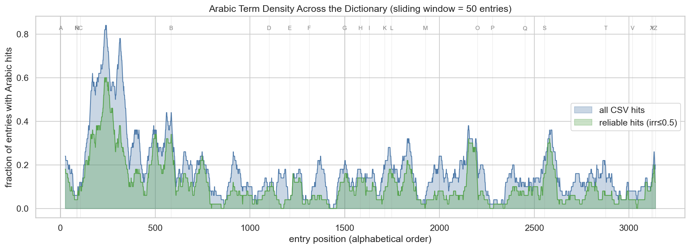

### Data & Method

- All 3,164 XML entries were ordered by their position in the dictionary (entry 1 = first A-entry, entry 3164 = last Z-entry).
- For each entry, we marked whether its headword appears as a lemma in the CSV (blue) or in the reliable subset with irrelevance ≤ 0.5 (green).
- A **sliding window of 50 entries** was applied: at each position, we compute the fraction of the surrounding 50 entries that contain Arabic hits. This is a **moving average** — a common technique for smoothing noisy binary data to reveal underlying trends.
- Letter boundaries are marked with gray vertical lines and letter labels at the top.
- **Tool:** `numpy.convolve()` for the moving average; matplotlib area chart with `fill_between()`.

### What it shows

Arabic term density is highly uneven across the dictionary:

- **Strongest peak:** Early A-entries (positions 100–350), where density reaches 60–80%. This is the *al-* prefix zone — entries like Alcohol, Alcali, Alembicus, Alkibric, etc.
- **Notable peaks:** Letters K (position ~1500, Kali and related terms), M (position ~1900–2000, Mumia and Marchasita), N (position ~2100, Naphtha and Nitrum), and S (position ~2600, Sal terms).
- **Dead zones:** Letters D, F, G, H, I, O, X, Y have very low Arabic density — these sections of the dictionary deal mainly with Latin, Greek, or Germanic terminology.

The gap between the blue (all hits) and green (reliable hits) areas shows how much noise was removed by filtering. In the A-section, the gap is particularly wide, confirming that many false positives clustered there.

**In plain terms:** If you walk through the dictionary from A to Z, Arabic influence isn't spread evenly. It surges in the early A-section (because of the Arabic article *al-*), pops up around K (from Arabic ق *qāf* words), M (مومياء *mūmiyā'*, مرقشيتا *marqashītā*), N (نفط *nafṭ*, نطرون *naṭrūn*), and S (سكر *sukkar*, صندل *ṣandal*). Large stretches of the dictionary (D through I, O, P) have almost no Arabic presence.

---

## 10. Arabic Share by Entry Length

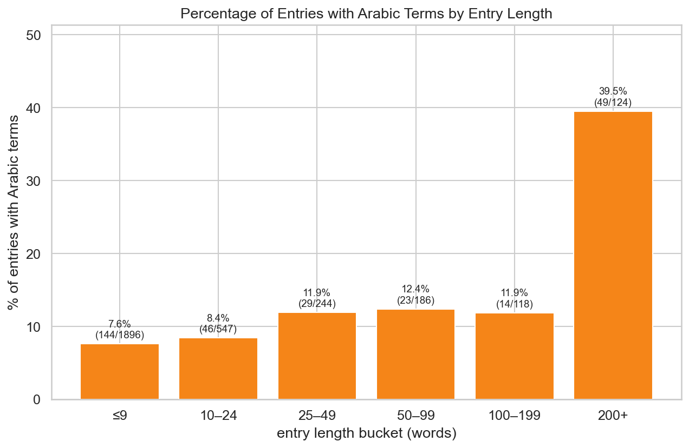

### Data & Method

- Dictionary entries were bucketed by word count into 6 groups: ≤9, 10–24, 25–49, 50–99, 100–199, 200+ words.
- For each bucket, we computed the **percentage** of entries that contain at least one Arabic detection (from the earlier headword-coverage analysis CSV).
- Counts are annotated as `percentage (arabic_entries/total_entries)`.
- **Data source:** `headword_letter_coverage.csv` and `entry_length_summary.csv` from the earlier visualization batch.
- **Tool:** matplotlib bar chart with text annotations.

### What it shows

There is a clear and dramatic trend: **longer entries are far more likely to contain Arabic terms.**

| Entry length | Arabic share |
|-------------|-------------|
| ≤9 words | 7.6% (144/1,896) |
| 10–24 words | 8.4% (46/547) |
| 25–49 words | 11.9% (29/244) |
| 50–99 words | 12.4% (23/186) |
| 100–199 words | 11.9% (14/118) |
| **200+ words** | **39.5% (49/124)** |

The jump from ~12% to nearly 40% at the 200+ word level is striking.

**Technical explanation:** This correlation could arise because: (a) longer entries tend to be encyclopedic treatises that discuss a substance's history, including Arabic sources and terminology; (b) entries about substances with Arabic names (like alkali, borax, elixir) tend to be more important and therefore receive longer definitions; (c) longer entries simply have more text in which Arabic terms can appear by chance.

**In plain terms:** Short dictionary entries (just a word and its translation) rarely mention Arabic. But the long, essay-like entries — where Ruland discusses a substance's history, quotes Arabic scholars like Avicenna and Serapio, and lists alternative names — are where Arabic influence shows up most. Nearly 40% of entries over 200 words long contain Arabic terminology. This tells us that Arabic knowledge was particularly associated with the dictionary's most substantial, scholarly entries.

---

## 11. Co-occurrence Network

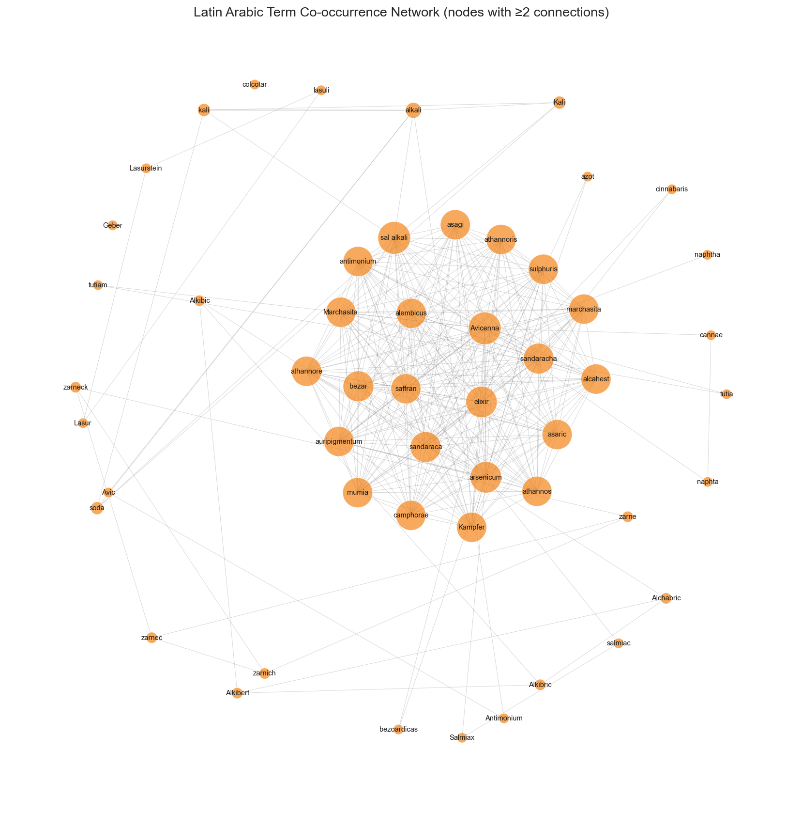

### Data & Method

- **Data source:** `latin_cooccurrence_pairs.csv` — pairs of Latin-script Arabic terms that appear together within the same dictionary entry, with counts.
- A **network graph** (also called a "graph" in mathematical terms) was constructed where:
  - Each **node** (circle) is a detected Arabic-origin term in its Latin form
  - Each **edge** (line) connects two terms that co-occur in at least one dictionary entry
  - **Node size** is proportional to the number of connections (degree centrality)
  - Only nodes with **≥2 connections** are shown, to reduce clutter
- **Layout algorithm:** Spring layout (`networkx.spring_layout()`) with `k=2.5` (node repulsion), 80 iterations, and a fixed random seed for reproducibility. This algorithm simulates nodes as charged particles that repel each other while edges act as springs pulling connected nodes together, resulting in a layout where related terms cluster nearby.
- **Tool:** Python `networkx` library for graph construction; matplotlib for rendering.

### What it shows

The network reveals a **dense central cluster** of terms that frequently co-occur, surrounded by satellite groups:

- **Central hub:** Terms like *Avicenna*, *arsenicum*, *auripigmentum*, *sandaraca*, *marchasita*, *elixir*, *antimonium*, *mumia*, *sal alkali* form a tightly interconnected core. These are the "usual suspects" of Arabic alchemical vocabulary — substances and authorities that Ruland discusses together in his longer entries.
- **Satellite pairs:** On the periphery, smaller groups appear: *zarne/zarnec/zarneck/zarnich* (variant spellings of arsenic), *Alkibric/Alkibert/Alkibic/Alchabric* (variants of a sulfur term), *tutia/tutiam* (zinc oxide variants).
- **Bridge nodes:** *Avicenna* connects to nearly every other term, reflecting his role as the most-cited Arabic authority in the dictionary.

**In plain terms:** This network shows which Arabic terms "travel together" in Ruland's dictionary. The densely connected center represents a core vocabulary of Arabic alchemy: arsenic, orpiment, sandarac, marcasite, antimony, elixir, and sal alkali tend to be discussed together, often with citations of Avicenna. The outlying clusters show families of variant spellings for the same substance. The overall structure reveals that Arabic alchemical knowledge entered European texts not as isolated terms but as an interconnected system of substances, concepts, and authoritative sources.

---

## 12. Authority References

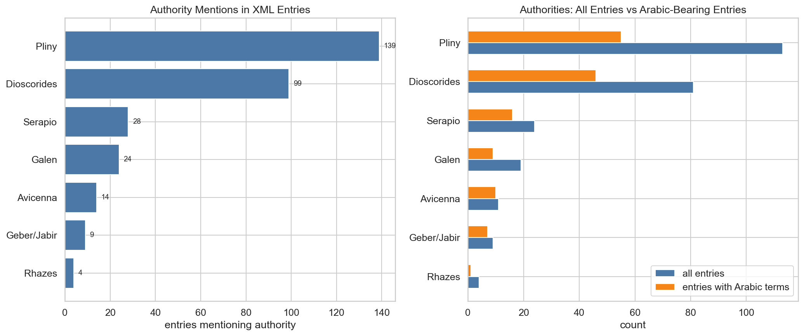

### Data & Method

- **Left panel:** We searched the full text of all 3,164 XML entries for mentions of 7 scholarly authorities using keyword matching:
  - **Arabic authorities:** Avicenna (ابن سينا, Ibn Sina), Geber/Jabir (جابر بن حيان), Serapio, Rhazes (الرازي, al-Razi)
  - **Classical authorities:** Dioscorides, Pliny, Galen
  - The search was case-insensitive and matched substrings (e.g., "Dioscorid" matches "Dioscorides," "Dioscoridem," etc.)
  - Each entry was counted once per authority, regardless of how many times that authority is mentioned within the entry.
- **Right panel:** For the same authorities, we compare how many entries mention them overall (blue) vs. how many of those entries also contain Arabic term detections from the CSV (orange).
- **Tool:** Python `defaultdict` for counting; substring search on `full_text.lower()`; matplotlib grouped horizontal bar chart.

### What it shows

**Left panel — Who does Ruland cite?**

| Authority | Entries citing them |
|-----------|-------------------|
| Pliny | 139 |
| Dioscorides | 99 |
| Serapio | 28 |
| Galen | 24 |
| Avicenna | 14 |
| Geber/Jabir | 9 |
| Rhazes | 4 |

Ruland overwhelmingly cites **classical Greco-Roman authorities** (Pliny and Dioscorides), with Arabic authorities appearing much less frequently. This is consistent with the humanist style of the period, which valued classical sources over medieval Arabic ones.

**Right panel — Where do Arabic authorities overlap with Arabic terms?**

The orange bars show that Arabic authorities (Avicenna, Geber, Serapio) appear disproportionately in entries that also contain Arabic term detections. For example, nearly all entries citing Avicenna also contain Arabic-origin terms. By contrast, Pliny and Dioscorides appear in many entries without Arabic terms — they're cited for general mineralogical and pharmaceutical knowledge, not specifically for Arabic material.

**In plain terms:** Ruland primarily cites ancient Greek and Roman authors like Pliny and Dioscorides — this was standard practice for a 17th-century scholar. Arabic authors like Avicenna and Jabir appear less often, but when they do, it's almost always in entries that also use Arabic terminology. This suggests that Arabic scholarly authorities and Arabic technical vocabulary entered the dictionary as a package: when Ruland discusses a substance with an Arabic name, he's also likely to cite an Arabic authority, and vice versa.

---

## 13. XML Dictionary Structure Overview

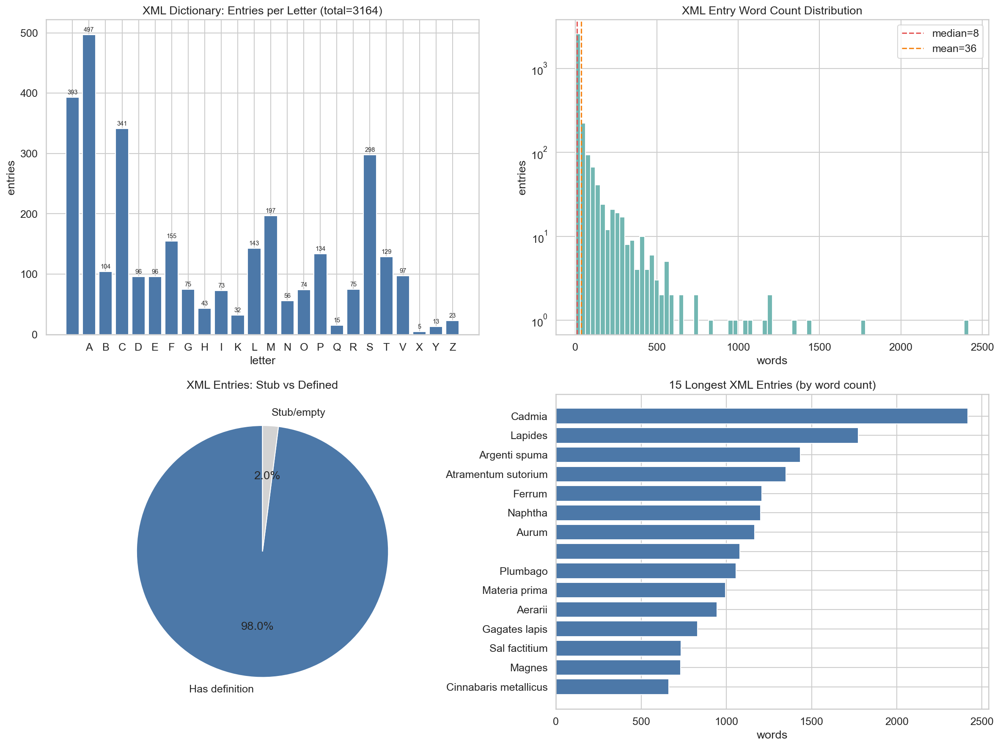

### Data & Method

Four panels derived purely from the XML, with no CSV data:

1. **Top-left:** Count of `<entry>` elements per initial letter, with counts annotated. Uses `pandas.Series.value_counts()`.
2. **Top-right:** Histogram of word counts (all 3,164 entries) on a logarithmic y-axis, with vertical lines for median (red, 8 words) and mean (orange, 38 words). Uses `seaborn.histplot()` with 80 bins.
3. **Bottom-left:** Pie chart showing the proportion of entries with actual definitions (>3 words, 98%) vs. stubs (headword only, 2%).
4. **Bottom-right:** The 15 longest entries by word count. Uses `pandas.DataFrame.nlargest()`.

### What it shows

- **Letter distribution (top-left):** Follows a characteristic pattern for Latin alchemical lexicons. A (497) and S (298) are the largest sections. The absence of J and U is expected — early modern Latin used I for J and V for U.
- **Word count distribution (top-right):** Extremely right-skewed (long-tailed). Half of all entries are 8 words or shorter — these are brief glosses like "Abam, id est, plumbum" (Abam, that is, lead). But a few entries are 1,000–2,500 words long, essentially mini-treatises embedded within the dictionary.
- **Stub vs defined (bottom-left):** 98% of entries have actual content beyond just the headword. The 2% of stubs are entries where Ruland listed a term but provided no definition.
- **Longest entries (bottom-right):** *Cadmia* (2,414 words), *Lapides* (1,875 words), and *Argenti spuma* (1,717 words) are the longest. These are encyclopedic entries covering multiple varieties of a substance, their properties, sources, and uses, with extensive citations of classical and Arabic authorities.

**In plain terms:** Ruland's dictionary is very uneven. Most entries are quick one-line definitions — "X means Y" — but a few dozen entries are extensive essays. The short entries typically define a term; the long entries teach about a subject. Understanding this structure is important because Arabic influence is concentrated in the long entries (as shown in the entry-length analysis above). The dictionary is not a uniform list — it's a mix of glossary and encyclopedia.

---

## Appendix: Reproduction

All visualizations were generated by the Python script `explore_ruland.py` using:

- **Libraries:** pandas, numpy, matplotlib, seaborn, networkx, xml.etree.ElementTree
- **Data files:**
  - XML: `Ruland.xml` (downloaded from GitHub)
  - CSV: `output_4ofixed_reviewed_with_entries.csv`
  - Supporting CSVs from earlier visualization runs: `headword_letter_coverage.csv`, `entry_length_summary.csv`, `latin_cooccurrence_pairs.csv`
- **Output:** All PNGs saved at 150 DPI to `/Users/slang/claude/ruland_exploration/`

To regenerate: `python3 explore_ruland.py`
