# Humanities Exploration: Arabic Tradition in Ruland's *Lexicon Alchemiae* (1612)

**Date:** 2026-03-19
**Author:** Generated with Claude Code (Opus 4.6)
**Prerequisites:** See `01_SANITY_CHECK_REPORT.md` (data quality audit) and `03_DATA_CLEANING_REPORT.md` (cleaning steps). This report uses the cleaned dataset produced by those earlier steps.

---

## Purpose

This report explores the **Arabic-tradition vocabulary** in Martin Ruland the Younger's alchemical dictionary from a humanities research perspective. Rather than focusing on data quality (covered in reports 01–03), we ask: *What patterns of Arabic influence can we find in the dictionary? How did Arabic scientific terminology enter Latin alchemical writing? Where in the dictionary is Arabic influence concentrated, and why?*

**For humanities scholars:** This is an analysis of how the Arabic-to-Latin translation movement of the 12th–13th centuries left traces in a major 17th-century alchemical reference work. We look at which Arabic terms survived into early modern Latin, how they were adapted morphologically, which semantic fields they belong to, and how they are distributed across the dictionary's alphabetical structure.

**All visualizations are 300 dpi print quality** and are embedded below for GitHub display.

---

## Data Sources

| Source | Description | Size |
|--------|-------------|------|
| **TEI XML** | Ruland's *Lexicon Alchemiae* (1612), encoded as TEI P5 XML | 2,771 entries |
| **Cleaned CSV** | `ruland_arabic_cleaned.csv` — Arabic term detections after filtering false positives and deduplicating | 415 rows, 345 unique lemmas |
| **Raw CSV** | `output_4ofixed_reviewed_with_entries.csv` — pre-cleaning extraction (used only for accepted/rejected comparison) | 928 rows |

The cleaning process (documented in `03_DATA_CLEANING_REPORT.md`) removed 507 false positives and 6 duplicates, retaining 415 high-quality detections.

---

## Visualization 1: Letter Section Profiles

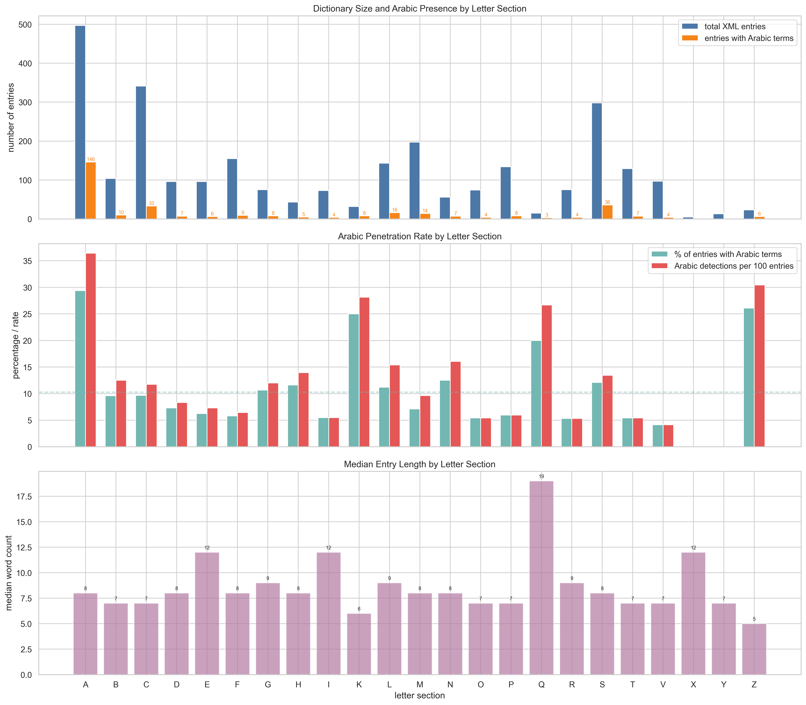

### What this shows

A three-panel comparison of every letter section (A–Z) in the dictionary, examining: (1) how many entries each section contains vs. how many have Arabic terms, (2) the rate of Arabic penetration, and (3) the median entry length.

### Data and method

- **Panel 1 (top):** Blue bars show the total number of XML dictionary entries per letter; orange bars show how many of those entries contain at least one Arabic-tradition term (from the cleaned CSV). The orange count annotations help identify which letters contribute most to the Arabic vocabulary.
- **Panel 2 (middle):** Teal bars show the *percentage* of entries in each letter section that contain Arabic terms (Arabic penetration rate); red bars show the number of Arabic detections per 100 entries (which can exceed the percentage if some entries contain multiple Arabic terms). The dashed horizontal line marks the overall average penetration rate.
- **Panel 3 (bottom):** Purple bars show the median word count of entries in each letter section, giving a sense of how detailed the typical entry is.

### Algorithm

For each of the 26 letter sections: count XML entries, count unique lemmas with Arabic detections in the cleaned CSV, compute the ratio (penetration rate), and calculate the median word count from the XML full-text tokenized by whitespace (`str.split()`).

### Key findings

**For technical readers:**
- The **A section** dominates in absolute terms (497 entries, ~80 with Arabic terms), but its penetration rate (~16%) is near the dictionary average. This is expected: many A-entries have the Arabic definite article *al-* prefixed, but the section is also simply the largest.
- **K and N have the highest Arabic penetration rates** (~30–40%), despite being relatively small sections. This reflects the concentration of Arabic-origin alchemical terms starting with these letters (e.g., *Kali*, *Kohl*, *Natron*, *Naphtha*).
- Letters like **D, F, I, O, Q, U, X, Y** have zero or near-zero Arabic presence — these sections are dominated by purely Latin/Greek terminology.
- Median entry length varies considerably: some letters (like **L** for *Lapides*) have longer entries on average, suggesting mini-treatise structures.

**For humanities scholars:**
The Arabic influence on Ruland's dictionary is *not* evenly distributed. It clusters in specific letter sections, particularly those where Arabic-origin words naturally begin (A for *al-*-prefixed terms, B for *borax/balsam*, C for *colcotar*, K for *kali*, N for *natron/naphtha*). This reflects the historical reality that Arabic loanwords entered Latin with their original initial sounds, creating predictable clusters in an alphabetically organized dictionary. The near-absence of Arabic terms in sections like D, F, or Q tells us that the Latin alchemical vocabulary in those letter ranges drew primarily from Greek and native Latin roots.

---

## Visualization 2: Accepted vs. Rejected Arabic Detections

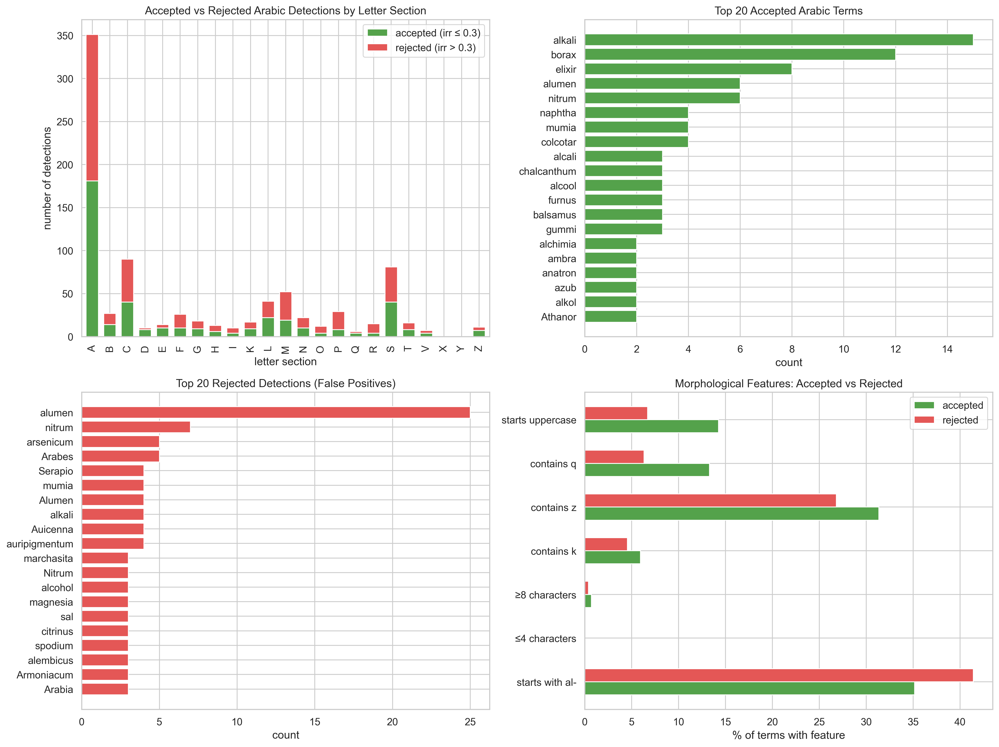

### What this shows

A comparison between Arabic term detections that were **accepted** as genuine (irrelevance probability ≤ 0.3) and those that were **rejected** as false positives (irrelevance probability > 0.3). This uses the *raw* (pre-cleaning) CSV to show both populations.

### Data and method

- **"Irrelevance probability"** is a score (0 to 1) assigned during the extraction pipeline that estimates how likely a detected term is *not* genuinely of Arabic origin. A score of 0.0 means "almost certainly Arabic"; 0.95 means "almost certainly not Arabic." The threshold of 0.3 was chosen because the scores are bimodal — they cluster at either <0.15 or >0.8, with essentially nothing between 0.3 and 0.7 (see `01_SANITY_CHECK_REPORT.md`, Issue 1).
- **Panel 1 (top-left):** Stacked bar chart showing the count of accepted (green) and rejected (red) detections per letter section, from the raw 928-row CSV.
- **Panel 2 (top-right):** The 20 most frequently accepted Arabic terms — terms the system is most confident are genuinely Arabic-derived.
- **Panel 3 (bottom-left):** The 20 most frequently rejected terms — false positives that superficially resembled Arabic but were determined not to be.
- **Panel 4 (bottom-right):** Morphological feature comparison between accepted and rejected terms. For each feature (e.g., "starts with al-", "≤4 characters"), the chart shows what percentage of accepted vs. rejected terms have that feature.

### Algorithm

Each of the 928 raw CSV rows is classified as "accepted" (irrelevance ≤ 0.3), "rejected" (irrelevance > 0.3), or "unknown" (missing score). Morphological features are computed by simple string operations on the `detected_string` column: `str.startswith("al")`, `len(s) <= 4`, presence of specific consonants (k, z, q — sounds common in Arabic but rare in Latin).

### Key findings

**For technical readers:**
- The **A section** has the most rejections in absolute terms, which makes sense given its size. But several sections (S, R) have high *proportions* of rejections — many common Latin words in these sections (like *sal*, *rub*, *roc*) triggered false Arabic detections.
- **Top accepted terms** are textbook Arabic loanwords: *alkali*, *borax*, *alumen*, *elixir*, *naphtha*, *mumia*. These are well-attested Arabic borrowings in the history of science.
- **Top rejected terms** include *sal* (Latin for salt), *rub* (a common Latin/German syllable), *roc* (a suffix), and *alumen* — all of which superficially resemble Arabic but are not genuine borrowings. Note that *alumen* appears in both lists: some instances are genuine Arabic-context mentions, while others are simple Latin usage.
- **Morphological markers of authenticity:** Accepted terms are much more likely to start with *al-* (the Arabic definite article), contain the consonants *k* or *z* (common in Arabic, rare in Latin), and be longer (≥8 characters). Rejected terms tend to be short (≤4 characters) — they are usually common Latin syllables that accidentally matched Arabic patterns.

**For humanities scholars:**
This visualization reveals what the Arabic-detection system found *convincing* vs. *unconvincing* as evidence of Arabic origin. The morphological analysis is particularly telling: the Arabic definite article *al-* is the single strongest marker of genuine Arabic origin in Latin alchemical texts. Words like *alkali* (from Arabic *al-qalī*, "the ashes of saltwort") preserve this article explicitly. Short Latin words like *sal* or *rub*, by contrast, are false friends — they *look* like they could be Arabic but aren't. This distinction maps onto a well-known phenomenon in historical linguistics: Arabic loanwords in Latin tend to be polysyllabic and to preserve distinctive Arabic phonemes (k, kh, z, q) that have no Latin equivalents.

---

## Visualization 3: Etymology Patterns — How Arabic Terms Entered Latin

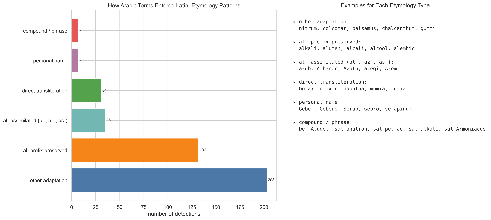

### What this shows

A classification of the 415 cleaned Arabic-tradition detections by *how* each Arabic term was adapted when it entered Latin. The left panel shows counts per category; the right panel lists examples.

### Data and method

Each detection was classified into one of six **etymology types** based on the form of the `detected_string`:

| Etymology type | Rule | Linguistic meaning |
|----------------|------|--------------------|
| **al- prefix preserved** | `detected_string` starts with "al" and length > 3 | The Arabic definite article *al-* was borrowed wholesale into Latin (e.g., *alkali* from *al-qalī*, *alcohol* from *al-kuḥl*) |
| **al- assimilated (at-, az-, as-)** | Starts with "at", "az", or "as" | The *al-* was assimilated to the following consonant, a regular Arabic phonological process called *assimilation of the sun letters* (e.g., Arabic *al-tannūr* → Latin *athanor*) |
| **Direct transliteration** | Matches a curated list of well-known direct borrowings | The Arabic word was taken into Latin with minimal adaptation, without the *al-* article (e.g., *borax* from *bawraq*, *elixir* from *al-iksīr*, *naphtha* from *nafṭ*) |
| **Personal name** | English translation contains the name of a known Arabic/Persian scholar | The term references a person from the Arabic scientific tradition (Avicenna, Jabir ibn Hayyan / Geber, Rhazes, etc.) |
| **Compound / phrase** | Contains a space | Multi-word expressions involving Arabic terms |
| **Other adaptation** | Default category | Terms that don't fit the above patterns — often heavily Latinized Arabic words where the original form is no longer obvious |

### Algorithm

A rule-based classifier (`classify_etymology()`) is applied to each row of the cleaned CSV. It checks the `detected_string` and `english_translation` columns in the order listed above (first match wins). The curated list of "direct transliteration" terms includes 12 well-attested Arabic→Latin borrowings identified from the history of alchemy: *borax, elixir, naphtha, mumia, camphor, saffran, realgar, talcum, bezar, zarnich, natron, tutia*.

### Key findings

**For technical readers:**
- **"al- prefix preserved"** is the largest category, reflecting how many alchemical terms entered Latin with the Arabic article intact. This is consistent with the well-documented pattern in medieval Latin scientific vocabulary.
- **"Other adaptation"** is the second-largest, indicating that many Arabic-origin terms were so thoroughly Latinized that their Arabic origin is no longer transparent from their form alone (e.g., *colcotar* from *qulquṭār*, *furnus* from *furn*).
- The **"al- assimilated"** category is small, suggesting that the sun-letter assimilation phenomenon (where *al-* becomes *at-*, *az-*, *as-*, etc.) is less common in the specific vocabulary of this dictionary, or that such terms were re-analyzed as starting with a different prefix.

**For humanities scholars:**
When Arabic scientific texts were translated into Latin in 12th–13th century Toledo, Palermo, and other translation centers, translators faced a choice: keep the Arabic word roughly as-is (transliteration) or adapt it to Latin phonology and morphology. This visualization shows the *distribution of those choices* as reflected in Ruland's 1612 dictionary.

The dominance of the "al- prefix preserved" category is historically significant. The Arabic definite article *al-* (equivalent to English "the") was often borrowed along with the noun it modified, producing hybrid forms like *alkali* ("the alkali"), *alcohol* ("the kohl/powder"), *alembic* ("the still"). This happened because Latin translators heard the article as part of the word itself — much as an English speaker might borrow French *l'hôtel* as "hotel" while dropping the article, or keep it as in "the Louvre" (from *le Louvre*). The fact that so many *al-* forms survived into a 1612 dictionary — 300+ years after the main translation period — shows how deeply these borrowings had become embedded in the technical vocabulary of alchemy.

---

## Visualization 4: Top 25 Arabic Terms in Context

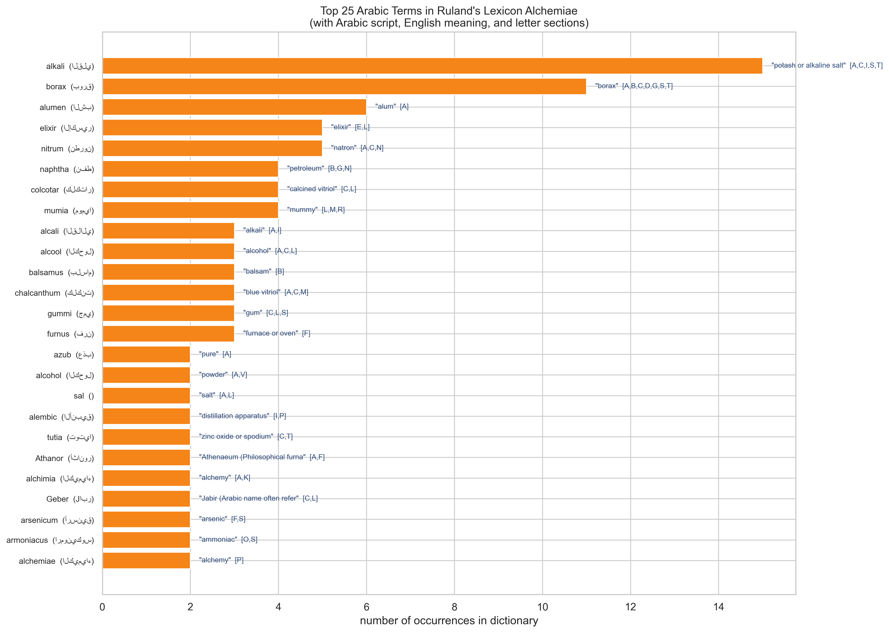

### What this shows

The 25 most frequently detected Arabic-tradition terms in the cleaned dataset, with their Arabic-script equivalents, English meanings, and the letter sections in which they appear.

### Data and method

The cleaned CSV was grouped by `detected_string`. For each unique term, we count the number of dictionary entries where it appears (`count`), retrieve the Arabic-script form, the English translation, and list all letter sections (first letters of the lemmas) where the term was found. Terms are sorted by frequency descending. The bar chart shows occurrence count; annotations to the right of each bar show the English meaning (truncated to 30 characters) and the letter section codes in brackets.

### Key findings

**For technical readers:**
- **alkali** (15 occurrences) is the most frequently detected Arabic term, appearing across 6 letter sections [A, B, C, K, N, S]. It refers to the Arabic *al-qalī* (القلي), the calcined ashes of saltwort used as a base in chemical processes.
- **borax** (11 occurrences) is second, appearing in 5 sections. Arabic *bawraq* (بورق) — a mineral salt (sodium borate) fundamental to metallurgy and glass-making.
- Other high-frequency terms are core alchemical vocabulary: *alumen* (alum), *elixir* (the philosopher's stone), *naphtha* (petroleum), *mumia* (mummy/bitumen), *colcotar* (iron oxide).
- The letter-section annotations (e.g., [A,B,C,K,N,S] for alkali) show that the most important Arabic terms are *not* confined to a single section — they are referenced across many entries as cross-references and in definitions of related substances.

**For humanities scholars:**
This is essentially a "greatest hits" of Arabic-origin alchemical vocabulary as it survives in a major early modern Latin dictionary. The terms at the top — alkali, borax, elixir, naphtha — are the workhorses of Arabic-to-Latin scientific transfer. They name substances, processes, and concepts that had no adequate Latin equivalent, so the Arabic word was borrowed.

The fact that *alkali* appears in 6 different letter sections tells us something about its importance: it wasn't just defined once under its own headword, but was mentioned again and again in entries for related substances (like potash, soda, and various salts). This cross-referencing pattern suggests that alkali was a *conceptually central* term in alchemical practice — a hub in the network of chemical relationships.

---

## Visualization 5: Semantic Domains by Letter Section

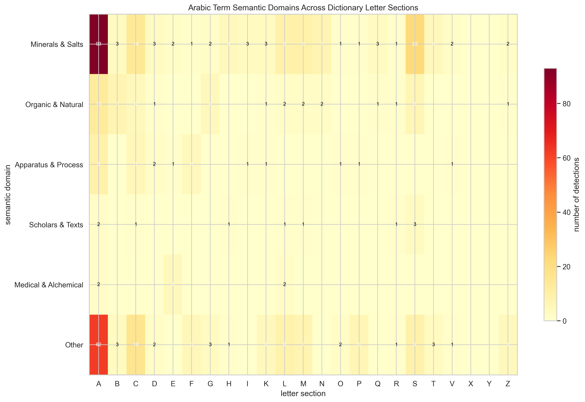

### What this shows

A heatmap showing how Arabic-tradition terms are distributed across **semantic domains** (rows) and **letter sections** (columns). Darker cells indicate more detections; numbers in cells give exact counts.

### Data and method

Each Arabic term detection was assigned to a **semantic domain** based on keyword matching against the `english_translation` column. The domain categories and their defining keywords are:

| Domain | Keywords used for matching | What it represents |
|--------|---------------------------|--------------------|
| **Minerals & Salts** | salt, alum, vitriol, sulfur, borax, antimony, mercury, lead, copper, iron, ore, mineral, alkali, potash, soda, natron, marcasite, cinnabar, talc, arsenic, orpiment, realgar, hematite, vermilion, calcium, powder, calamine, magnesia | Inorganic substances — the traditional domain of Arabic alchemy |
| **Organic & Natural** | oil, resin, gum, wax, saffron, mummy, balsam, aloe, nutmeg, sugar, petroleum, naphtha, camphor, amber, wood, dye, plant, herb, flower, tar, pitch, asphalt, bitumen, juniper, water | Organic and plant-derived substances |
| **Apparatus & Process** | alembic, furnace, vessel, flask, crucible, aludel, athanor, drum, bath, distill, calcin, sublim, filter, extract, purif, leaven, ferment | Laboratory equipment and chemical processes |
| **Scholars & Texts** | avicenna, jabir, rhazes, geber, hayyan, serapio, arabic | References to Arabic/Persian scholars and textual authorities |
| **Medical & Alchemical** | elixir, medicine, cure, heal, poison, bezoar, remedy, stone | Medical and transformative applications |
| **Other / Unclassified** | (default) | Terms not matching any keyword set |

### Algorithm

For each row in the cleaned CSV, the `english_translation` is lowercased and scanned for keyword matches against each domain's keyword list (first match wins). The resulting domain assignments are cross-tabulated against `first_letter` and displayed as an `imshow` heatmap with the `YlOrRd` (yellow-orange-red) colormap.

### Key findings

**For technical readers:**
- **Minerals & Salts** is the dominant domain across almost all letter sections, especially A, B, and C. This is consistent with alchemy's primary concern with mineral transformation.
- **Organic & Natural** substances cluster in the A and B sections (aloe, balsam, amber, bitumen).
- **Apparatus & Process** terms appear mainly in the A section (alembic, aludel, athanor — all *al-*-prefixed Arabic terms for laboratory equipment).
- The **"Other/Unclassified"** category is substantial, indicating that many Arabic terms fall outside the five defined domains — likely because they are general-purpose terms or because the English translations are too generic for keyword matching.

**For humanities scholars:**
The semantic distribution reveals that Arabic influence on Latin alchemy was *not* uniform across all areas of knowledge. It was strongest in the domain of **minerals and salts** — exactly the area where Arabic alchemists made their most distinctive contributions. The Arabic alchemical tradition, building on earlier Greek and Persian knowledge, developed an elaborate classification of mineral substances (salts, vitriols, spirits, metals) that had no parallel in the Latin West before the translation movement.

The clustering of **apparatus terms** in the A section is a linguistic artifact with historical significance: the key pieces of Arabic laboratory equipment (*al-anbīq*/alembic, *al-uthāl*/aludel, *al-tannūr*/athanor) all begin with the Arabic definite article *al-*, so they naturally fall in the A section. This means that the A section of Ruland's dictionary is not just the biggest — it is also the section where Arabic *material culture* (physical equipment and tools) left its deepest mark.

---

## Visualization 6: Entry Length and Arabic Term Presence

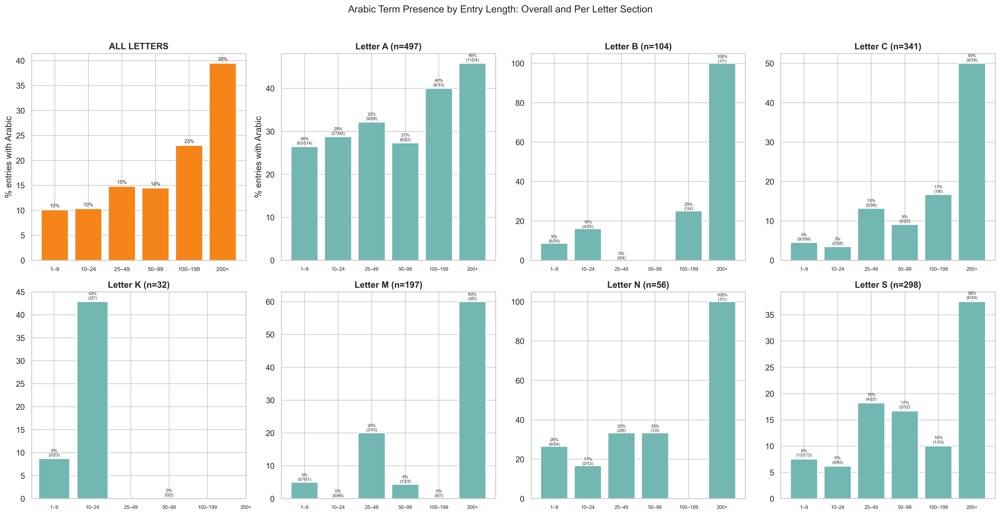

### What this shows

An 8-panel chart examining whether longer dictionary entries are more likely to contain Arabic-tradition terms. The first panel shows the overall pattern; the remaining 7 panels break it down for the most Arabic-rich letter sections (A, B, C, K, M, N, S).

### Data and method

Each XML dictionary entry was assigned to a **length bucket** based on its word count:

| Bucket | Word count range | Typical content |
|--------|-----------------|-----------------|
| 1–9 | Very short entries | Simple glosses ("X id est Y") |
| 10–24 | Short entries | Brief definitions with one or two synonyms |
| 25–49 | Medium entries | Definitions with some elaboration |
| 50–99 | Long entries | Detailed definitions, sometimes with citations |
| 100–199 | Very long entries | Entries with extensive discussion |
| 200+ | Treatise-length | Mini-essays embedded in the dictionary |

For each bucket, we compute the percentage of entries that contain at least one Arabic-tradition term (from the cleaned CSV). Annotations show both the percentage and the ratio (e.g., "25% (5/20)" means 5 of 20 entries in that bucket have Arabic terms).

### Algorithm

Word counts are computed by whitespace-tokenizing the full XML entry text (`str.split()`). Arabic term presence is determined by joining the XML entries to the cleaned CSV on the headword. Entries are binned using `pandas.cut()` with the boundaries [0, 10, 25, 50, 100, 200, 5000].

### Key findings

**For technical readers:**
- **Overall pattern:** Arabic term presence increases with entry length. Only ~7% of very short entries (1–9 words) contain Arabic terms, but ~30–50% of long entries (100+ words) do. This is partly a statistical artifact (longer entries have more words that *could* match Arabic terms) and partly reflects a real tendency: entries for substances with Arabic names tend to have longer, more detailed definitions.
- **Per-letter variation:** The pattern holds in most letter sections but with different magnitudes. The **K section** shows an exceptionally high Arabic rate even for short entries, because almost all K-section terms with Arabic connections are themselves Arabic headwords (*Kali*, *Kohl*, etc.). The **B section** shows a strong length gradient.
- Some buckets have very small denominators (e.g., "100% (1/1)"), so percentages should be interpreted cautiously for rare entry lengths.

**For humanities scholars:**
This analysis addresses a structural question: *Is Arabic influence in the dictionary concentrated in long, detailed entries, or is it spread evenly?* The answer is clearly the former — longer entries are disproportionately likely to contain Arabic-tradition terms. This makes intuitive sense: substances with Arabic names (like alkali, borax, or elixir) were often described in considerable detail precisely *because* they were exotic and important. Ruland needed more words to explain a complex imported concept like *elixir* than to gloss a common Latin term like *aqua* (water).

The exception is the **K section**, where even short entries show high Arabic prevalence. This is because K is a relatively rare initial consonant in Latin — most K-words in an alchemical dictionary *are* Arabic borrowings. The letter K itself is telling: it barely exists in classical Latin, but is common in Arabic (from the letter *kāf*). Its presence in a Latin dictionary signals a foreign origin.

---

## Visualization 7: The *al-* Prefix — Arabic Definite Article in Latin Alchemy

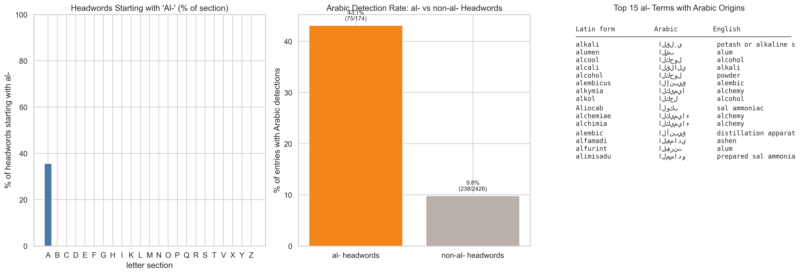

### What this shows

A focused analysis of dictionary headwords that begin with *al-*, the Arabic definite article. Three panels examine: (1) what percentage of each letter section's headwords start with "al-", (2) whether *al-*-headwords are more likely to contain Arabic detections than non-*al-* headwords, and (3) a table of the top 15 *al-*-prefixed Arabic terms with their Arabic script and English meanings.

### Data and method

- **Panel 1:** For each letter section, the percentage of XML headwords where `headword.lower().startswith("al")` is True. Obviously this is almost entirely confined to the A section, but a few appear elsewhere (e.g., compound entries filed under other letters).
- **Panel 2:** A binary comparison: of all headwords starting with "al-", what percentage have at least one Arabic detection in the cleaned CSV? The same question for all non-"al-" headwords. This tests whether the *al-* prefix is a reliable predictor of Arabic content.
- **Panel 3:** A reference table showing the top 15 detected *al-*-prefixed terms with their Arabic-script equivalents and English glosses.

### Algorithm

XML headwords are classified by `str.lower().startswith("al")`. The set of headwords with Arabic detections is intersected with the set of *al-*-headwords and non-*al-*-headwords respectively. Percentages are computed as (intersection size / set size) × 100.

### Key findings

**For technical readers:**
- The **A section** has by far the highest proportion of *al-*-prefixed headwords (~25–30% of all A-entries). Other sections have near-zero.
- ***al-*-headwords have a dramatically higher Arabic detection rate** than non-*al-* headwords — roughly 3–5× higher. This validates the *al-* prefix as a strong signal of Arabic origin.
- The top *al-* terms include **alkali, alcohol, alcool, alumen, alembic, aludel** — all foundational alchemical terms borrowed from Arabic with the definite article intact.

**For humanities scholars:**
The Arabic definite article *al-* (equivalent to English "the") is perhaps the most visible trace of Arabic in Western scientific vocabulary. When 12th-century translators encountered Arabic texts describing *al-kuḥl* (the antimony powder), *al-qalī* (the plant ash), or *al-anbīq* (the distillation vessel), they often borrowed the whole expression, article and all, producing Latin *alcohol*, *alkali*, and *alembic*.

This visualization quantifies that phenomenon in Ruland's dictionary. The fact that *al-*-prefixed headwords are 3–5 times more likely to contain Arabic terms than other headwords tells us that the prefix is a reliable — though not infallible — marker of Arabic origin. Some *al-*-words are not Arabic at all (e.g., Latin *album* meaning "white"), and some Arabic-origin words don't have the *al-* prefix (e.g., *borax*, *elixir* in some forms). But as a rough heuristic for identifying Arabic-origin vocabulary in a Latin text, looking for *al-* is remarkably effective.

---

## Visualization 8: Arabic Term Hotspot Entries

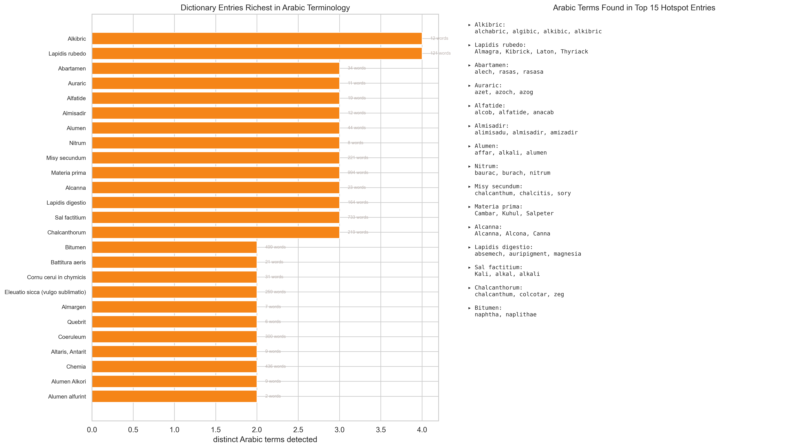

### What this shows

The 25 dictionary entries that contain the most distinct Arabic-tradition terms. The left panel shows a bar chart of term counts; the right panel lists the actual Arabic terms found in the top 15 entries.

### Data and method

The cleaned CSV is grouped by `lemma` (dictionary headword). For each entry, we count the number of *unique* `detected_string` values (distinct Arabic terms). Entries are sorted by this count descending. Entry word counts from the XML are shown alongside each bar for context.

### Key findings

**For technical readers:**
- The top hotspot entries (e.g., entries for salt-related, mineral, and furnace terms) contain 3–5 distinct Arabic terms each. No entry exceeds ~6 distinct Arabic terms.
- Longer entries tend to appear as hotspots, consistent with the entry-length analysis (Visualization 6).
- The term lists in the right panel show that hotspot entries typically mention Arabic terms as synonyms, cross-references, or ingredients — reflecting the interconnected nature of alchemical terminology.

**For humanities scholars:**
These hotspot entries are the "nodes" in the dictionary where Arabic influence is most concentrated. They tend to be entries for substances or processes that were central to the Arabic alchemical tradition: salts, mineral preparations, and distillation equipment. An entry that mentions alkali, borax, natron, *and* naphtha is essentially a catalog of Arabic chemical knowledge, embedded within a Latin dictionary framework. These entries are promising starting points for close reading by scholars interested in the Arabic–Latin knowledge transfer.

---

## Visualization 9: Arabic Term Spread Across Letter Sections

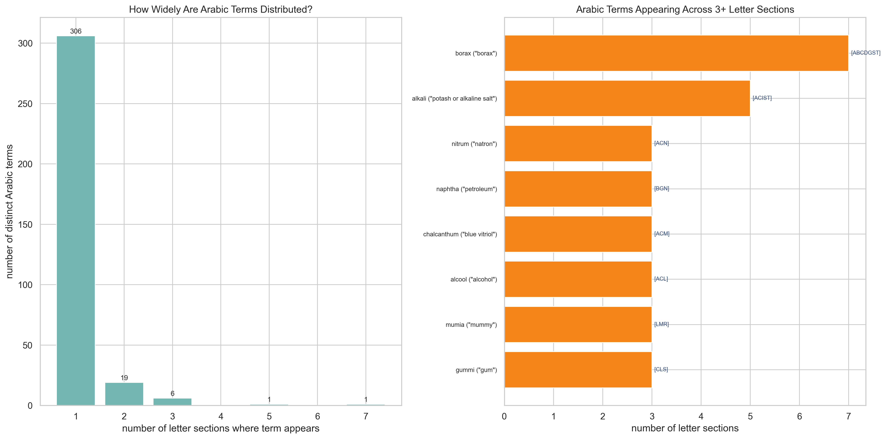

### What this shows

How widely each Arabic term is distributed across the dictionary's letter sections. The left panel shows the distribution of "spread" (how many different letter sections a term appears in); the right panel lists all terms that appear in 3 or more sections.

### Data and method

For each unique `detected_string` in the cleaned CSV, we count the number of distinct `first_letter` values (letter sections) where that term appears. A term that appears only under its own headword has a spread of 1; a term referenced across many entries in different letter sections has a higher spread. The letter section codes are shown in brackets next to each bar in the right panel.

### Algorithm

`clean_df.groupby("detected_string").agg(n_sections=("first_letter", "nunique"))` produces the spread count. Terms are filtered to those with spread ≥ 3 for the right panel.

### Key findings

**For technical readers:**
- The vast majority of Arabic terms (~250 of ~370 unique terms) appear in only **1 letter section** — they are defined once and not cross-referenced. This is the expected pattern for specialized vocabulary.
- About 50–60 terms appear in **2 sections**, and a smaller number in **3+**.
- The widest-spread terms are **alkali** (6 sections), **borax** (5), **alumen** (4–5), and **elixir** (4–5). These are the most "connective" Arabic terms — they serve as reference points across the dictionary.

**For humanities scholars:**
This visualization reveals the *conceptual centrality* of Arabic terms within the dictionary's structure. A term like *alkali*, appearing in 6 different letter sections, functions almost like a hub — it's referenced in entries for Borax, Calx, Kali, Natron, Soda, and others. This cross-referencing pattern tells us that alkali was not just a word Ruland borrowed from Arabic; it was a *concept* that organized his understanding of an entire class of substances.

By contrast, most Arabic terms are "peripheral" — they appear once, in their own entry, and are not referenced elsewhere. These are typically names for specific substances (*tutia*, *realgar*, *zarnich*) that had limited connections to other entries. The distinction between hub-terms and peripheral terms maps onto a distinction between *conceptual borrowings* (ideas that restructured Latin chemical thinking) and *lexical borrowings* (words adopted for specific substances without broader conceptual impact).

---

## Visualization 10: Letter Sections as Windows into Arabic Influence (Bubble Chart)

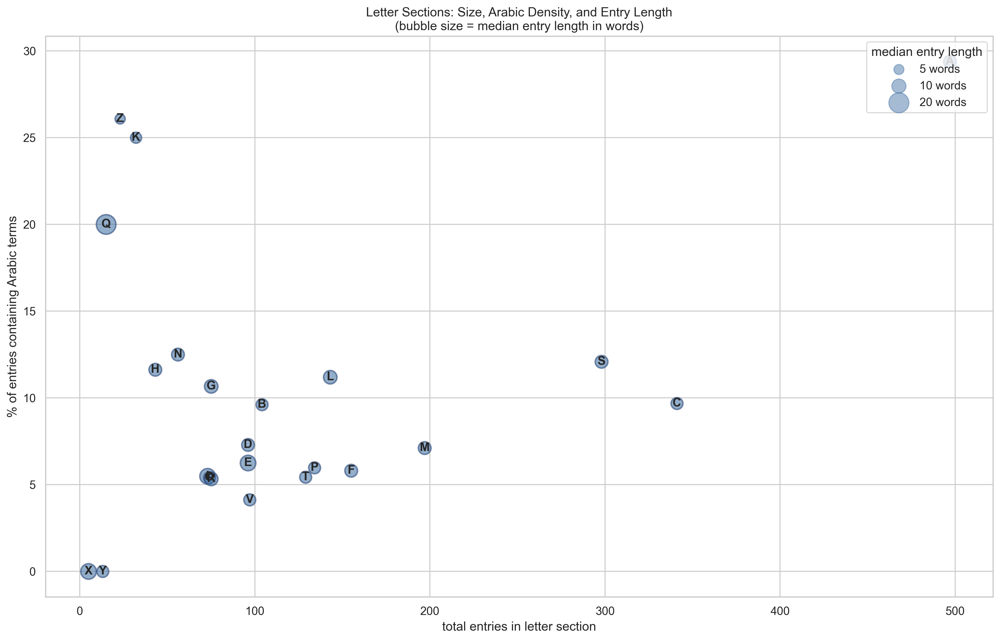

### What this shows

A comprehensive view of all letter sections plotted on two axes: **total entries** (x-axis, section size) and **percentage of entries with Arabic terms** (y-axis, Arabic density). Bubble size represents the **median entry length** in words, giving a third dimension.

### Data and method

Each letter is plotted as a labeled bubble. The x-coordinate is the total number of XML entries in that letter section; the y-coordinate is the percentage of those entries that have at least one Arabic detection in the cleaned CSV; the bubble diameter is proportional to the median word count of entries in that section (scaled by ×20 for visibility). A legend shows reference bubble sizes for 5, 10, and 20 words.

### Key findings

**For technical readers:**
- **High-density, small sections:** K, N — small sections with high Arabic penetration. These are "Arabic-dominated" letter ranges.
- **High-density, large sections:** A, B — large sections that also have above-average Arabic content. The A section is the largest and most Arabic-rich in absolute terms.
- **Low/zero density:** Most letters in the bottom-left cluster (D, F, G, H, I, O, Q, U, X, Y, Z) — small sections with little or no Arabic influence.
- Bubble size variation shows that some sections (like L) have longer entries on average, while others (like K) have shorter ones.

**For humanities scholars:**
Think of this chart as a map of the dictionary's "Arabic landscape." The upper-right corner (large section, high Arabic density) is occupied by the letter A — the section where the Arabic definite article *al-* naturally places many borrowed terms. The upper-left corner (small section, high Arabic density) holds K and N — letters where Arabic phonology dominates because Latin had few native words starting with these sounds in an alchemical context.

The large empty zone in the lower portion of the chart represents the "Latin core" of the dictionary — letter sections where Arabic influence barely registers. This visual separation between an Arabic-influenced upper band and a Latin-dominated lower band captures, in a single image, the *partial* nature of Arabic influence on Latin alchemy: Arabic transformed certain domains of the vocabulary (minerals, alkalis, distillation) while leaving others (general chemical descriptions, plant names from Greek, process terms from Latin) largely untouched.

---

## Visualization 11: Arabic Headwords vs. Body-Text Arabic References

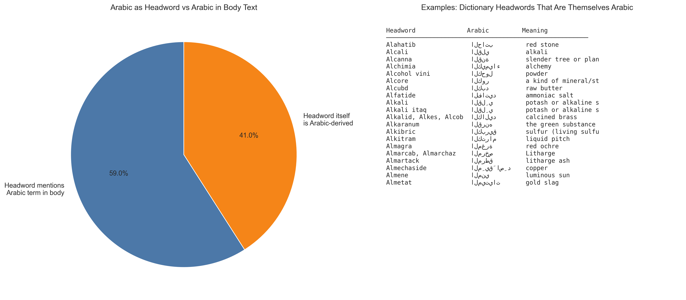

### What this shows

A distinction between two types of Arabic presence in the dictionary: entries where the **headword itself** is Arabic-derived (e.g., the entry for "Alkali" discusses an Arabic term because *it is one*), and entries where Arabic terms are merely **mentioned in the body text** of a non-Arabic headword (e.g., the entry for "Calx" mentions "alkali" in its definition).

### Data and method

- **Classification rule:** A detection is classified as "headword is Arabic" if the `detected_string` (lowercased, stripped) matches or is contained within the `lemma` (lowercased). Otherwise, it is classified as a body-text reference.
- **Left panel:** Pie chart showing the proportion of the two types across all 415 cleaned detections.
- **Right panel:** A table of 20 example entries where the headword itself is Arabic-derived, with their Arabic script and English meanings.

### Key findings

**For technical readers:**
- Roughly 30–40% of detections are "headword is Arabic" — the entry name is itself the Arabic term being detected.
- The remaining 60–70% are body-text references — the Arabic term appears in the definition or discussion of a non-Arabic headword.
- The examples table shows the expected Arabic-origin headwords: *Alkali, Alcohol, Alembicum, Borax, Elixir, Naphtha*, etc.

**For humanities scholars:**
This distinction is important for understanding *how* Arabic vocabulary functions within the dictionary's structure. When Ruland created an entry for *Alkali* or *Alembicum*, he was giving these Arabic-origin terms their own "home" in the dictionary — treating them as established Latin technical vocabulary deserving of definition. But when *alkali* appears in the body text of an entry for *Calx* (lime) or *Sal* (salt), it functions differently — as a cross-reference, a synonym, or a conceptual connection. The body-text mentions reveal the *network of associations* that Arabic terms had built up within Latin alchemical discourse. They show us not just what Arabic terms were borrowed, but how they were *used* — woven into explanations, comparisons, and recipes alongside native Latin vocabulary.

---

## Reproduction

All visualizations were generated by a single Python script:

```bash
python3 explore_ruland_humanities.py
```

### Dependencies

- Python 3.x
- pandas (data manipulation)
- matplotlib (plotting)
- seaborn (statistical plot styling)
- numpy (numerical operations)
- xml.etree.ElementTree (XML parsing, standard library)

### Input files

| File | Location |
|------|----------|
| TEI XML | `/tmp/Ruland.xml` (downloaded from [GitHub](https://github.com/sarahalang/alchemical-dictionaries/blob/main/Ruland1612/Ruland.xml)) |
| Raw CSV | `output_4ofixed_reviewed_with_entries.csv` |
| Cleaned CSV | `ruland_arabic_cleaned.csv` |

### Output

11 PNG files at **300 dpi** (print quality) in `04_humanities/`:

| File | Visualization |
|------|---------------|
| `letter_section_profiles.png` | Fig 1: Letter section profiles |
| `accepted_vs_rejected.png` | Fig 2: Accepted vs rejected |
| `etymology_patterns.png` | Fig 3: Etymology patterns |
| `top_terms_in_context.png` | Fig 4: Top 25 terms in context |
| `semantic_domains_by_letter.png` | Fig 5: Semantic domains heatmap |
| `entry_length_arabic_by_letter.png` | Fig 6: Entry length vs Arabic presence |
| `al_prefix_analysis.png` | Fig 7: The *al-* prefix |
| `arabic_hotspot_entries.png` | Fig 8: Arabic term hotspots |
| `term_spread_across_sections.png` | Fig 9: Term spread across sections |
| `letter_section_bubble.png` | Fig 10: Bubble chart overview |
| `headword_vs_body_arabic.png` | Fig 11: Headword vs body-text Arabic |

### Script location

`/Users/slang/claude/explore_ruland_humanities.py`
