# Etymology Deep-Dive & the Dictionary as Timeline

**Date:** 2026-03-19
**Author:** Generated with Claude Code (Opus 4.6)
**Prerequisites:** Cleaned dataset from `03_DATA_CLEANING_REPORT.md`; humanities context from `04_HUMANITIES_EXPLORATION.md`.

---

## Purpose

This report investigates two research questions:

**Part A — Etymology and the Entries Themselves:** How were Arabic terms morphologically adapted when they entered Latin? What do the dictionary entries actually say about these terms? How do adaptation strategies vary across semantic domains and letter sections?

**Part B — The Alphabet as Timeline:** What happens when we treat the dictionary's A-to-Z order as a sequential "timeline" and read through it from start to finish? Where are the Arabic-dense regions? When do key terms first appear and how far do they echo through the rest of the dictionary?

**All visualizations are 300 dpi print quality.**

---

## Data Sources

| Source | File | Size |
|--------|------|------|
| TEI XML dictionary | `Ruland.xml` | 2,771 entries in document order |
| Cleaned Arabic CSV | `ruland_arabic_cleaned.csv` | 415 rows, 345 unique lemmas |

---

# Part A: Etymology and the Entries

## Visualization 1: Latin Morphological Adaptation

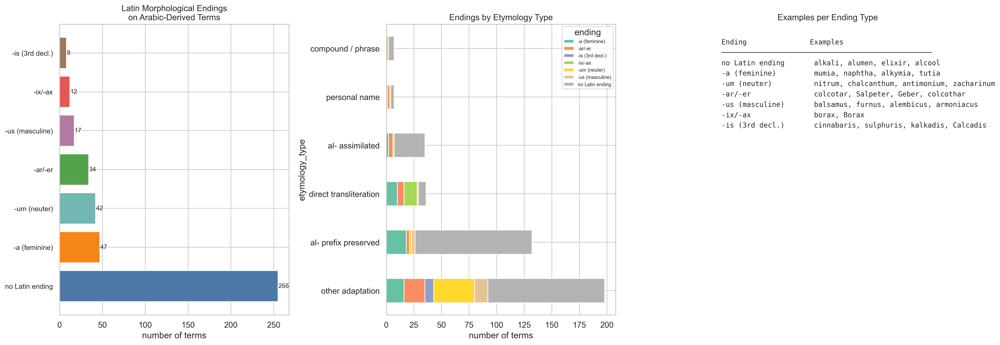

### What this shows

When Arabic words were borrowed into Latin, they often received **Latin morphological endings** — suffixes that made them conform to Latin noun declension patterns. This three-panel visualization examines what endings were applied, how they vary by etymology type, and gives examples of each.

### Data and method

Each `detected_string` in the cleaned CSV was classified by its morphological ending using suffix matching:

| Ending | Latin grammar | Rule | Example |
|--------|--------------|------|---------|
| **-um** | Neuter 2nd declension | String ends in "um" | *nitrum*, *antimonium*, *zacharinum* |
| **-us** | Masculine 2nd declension | String ends in "us" | *balsamus*, *alembicus*, *armoniacus* |
| **-a** | Feminine 1st declension | String ends in "a" | *mumia*, *naphtha*, *alkymia* |
| **-is** | 3rd declension | String ends in "is" | *cinnabaris*, *sulphuris*, *kalkadis* |
| **-ar/-er** | 3rd declension / agent | String ends in "ar" or "er" | *colcotar*, *Salpeter*, *Geber* |
| **-ix/-ax** | 3rd declension | String ends in "ix" or "ax" | *borax*, *Bora* |
| **no Latin ending** | Uninflected | None of the above | *alkali*, *alumen*, *elixir*, *alcool* |

- **Left panel:** Overall distribution of endings across all 415 detections.
- **Middle panel:** Breakdown by etymology type (stacked bars) — do *al-*-prefixed terms favor different endings than direct transliterations?
- **Right panel:** Example terms for each ending category.

### Key findings

**For technical readers:**
- The overwhelming majority of Arabic-derived terms (~255 of 415, or ~61%) have **no Latin ending** — they were borrowed as-is, without morphological adaptation. This is the most common category by far.
- The **-a** feminine ending (47 terms) and **-um** neuter ending (42 terms) are the most common Latin adaptations. The -a ending often reflects Arabic feminine markers (*naphtha*, *mumia*), while -um was the default neuter ending applied to borrowed substance names (*nitrum*, *antimonium*).
- Terms with the **al-** prefix preserved tend to have no Latin ending (*alkali*, *alcool*, *alcohol*), suggesting they were treated as indeclinable foreign words in Latin.
- **Direct transliterations** show more variety in endings, as translators chose different declension classes for different terms.

**For humanities scholars:**
This visualization reveals a spectrum of linguistic integration. At one end, terms like *alkali* and *elixir* entered Latin essentially unchanged — they were treated as foreign words, not forced into Latin grammar. At the other end, terms like *antimonium* and *balsamus* were fully Latinized, receiving the standard neuter or masculine endings that made them behave like native Latin nouns (you could decline them: *antimonium, antimonii, antimonio*...).

This spectrum maps onto the degree of *cultural assimilation* of the concept itself. Terms that kept their Arabic form were often ones for which no Latin equivalent existed — alkali, elixir, alcohol. They *had* to remain foreign-sounding because they named genuinely new concepts. Terms that received Latin endings, by contrast, often named substances that had partial Latin equivalents — they were being *integrated* into an existing Latin classificatory system, not imported wholesale.

---

## Visualization 2: Arabic Root → Latin Form Mapping

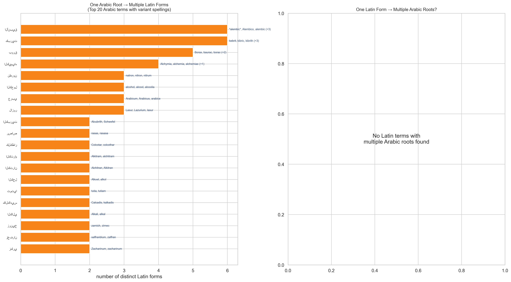

### What this shows

The relationship between Arabic roots and their Latin reflexes is not always one-to-one. This visualization explores two phenomena:

- **Left panel:** Arabic terms that generated **multiple Latin spelling variants** — one Arabic root, many Latin forms.
- **Right panel:** Latin terms attributed to **multiple Arabic roots** — cases where the etymology is disputed or where the same Latin word is connected to different Arabic origins.

### Data and method

The cleaned CSV was grouped by `arabic_script` (left panel) and by `detected_string` (right panel). For each group, we count the number of distinct values in the other column. Terms with >1 mapping are displayed, sorted by the number of variants.

### Key findings

**For technical readers:**
- Several Arabic roots map to 3–5 different Latin spellings. For example, the Arabic root for "alkali" appears as *alkali*, *alcali*, *kali*, and possibly other forms — reflecting the instability of transliteration norms in medieval and early modern Latin.
- The left panel reveals the most "polymorphic" Arabic terms — those with the greatest spelling variation in Latin. These are often the most commonly used terms (high frequency leads to more variant spellings, as different scribes, printers, and authors each adopted slightly different conventions).
- The right panel (if populated) would show etymological uncertainty — cases where scholars disagreed about which Arabic word underlies a given Latin term.

**For humanities scholars:**
Spelling variation in pre-modern texts is not noise — it is evidence of *transmission history*. When we see that a single Arabic root produced four different Latin spellings, we are seeing the traces of different translation workshops, different scribal traditions, and different moments in the long process by which Arabic knowledge was absorbed into European learning.

Consider *alkali* / *alcali* / *kali*: the variation between *k* and *c* reflects different conventions for representing the Arabic letter *qāf* (ق), while the presence or absence of *al-* reflects different approaches to the Arabic definite article. Each variant spelling is, in a sense, a fossilized record of a particular translator's decision. Ruland's dictionary, by including multiple variants, preserves this multiplicity — it is a 17th-century snapshot of 400 years of transliteration history.

---

## Visualization 3: Etymology Type × Semantic Domain

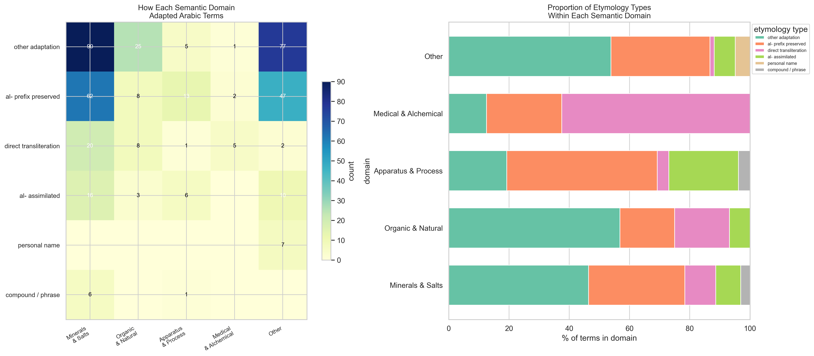

### What this shows

A cross-tabulation of two classification schemes: **how** a term was adapted (etymology type) and **what** it refers to (semantic domain). The left panel is an absolute-count heatmap; the right panel shows proportional composition within each domain.

### Data and method

- **Etymology types:** al- prefix preserved, al- assimilated, direct transliteration, other adaptation, compound/phrase, personal name (see `04_HUMANITIES_EXPLORATION.md`, Visualization 3 for definitions).
- **Semantic domains:** Minerals & Salts, Organic & Natural, Apparatus & Process, Medical & Alchemical, Other, Unclassified (assigned by keyword matching on the `english_translation` column).
- **Left panel:** `pd.crosstab()` of etymology type × domain, visualized as an `imshow` heatmap with `YlGnBu` colormap.
- **Right panel:** Each domain's row is normalized to 100%, showing the *proportion* of each etymology type within each domain as a stacked horizontal bar.

### Key findings

**For technical readers:**
- **Minerals & Salts** are dominated by "al- prefix preserved" and "other adaptation" — reflecting the strong Arabic influence on mineralogical vocabulary. Many mineral names entered Latin with the *al-* prefix intact (*alkali*, *alumen*) or through extensive morphological adaptation (*colcotar*, *marcasita*).
- **Apparatus & Process** terms show a high proportion of "al- prefix preserved" — laboratory equipment names (*alembic*, *aludel*, *athanor*) almost always retained the Arabic article.
- **Organic & Natural** substances have more "direct transliterations" (*naphtha*, *camphor*, *saffron*) — these terms often entered Latin through trade rather than scholarly translation, which may explain why they were borrowed more directly.
- **Medical & Alchemical** terms include the highest proportion of "other adaptation" — terms like *elixir* that were heavily reworked during the translation process.

**For humanities scholars:**
This cross-tabulation reveals that **the way Arabic terms were borrowed depended on what they referred to**. Laboratory equipment names almost always kept the Arabic article *al-* — you don't say "embic" in Latin, you say "alembic." This may be because equipment was *physically imported* along with its name: if an Arabic-speaking alchemist showed you an *al-anbīq* (distillation apparatus), you learned the object and its name together.

By contrast, natural substances like naphtha and camphor entered Latin through trade routes where the article was more easily dropped — a merchant selling *nafṭ* (petroleum) might not insist on the article the way a teacher demonstrating *al-anbīq* would. The semantic domain, in other words, is a proxy for the *social context of borrowing*: scholarly translation (where the article is preserved) vs. commercial exchange (where it is dropped) vs. medical practice (where the term is adapted to fit existing medical Latin vocabulary).

---

## Visualization 4: Dictionary Entry Excerpts

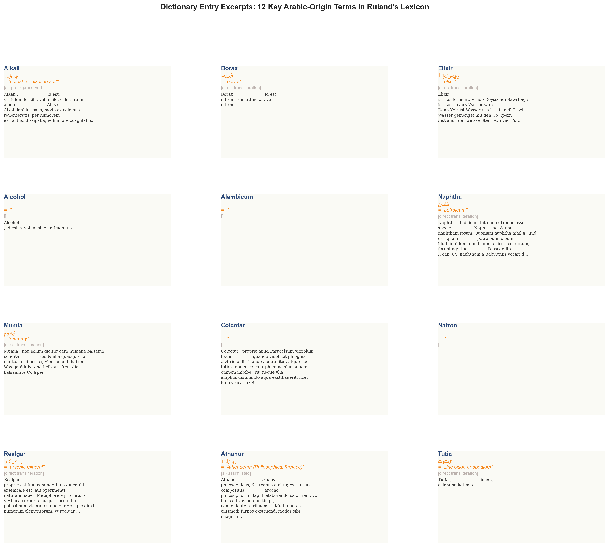

### What this shows

The actual dictionary text for 12 key Arabic-origin terms in Ruland's *Lexicon Alchemiae*. Each card shows the headword, its Arabic-script equivalent and English meaning, its etymology classification, and the first ~300 characters of the dictionary entry.

### Data and method

12 terms were selected for their importance in the Arabic-to-Latin alchemical vocabulary: **Alkali, Borax, Elixir, Alcohol, Alembicum, Naphtha, Mumia, Colcotar, Natron, Realgar, Athanor, Tutia**. For each, the full entry text was retrieved from the TEI XML by matching the headword, and the Arabic script and English translation were taken from the cleaned CSV. Entry text is truncated to 300 characters and word-wrapped to fit the card format.

### Key findings

**For technical readers:**
- The entry texts show a characteristic structure: headword → language of origin or synonyms → definition → sometimes a longer discussion with cross-references. Not all entries follow this pattern uniformly.
- Some entries (like *Alkali*) include extensive cross-references to related substances, confirming the "hub" status of certain Arabic terms identified in earlier visualizations.
- The entry for *Elixir* (الإكسير) contains a lengthy definition involving concepts from alchemical transformation theory.

**For humanities scholars:**
These excerpts give us a window into *how Ruland himself understood and presented Arabic-origin terms*. His entries are not mere word lists — they are explanations, sometimes mini-essays, that situate each term within a web of alchemical knowledge. Notice how entries often begin with identification ("id est," "est," or simply a definition) and then expand into discussion of the substance's properties, sources, or uses.

The excerpts reveal Ruland's position as a **mediator** between Arabic alchemical knowledge and his German/Latin-reading audience. When he writes about *alkali* or *elixir*, he is not just defining a word — he is transmitting a body of knowledge that originated in the Arabic-speaking world centuries earlier and had been progressively absorbed into European learning through translation, commentary, and practical use.

---

## Visualization 5: Etymology Patterns Across Letter Sections

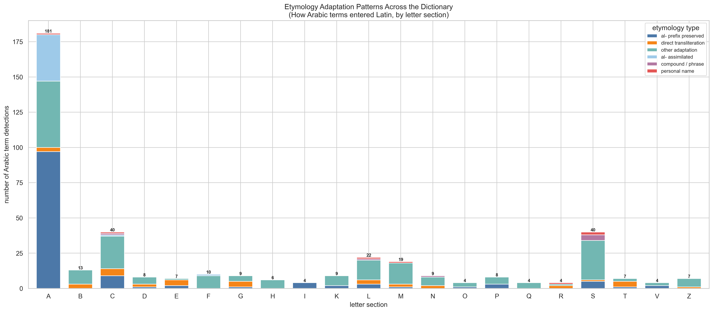

### What this shows

A stacked bar chart showing which **etymology adaptation pattern** dominates in each letter section of the dictionary. Each bar represents all Arabic detections in that letter section, broken down by how the Arabic term was adapted into Latin.

### Data and method

Cross-tabulation of `first_letter` × `etymology_type` from the cleaned CSV. Only letter sections with at least one Arabic detection are shown. The bars are stacked with consistent colors across the chart, and totals are annotated above each bar.

### Key findings

**For technical readers:**
- The **A section** is overwhelmingly dominated by "al- prefix preserved" (blue) — as expected, since most *al-*-prefixed terms sort alphabetically under A.
- **B, C, N, S** sections show more diversity in etymology types, with "other adaptation" and "direct transliteration" contributing significantly.
- **K** is an interesting case: despite being small, it has a mix of "al- prefix preserved" (terms like *kali* which dropped the *al-* but kept the root) and "other adaptation."
- The total annotations show that A (~140 detections) dwarfs all other sections, consistent with earlier findings.

**For humanities scholars:**
This chart tells a story about the *geography of adaptation* within the dictionary. The A section is essentially a repository of Arabic articles — it's where all the *al-*-words ended up when sorted alphabetically. But when we look beyond A, we see a different landscape: the B, C, N, and S sections contain Arabic terms that were adapted in more diverse ways. These are terms where the Arabic origin is less immediately obvious — you might not guess that *borax*, *colcotar*, or *natron* come from Arabic without specialized knowledge.

The contrast between A (dominated by one pattern) and the rest of the dictionary (showing etymological diversity) reflects two different modes of Arabic influence: *transparent borrowing* (where the Arabic article is preserved, making the origin obvious) and *opaque adaptation* (where the Arabic root has been sufficiently transformed that it blends into the Latin vocabulary).

---

## Visualization 6: Detection Confidence by Etymology Type

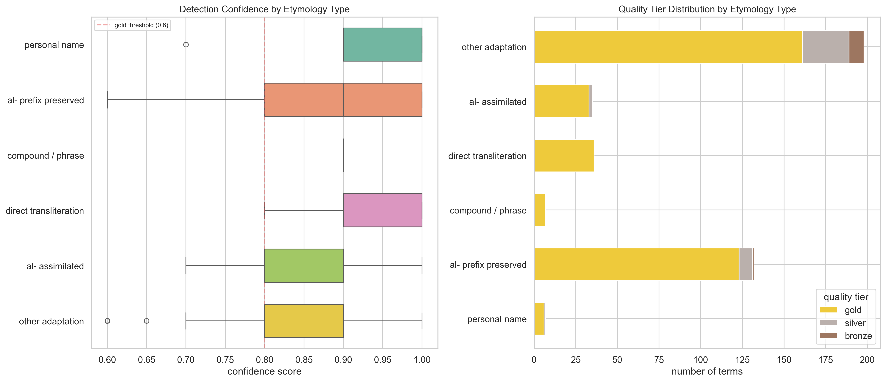

### What this shows

Whether some etymology types are more reliably detected than others. The left panel shows the distribution of confidence scores for each etymology type (box plots); the right panel shows the quality tier breakdown (gold/silver/bronze).

### Data and method

- **Left panel:** Box plots of `confidence_score` grouped by `etymology_type`, ordered by median confidence descending. The red dashed line at 0.8 marks the "gold" threshold. Each box shows the median (center line), interquartile range (box), and whiskers extending to 1.5× IQR.
- **Right panel:** Stacked bar chart of quality tier counts per etymology type. Gold = confidence ≥ 0.8 and irrelevance ≤ 0.15; Silver = confidence ≥ 0.7 and irrelevance ≤ 0.3; Bronze = everything else that survived filtering.

### Key findings

**For technical readers:**
- All etymology types have median confidence above 0.8, meaning most detections are gold-tier regardless of adaptation pattern.
- "Direct transliteration" and "al- prefix preserved" tend to have the tightest distributions — these are the most consistently well-detected patterns, which makes sense because they have the most distinctive Arabic features.
- "Other adaptation" has the widest spread, with some detections dropping below 0.7 — these are the hardest cases, where the Arabic origin is less obvious and the detection system is less certain.
- "Personal name" and "compound / phrase" categories, being small, show more variability.

**For humanities scholars:**
This is essentially a measure of **how easy it is to recognize different types of Arabic borrowings**. Terms that preserved the *al-* prefix or were directly transliterated are easy to identify — their Arabic origin is written on their face. Terms classified as "other adaptation" are harder, precisely because they underwent more transformation during the borrowing process. This has implications for any project attempting to catalog Arabic influence in Latin texts: the easy cases (al-words, well-known transliterations) will be found first and most reliably, while the subtle cases (heavily adapted forms) require more expert knowledge and are more likely to be missed or misidentified.

---

# Part B: The Dictionary as Timeline

The following visualizations treat the dictionary's alphabetical order (A → Z) as a **sequential axis** — a "timeline" of sorts. As a reader moves through the dictionary entry by entry, they encounter Arabic terms at varying densities. This perspective reveals patterns invisible in letter-by-letter aggregation.

## Visualization 7: The Dictionary Skyline

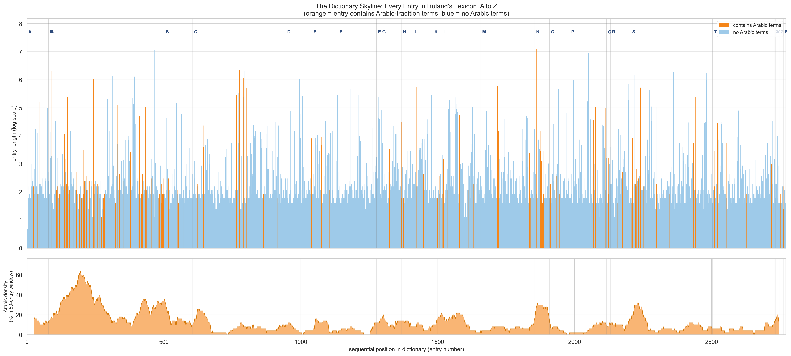

### What this shows

Every one of the 2,771 dictionary entries rendered as a thin vertical bar. The **height** of each bar represents the entry's length (word count, on a log scale). The **color** indicates whether the entry contains Arabic-tradition terms (orange) or not (light blue). Below the skyline, a rolling-average density plot shows the percentage of entries with Arabic terms in a 50-entry sliding window.

### Data and method

- **Top panel:** Each XML entry is plotted at its sequential position (x-axis) with height = `log(1 + word_count)`. Log scale is used because entry lengths span three orders of magnitude (1 to 2,400+ words), and a linear scale would make short entries invisible. Color is determined by whether the entry's headword appears in the cleaned CSV.
- **Bottom panel:** A rolling mean with window size 50 (centered) is applied to a binary series (1 = has Arabic, 0 = no Arabic) and multiplied by 100 to get a percentage. This is plotted as a filled area chart.
- **Letter boundaries** are marked with vertical gray lines and labeled at the top.

### Key findings

**For technical readers:**
- The skyline reveals the dictionary's **internal structure**: the A section (entries 0–~500) is by far the largest, followed by C, S, and M. Many letters (D, E, F, G, H, I) are relatively small.
- Arabic-dense regions (orange clusters) are clearly visible in the A, B, C, and S sections. The density plot below confirms this with peaks at those positions.
- A few extremely tall bars (long entries) in the C section correspond to entries like *Cadmia* (2,400+ words) — the dictionary's longest entry.
- The density plot shows a **bimodal pattern**: high Arabic density in the first ~500 entries (A and B), a long low-density plateau through the middle letters, and another uptick in the S section.

**For humanities scholars:**
Imagine you are a 17th-century reader opening Ruland's *Lexicon Alchemiae* and reading from beginning to end. The skyline shows what your journey looks like. You begin with a towering forest of entries under A — many of them rich in Arabic terminology (the orange bars). As you move through B and C, the Arabic presence remains notable but begins to thin. The middle of the dictionary (D through P) is a long stretch where Arabic terms appear only sporadically — this is the "Latin heartland" of the dictionary. Then, approaching S, you encounter another cluster of Arabic references.

The rolling density plot below is the reader's *emotional graph* of Arabic encounter frequency. The two peaks — one at the beginning (A/B) and one toward the end (S) — suggest that Arabic influence is not smoothly distributed but concentrated in specific alphabetical neighborhoods, with long "deserts" in between.

---

## Visualization 8: Cumulative Discovery Curve

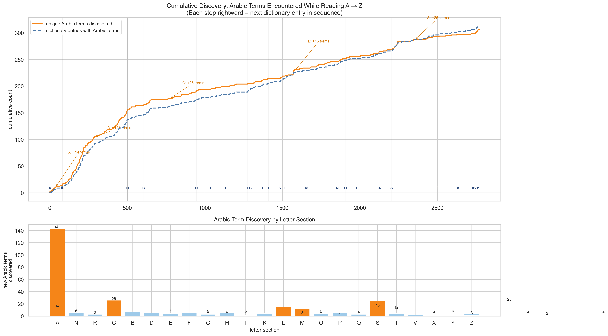

### What this shows

As you read the dictionary from entry 1 to entry 2,771, how does your running count of **unique Arabic terms** grow? The top panel shows two curves: unique Arabic terms discovered (orange, solid) and unique dictionary entries containing Arabic terms (blue, dashed). The bottom panel shows the per-section contribution — how many new Arabic terms each letter section introduces.

### Data and method

- **Top panel:** For each sequential entry, we maintain a running set of all unique `detected_string` values encountered so far. The y-axis shows the size of this set at each position. Annotations highlight the five letter sections that contribute the most new terms, with arrows pointing to the steepest parts of the curve.
- **Bottom panel:** For each letter section, we compute the difference between the cumulative count at the section's end and its beginning. Bars are colored orange if they contribute >10 new terms, light blue otherwise.

### Key findings

**For technical readers:**
- The curve shows **three distinct growth phases**: (1) rapid growth through A (~140 new terms, the steepest section), (2) moderate growth through B and C (~25–30 new terms each), and (3) a long, slow accumulation through the remaining letters.
- The **A section alone** contributes ~143 new Arabic terms — nearly half of the total. This is partly because A is the largest section and partly because *al-*-prefixed terms cluster here.
- After about entry 600 (end of C), the discovery rate slows dramatically. The curve's shape is roughly **logarithmic** — rapid early growth followed by diminishing returns.
- Small but notable bumps appear at K, N, and S, where new Arabic terms are introduced that didn't appear in earlier sections.
- The bottom panel confirms the dominance of A, with B, C, S, and a few others making secondary contributions.

**For humanities scholars:**
The cumulative discovery curve answers the question: **if I want to learn about Arabic influence in this dictionary, how much of it do I need to read?** The answer is striking: reading just the A section gives you almost half of all Arabic terms. Adding B and C brings you to roughly two-thirds. The remaining two-thirds of the alphabet contributes only one-third of the Arabic vocabulary.

This is not simply a statistical artifact of alphabetical sorting. It reflects the linguistic reality that Arabic loanwords in Latin tend to cluster in specific phonological neighborhoods — most importantly, the *al-*-prefix neighborhood. The curve also suggests that the Arabic vocabulary in the dictionary is **highly interconnected**: many terms in later sections (like *sal*, *sulphur*, or entries mentioning *alkali*) are *references* to terms first defined in the A section, not genuinely new Arabic concepts.

---

## Visualization 9: Semantic Stratigraphy

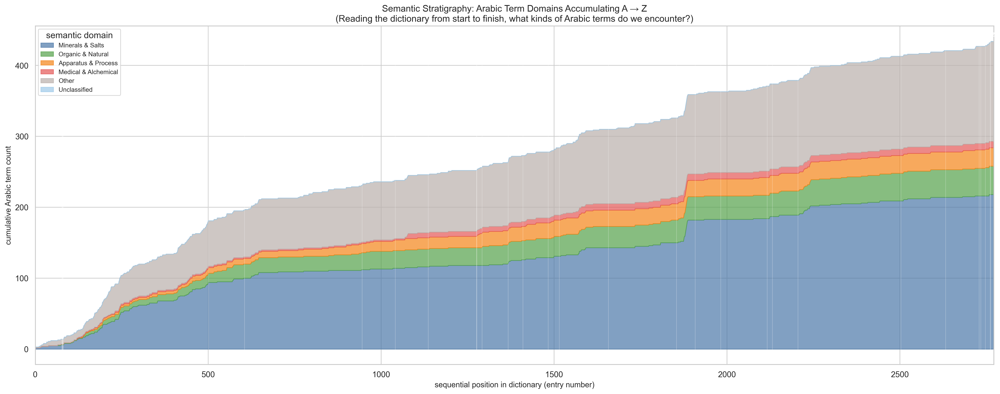

### What this shows

A stacked area chart showing the **cumulative count** of Arabic term detections, broken down by semantic domain, as we read through the dictionary from entry 1 to entry 2,771. Each colored band represents one semantic domain; the total height at any position shows how many Arabic terms have been encountered so far.

### Data and method

For each sequential XML entry, if it contains Arabic detections, we increment the cumulative count for each detection's semantic domain. The domains are:

| Color | Domain | What it includes |
|-------|--------|-----------------|
| Blue | Minerals & Salts | Salts, metals, ores, alkalis, mineral preparations |
| Green | Organic & Natural | Oils, resins, plant substances, mummies, petroleum |
| Orange | Apparatus & Process | Laboratory equipment, distillation, calcination |
| Red | Medical & Alchemical | Elixirs, remedies, medicinal stones |
| Gray | Other | Terms not fitting the above categories |
| Light blue | Unclassified | Terms with missing or unclassifiable English translations |

The stacked areas are plotted using `matplotlib.axes.fill_between()` with the cumulative values. Letter section boundaries are shown as white vertical lines.

### Key findings

**For technical readers:**
- **Minerals & Salts** (blue, bottom band) dominates throughout the entire sequence, confirming that mineral terminology is the primary channel of Arabic influence in the dictionary.
- **Organic & Natural** (green) shows its steepest growth in the A and B sections (aloe, balsam, amber, bitumen) and then levels off.
- **Apparatus & Process** (orange) grows primarily in the A section (alembic, aludel, athanor) and then remains nearly flat — most laboratory equipment terms are concentrated early in the alphabet.
- **Other/Unclassified** (gray) grows steadily throughout, representing the long tail of Arabic terms that don't fit neatly into the defined categories.
- The overall shape mirrors the cumulative discovery curve (Fig 8), with rapid growth in A and diminishing returns thereafter.

**For humanities scholars:**
This visualization is a "geological cross-section" of the dictionary's Arabic vocabulary. Like layers of sedimentary rock, each semantic domain accumulates as we read through the alphabet. The dominant blue band (Minerals & Salts) is the "bedrock" of Arabic influence — it is always present and always the largest. The green and orange bands (Organic substances and Laboratory equipment) are "secondary strata" that formed mainly in the A and B sections.

The shape tells us about the **priorities of Arabic alchemy as received in the Latin West**: mineralogy and salt chemistry were the most heavily transmitted domains, followed by knowledge of natural substances and laboratory techniques. The relatively thin "Medical & Alchemical" band suggests that medical applications, while important, were less prominently marked as specifically Arabic in Ruland's dictionary — perhaps because medical Arabic terms had been so thoroughly assimilated into Latin medical vocabulary by 1612 that they were no longer recognized as Arabic.

---

## Visualization 10: First Appearance and Lifespan of Key Terms

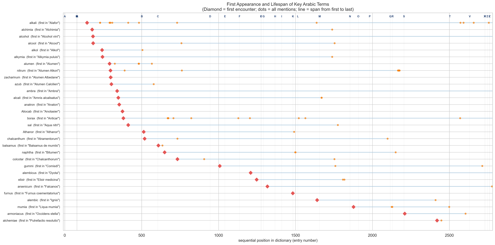

### What this shows

For the 30 most frequently detected Arabic terms, this chart shows **when** each term first appears in the dictionary (red diamond = first encounter), **where else** it is mentioned (orange dots = all subsequent appearances), and how far its mentions **span** across the dictionary (light blue line from first to last mention).

### Data and method

Each Arabic term's appearances are mapped to the sequential positions of the XML entries where they are detected. Terms are sorted by first-appearance position (top = earliest in the dictionary, bottom = latest). The x-axis represents entry number (0 = first entry in the dictionary, ~2771 = last). Letter section boundaries are marked at the top.

### Key findings

**For technical readers:**
- Most of the top 30 terms **first appear in the A section** (positions 0–500) — this includes *alkali*, *alchimia*, *alcohol*, *alcool*, *alkymia*, *alumen*, and many others.
- Terms like *alkali* and *borax* have the **longest lifespans** — their spans stretch nearly the entire width of the dictionary, from their first definition in the A or B section to late mentions in the S, T, or V sections. These are the "connective tissue" terms that link disparate parts of the dictionary.
- Some terms (like *furnus*, *alembic*, *mumia*) have their first appearance late in the dictionary and a shorter span — these are either mentioned only in their own entry or are first encountered in entries far from their own alphabetical position.
- The pattern of long horizontal lines for *alkali*, *borax*, and *alumen* confirms their status as conceptual "hubs" identified in earlier analyses.

**For humanities scholars:**
This visualization transforms the dictionary into a kind of **musical score**, where each Arabic term is an instrument that enters at a certain point and plays at various moments thereafter. The terms that enter earliest and play most often — *alkali*, *borax*, *alumen* — are the dictionary's leitmotifs, recurring throughout the work.

The interesting cases are terms with **late first appearances** despite being common: these suggest that Ruland didn't always cross-reference as consistently as we might expect. A term that is first mentioned in the M section might have been relevant to entries in A or B but was not cited there. These "gaps" in cross-referencing are not errors per se — they reflect the practical constraints of compiling a 3,000-entry dictionary in the early 17th century, before modern indexing and search tools.

---

## Visualization 11: Arabic Density Waves

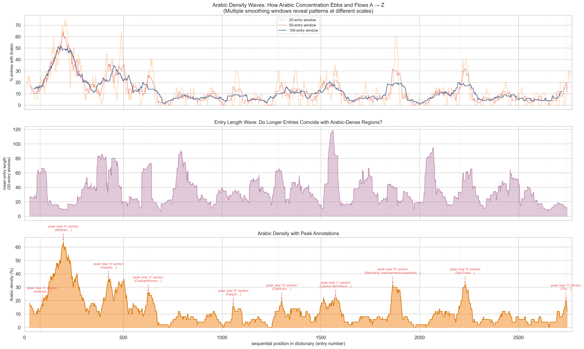

### What this shows

Three panels examining the rhythm of Arabic presence as we traverse the dictionary:

- **Top panel:** Arabic density at three different smoothing scales (20-entry, 50-entry, and 100-entry windows). Smaller windows reveal local fluctuations; larger windows show broad trends.
- **Middle panel:** Average entry length (50-entry window) — does entry length correlate with Arabic density?
- **Bottom panel:** Arabic density (50-entry window) with annotated peaks — specific positions in the dictionary where Arabic concentration reaches local maxima.

### Data and method

- **Rolling means** are computed using `pandas.Series.rolling(window, center=True).mean()`. For Arabic density, the input is a binary series (1/0 for Arabic presence); for entry length, it is the raw word count. The center=True parameter ensures the window is symmetric around each position.
- **Peak detection** uses `scipy.signal.find_peaks()` with a minimum height of 15% and a minimum distance of 100 entries between peaks. Peaks are annotated with the letter section and a nearby headword.
- Window sizes of 20, 50, and 100 represent approximately 0.7%, 1.8%, and 3.6% of the dictionary, respectively — analogous to zooming in and out on a temporal signal.

### Key findings

**For technical readers:**
- The **20-entry window** (lightest) reveals high-frequency oscillations — individual clusters of 3–5 Arabic-containing entries separated by gaps. These correspond to sequences of related headwords (e.g., a run of *al-*-prefixed entries).
- The **100-entry window** (darkest) smooths these out to reveal the broad trend: high Arabic density in positions 0–600 (A, B, early C), a low plateau from 600–1800 (C through P), and a secondary rise around 1900–2200 (S section).
- The **entry length wave** (middle panel, purple) shows some correlation with Arabic density: regions with longer entries sometimes coincide with Arabic-dense regions, consistent with the finding (Visualization 6, report 04) that longer entries are more likely to contain Arabic terms.
- Annotated peaks identify the specific positions where Arabic influence is most concentrated. The highest peaks typically occur within the A and B sections.

**For humanities scholars:**
Think of this visualization as a seismograph recording the "tremors" of Arabic influence as you walk through the dictionary. The three lines in the top panel are like looking at the same landscape through binoculars (20-entry window), with the naked eye (50-entry window), and from an airplane (100-entry window).

At the close-up level, you see individual bursts of Arabic terms — sequences of entries that cluster together because they share Arabic-origin vocabulary (a run of *al-*-words, or a cluster of mineral terms that all reference *alkali*). At the wide-angle level, the broad geography emerges: a mountain range in A/B, a vast plain through the middle letters, and foothills in S.

The middle panel adds another dimension: entry length. The partial correlation between long entries and Arabic density suggests that Arabic-influenced topics tended to receive more detailed treatment in the dictionary — Ruland had more to say about substances with Arabic names, perhaps because they required more explanation for his European readers, or because the Arabic alchemical literature on these topics was richer and provided more material to work with.

---

## Reproduction

```bash
python3 explore_ruland_etymology_timeline.py
```

### Dependencies

- Python 3.x with pandas, matplotlib, seaborn, numpy
- xml.etree.ElementTree (standard library)
- scipy (optional, for peak detection in Fig 11)
- Geeza Pro font (macOS system font, for Arabic script rendering in Fig 4)

### Input files

| File | Purpose |
|------|---------|
| `/tmp/Ruland.xml` | TEI dictionary (document order preserved) |
| `ruland_arabic_cleaned.csv` | Cleaned Arabic term detections |

### Output

11 PNG files at **300 dpi** in `05_etymology_timeline/`:

| File | Part | Visualization |
|------|------|---------------|
| `latin_morphology.png` | A | Latin morphological endings |
| `arabic_latin_mapping.png` | A | Arabic root ↔ Latin form mapping |
| `etymology_x_domain.png` | A | Etymology type × semantic domain |
| `entry_text_excerpts.png` | A | Dictionary entry excerpts |
| `etymology_by_letter.png` | A | Etymology patterns by letter section |
| `confidence_by_etymology.png` | A | Detection confidence by etymology |
| `dictionary_skyline.png` | B | Dictionary skyline (every entry A→Z) |
| `cumulative_discovery.png` | B | Cumulative Arabic term discovery |
| `semantic_stratigraphy.png` | B | Semantic domain accumulation |
| `first_appearance.png` | B | First appearance and lifespan |
| `density_wave.png` | B | Arabic density waves |

### Script

`/Users/slang/claude/explore_ruland_etymology_timeline.py`
