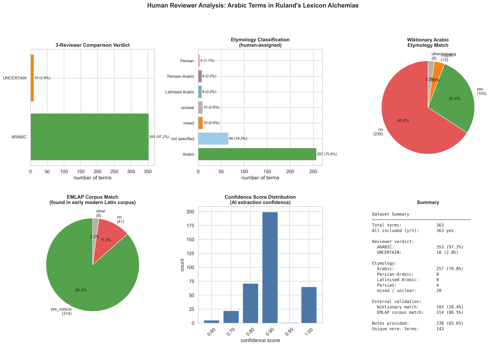
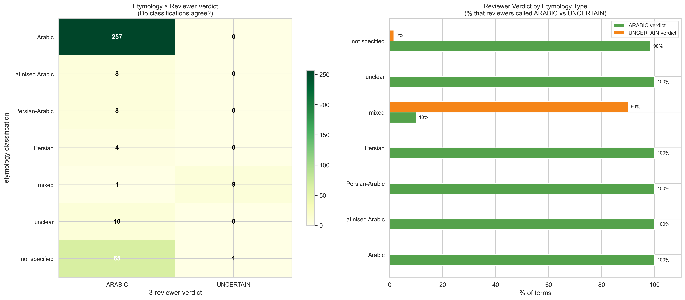
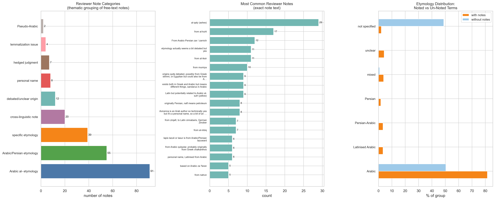
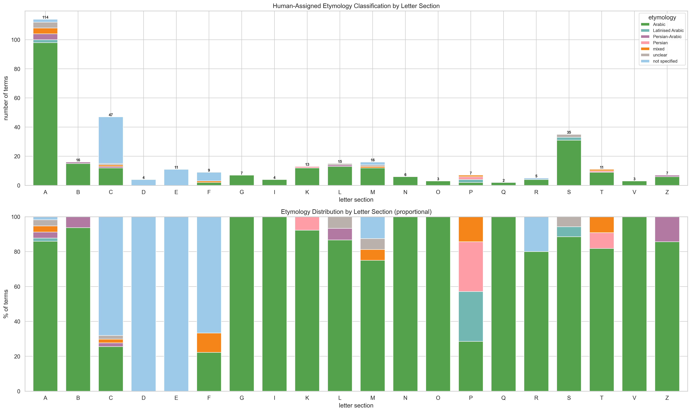
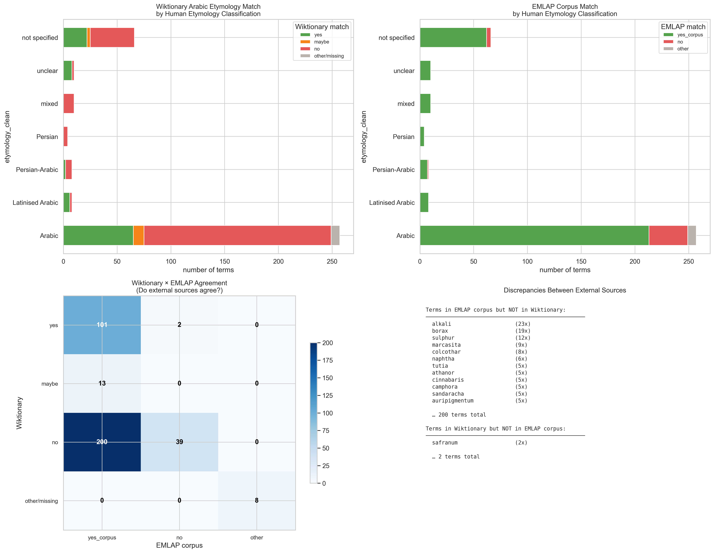
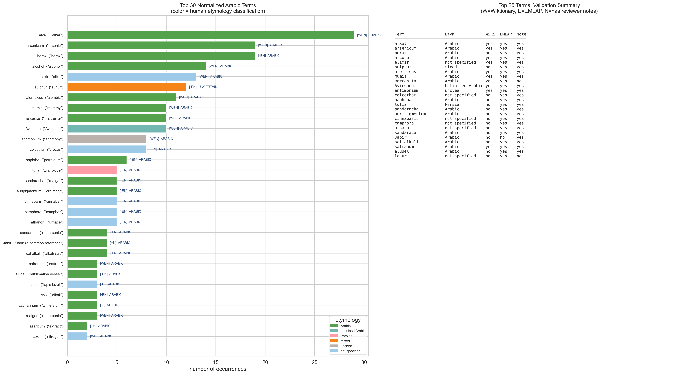
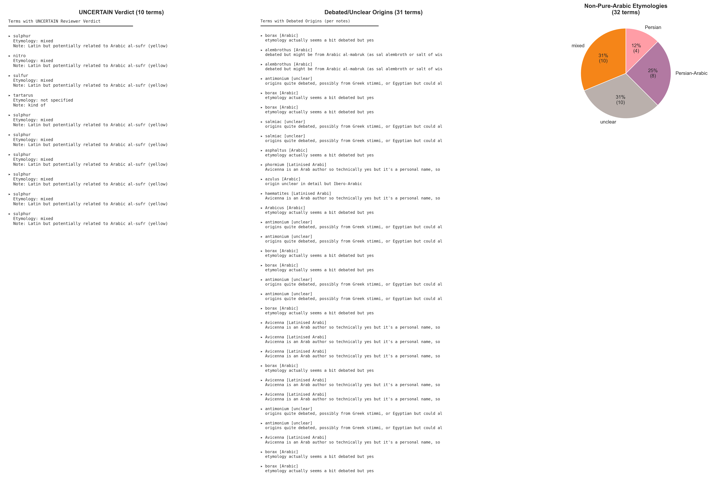
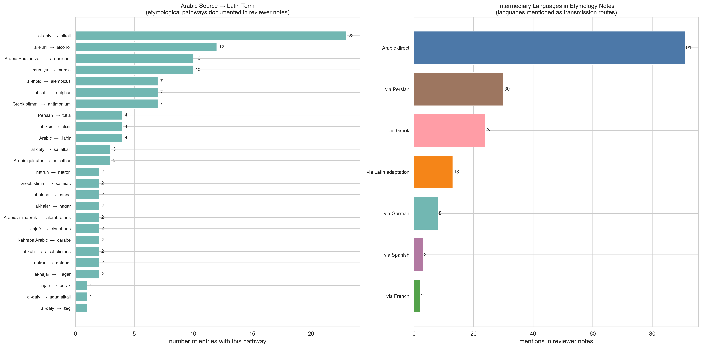
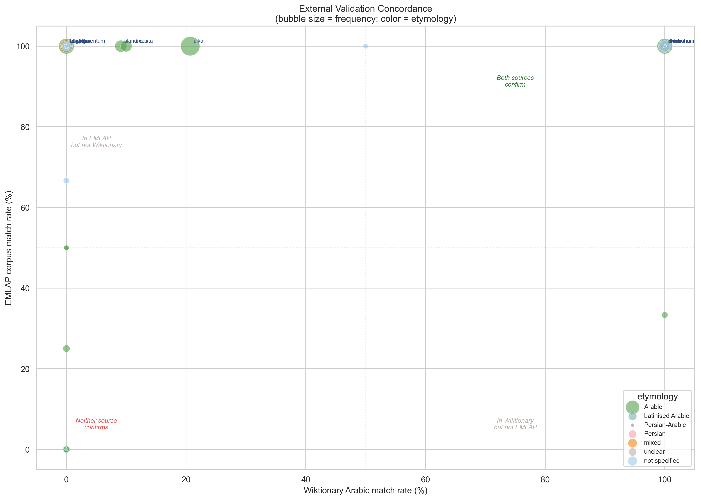
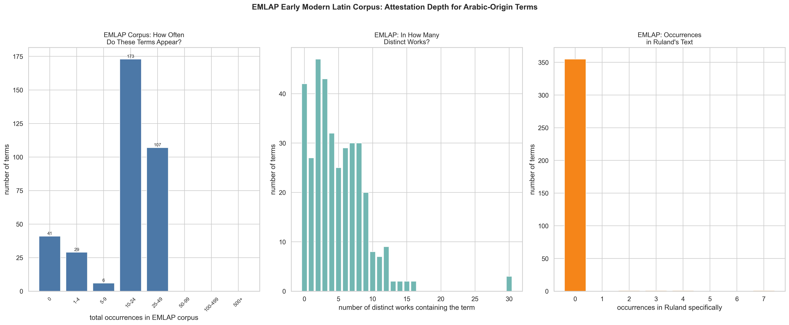

# Human Reviewer Analysis: Verdicts, Etymology, and Notes

**Date:** 2026-03-19
**Author:** Generated with Claude Code (Opus 4.6)
**Source file:** `Final Single Sheet - 2026-01-27_reviewerCopy_reducedFinalSingleSheet.tsv` (363 rows, 25 columns)

---

## Purpose

This report analyses the **human-curated** layer of the Arabic term extraction — the fields that three human reviewers produced: their verdict on whether each term is Arabic, their etymology classification, their free-text notes explaining etymological reasoning, and external validation against Wiktionary and the EMLAP early modern Latin corpus.

**For humanities scholars:** While earlier reports (01–05) focused on AI-extracted data and its quality, this report examines what *human experts* said about the same terms. The reviewer verdicts, etymology classifications, and notes represent scholarly judgment — informed opinions about each term's linguistic origin, transmission pathway, and degree of certainty.

**All visualizations are 300 dpi print quality.**

---

## Data Source

The TSV contains 363 terms that survived a reduction/review process. Key columns:

| Column | Description | Coverage |
|--------|-------------|----------|
| `lemma /headword` | Ruland dictionary headword | 335/363 (92%) |
| `Etymology` | Human-assigned etymology classification | 297/363 (82%) |
| `3 human reviewer comparison verdict` | Consensus verdict from 3 reviewers | 363/363 (100%) |
| `Include (controled vocab, y/n)` | Whether to include in final dataset | 363/363 (all "yes") |
| `notes` | Free-text etymological notes | 238/363 (66%) |
| `normalized control string (harmonized)` | Harmonized Latin term form | 363/363 (100%) |
| `wiki_match_flag` | Whether Wiktionary lists Arabic etymology | 362/363 (100%) |
| `emlap_match_flag` | Whether term appears in EMLAP corpus | 363/363 (100%) |
| `emlap_total_occurrences` | Total EMLAP corpus occurrences | 360/363 |
| `emlap_distinct_works` | Number of distinct EMLAP works containing term | 360/363 |
| `emlap_ruland_occurrences` | Occurrences specifically in Ruland's text in EMLAP | 360/363 |
| `arabice_similarity` | Arabic string similarity score | 70/363 (19%) |

---

## Visualization 1: Overview Dashboard



### What this shows

A six-panel dashboard summarizing the entire reviewed dataset at a glance.

### Panels

- **Top-left: 3-Reviewer Comparison Verdict.** The consensus verdict from three independent human reviewers. 353 terms (97.2%) were classified as **ARABIC**; only 10 (2.8%) as **UNCERTAIN**. No terms were classified as non-Arabic — all 363 were included in the final dataset with a "yes" include flag.
- **Top-center: Etymology Classification.** Human-assigned etymological origin. 257 terms (70.8%) are classified as purely **Arabic**; 8 as **Latinised Arabic** (Arabic terms that acquired Latin morphology); 8 as **Persian-Arabic** (terms that entered Arabic from Persian before passing to Latin); 4 as **Persian**; 10 as **mixed** (multiple possible origins); 10 as **unclear**; 66 have no etymology specified.
- **Top-right: Wiktionary Match.** Whether Wiktionary lists an Arabic etymology for the term. 103 terms (28.4%) match; 239 (65.8%) do not; 13 (3.6%) are "maybe."
- **Bottom-left: EMLAP Corpus Match.** Whether the term appears in the EMLAP (Early Modern Latin Alchemical and Pharmaceutical) corpus. 314 terms (86.5%) are found in the corpus; 41 (11.3%) are not.
- **Bottom-center: Confidence Score Distribution.** The AI extraction confidence score. Most terms cluster at 0.85 and 0.90.
- **Bottom-right: Summary Statistics.** Key numbers at a glance.

### Key findings

**For technical readers:**
- The reviewer process was highly convergent: 97.2% agreement on ARABIC verdict. The 10 UNCERTAIN cases are the interesting edge cases worth examining (see Visualization 7).
- There is a large gap between Wiktionary coverage (28%) and EMLAP coverage (87%). This means most of these Arabic-origin terms are **attested in early modern Latin texts** but are **not documented in Wiktionary** as having Arabic etymology — a significant coverage gap in a major reference source.
- The 66 terms without etymology classification (18%) represent a gap in the review process — these terms were judged Arabic by verdict but not given a specific etymological label.

**For humanities scholars:**
The near-unanimous ARABIC verdict (97.2%) tells us that the three reviewers were in strong agreement: these 363 terms genuinely derive from the Arabic tradition. The interesting question is not *whether* they're Arabic (that's settled) but *how* they're Arabic — pure Arabic? Persian-Arabic? Latinised? — and what the 10 uncertain cases reveal about the boundaries of "Arabic influence" as a category.

The Wiktionary gap is striking: only 28% of these terms have their Arabic etymology documented in one of the world's largest crowd-sourced dictionaries. This suggests that the Arabic layer of early modern Latin scientific vocabulary is significantly **under-documented** in standard reference works.

---

## Visualization 2: Etymology × Verdict Cross-Tabulation



### What this shows

Whether the etymology classification and the reviewer verdict agree. The left panel is a count heatmap; the right panel shows the percentage of each etymology type that received an ARABIC vs. UNCERTAIN verdict.

### Data and method

A `pd.crosstab()` of `etymology_clean` × `verdict_clean`. The right panel normalizes each etymology row to 100%.

### Key findings

- All 257 pure "Arabic" terms received an ARABIC verdict — perfect agreement.
- All 8 "Latinised Arabic" and all 8 "Persian-Arabic" terms also received ARABIC — the reviewers considered these as falling within the Arabic tradition even when the ultimate origin was Persian or the form was heavily Latinised.
- The UNCERTAIN verdicts cluster in "unclear" (5 of 10), "mixed" (3 of 10), and "not specified" (2 of 10). This makes sense: terms whose etymology is genuinely ambiguous are the ones where reviewers hesitated.
- All 4 "Persian" terms received ARABIC verdicts — the reviewers included Persian-origin terms that entered Latin through the Arabic alchemical tradition.

**For humanities scholars:**
The cross-tabulation reveals the reviewers' **inclusive** concept of "Arabic tradition." They didn't restrict "Arabic" to terms with purely Arabic roots — they included Persian terms (*naphtha*, *tutia*) and Latinised forms (*antimonium*) as long as the term entered European Latin through the Arabic alchemical transmission. This is historically appropriate: the Arabic-to-Latin translation movement transmitted Persian and Greek knowledge alongside originally Arabic material, and the categories blur at the edges.

---

## Visualization 3: Reviewer Notes Analysis



### What this shows

An analysis of the 238 free-text notes that reviewers attached to terms. Three panels: (1) thematic categories of notes, (2) the most common exact note texts, and (3) whether noted and un-noted terms differ in their etymology distribution.

### Data and method

Each note was categorized by keyword matching into thematic groups:

| Category | Rule | Example |
|----------|------|---------|
| **Arabic al- etymology** | Contains "al-" and "from al" | "from al-kuhl" |
| **Arabic/Persian etymology** | Contains "from" + "arabic" or "persian" | "from Arabic qulqutar" |
| **specific etymology** | Contains specific etymological info not fitting above | "from zinjafr, to Latin cinnabaris" |
| **cross-linguistic note** | Mentions Latin, Greek, or Egyptian | "exists both in Greek and Arabic" |
| **debated/unclear origin** | Contains "debated" or "unclear" | "etymology actually seems a bit debated" |
| **personal name** | Mentions a personal name or "author" | "Avicenna is an Arab author" |
| **hedged judgment** | Contains "probably", "likely", "kind of" | "likely yes" |
| **lemmatization issue** | Mentions lemmatization problems | "seems badly lemmatized to calx?" |
| **Pseudo-Arabic** | Mentions Paracelsus or pseudo-Arabic | "it's Paracelsian Pseudo-Arabic" |

### Key findings

**For technical readers:**
- The largest note category is **Arabic al- etymology** (91 notes) — reviewers most commonly documented the specific Arabic source form with the *al-* prefix (e.g., "from al-kuhl", "from al-qaly", "from al-inbiq").
- **Specific etymology** (36 notes) and **cross-linguistic** notes (20 notes) are the next most common — reviewers often flagged cases where the etymology involved multiple languages or was more complex than a simple Arabic→Latin borrowing.
- **Debated/unclear origins** appear in 12 notes — these are the most interesting from a research perspective, as they mark terms where even experts disagree.
- The right panel shows that terms **with notes** are more likely to have a specified etymology (Arabic, Persian-Arabic, etc.) while terms **without notes** are disproportionately "not specified" — suggesting that reviewers who classified the etymology also tended to document their reasoning.

**For humanities scholars:**
The notes are a scholarly commentary layer on top of the data. The most common note — "al-qaly (ashes)" appearing 29 times — documents the Arabic source of *alkali*, the single most frequently detected term. The reviewers were essentially writing micro-etymological entries: "from al-kuhl" (17 times for *alcohol*), "from al-iksir" (11 times for *elixir*), "from mumiya" (10 times for *mumia*).

The most valuable notes are the ones expressing **uncertainty**: "etymology actually seems a bit debated but yes" (11 terms, mostly for *arsenicum/sulphur*), "origins quite debated, possibly from Greek stimmi, or Egyptian" (9 terms for *antimonium*). These notes locate the **fault lines** in our knowledge of Arabic-Latin transmission — the places where the etymology is genuinely contested among specialists.

---

## Visualization 4: Human Etymology by Letter Section



### What this shows

The human-assigned etymology classification broken down by dictionary letter section. Top panel: absolute counts (stacked bars). Bottom panel: proportional view (each bar sums to 100%).

### Key findings

- The **A section** dominates in absolute terms (~130 terms) and is overwhelmingly classified as pure "Arabic" — consistent with the *al-*-prefix concentration.
- Sections like **B** and **C** show more etymological diversity: "mixed", "Persian-Arabic", and "unclear" categories appear alongside pure "Arabic."
- The proportional view reveals that **S** has a notably high proportion of "not specified" etymologies, and **K** and **N** are almost entirely pure "Arabic."
- "Latinised Arabic" terms are scattered across several sections but never dominate any single letter — they are a minority phenomenon distributed across the dictionary.

**For humanities scholars:**
The letter-by-letter etymology view shows where the *certainty* of Arabic origin varies. Pure Arabic etymologies dominate the A, K, and N sections — these contain the most transparently Arabic terms. The B, C, and S sections show more ambiguity, with "mixed" and "unclear" classifications appearing. This maps onto a linguistic reality: B-section terms like *borax* and *balsam* have complex etymologies involving Arabic, Persian, and sometimes Greek; C-section terms like *colcotar* may ultimately derive from Greek *chalkanthos* with Arabic mediation.

---

## Visualization 5: External Validation — Wiktionary × EMLAP × Etymology



### What this shows

How the reviewer's etymology classifications compare against two independent external sources: **Wiktionary** (a crowd-sourced dictionary that sometimes documents Arabic etymologies) and the **EMLAP corpus** (a digitized corpus of early modern Latin alchemical and pharmaceutical texts).

### Panels

- **Top-left:** Wiktionary match rate by etymology type. Stacked bars show how many terms of each etymology class are confirmed ("yes"), possibly confirmed ("maybe"), or not found ("no") in Wiktionary.
- **Top-right:** EMLAP corpus match rate by etymology type. Stacked bars show how many terms appear in the EMLAP corpus.
- **Bottom-left:** Agreement matrix between Wiktionary and EMLAP. The heatmap shows how many terms fall into each combination of Wiktionary status × EMLAP status.
- **Bottom-right:** Discrepancy lists — terms found in EMLAP but not Wiktionary, and vice versa.

### Key findings

**For technical readers:**
- **EMLAP has far better coverage** than Wiktionary: 87% of terms are found in the corpus vs. only 28% in Wiktionary. This makes EMLAP a much more reliable external validator for early modern Latin alchemical vocabulary.
- The agreement matrix shows the largest cell is **Wiktionary=no, EMLAP=yes_corpus** (207 terms) — these are terms attested in actual early modern Latin texts but lacking Wiktionary documentation of their Arabic origins.
- Pure "Arabic" etymology terms have the highest Wiktionary match rate (~30%), while "unclear" and "mixed" terms have lower rates — suggesting Wiktionary captures the well-known borrowings but misses the disputed or less-famous ones.
- The discrepancy panel identifies specific terms in EMLAP but absent from Wiktionary — these represent opportunities for Wiktionary improvement.

**For humanities scholars:**
This visualization quantifies a known problem in historical linguistics: **reference works lag behind specialist knowledge**. The three human reviewers, with their expertise in early modern alchemy, identified 363 Arabic-origin terms. Wiktionary confirms only 103 of these — less than a third. The EMLAP corpus confirms 314, but corpus attestation proves the *word exists* in Latin texts, not that it's *Arabic in origin*. The gap between specialist knowledge (363 terms) and reference-work documentation (103 terms) represents the frontier of under-documented Arabic influence on European scientific vocabulary.

---

## Visualization 6: Top 30 Normalized Terms with Full Context



### What this shows

The 30 most frequently occurring Arabic-origin terms (using the harmonized `normalized control string`), with their etymology classification (bar color), English meaning, and external validation status. Annotations show `[WEN]` flags where W=Wiktionary, E=EMLAP, N=notes (dot if absent).

### Key findings

- **alkali** (29 occurrences) leads by a wide margin — it appears in 29 different dictionary entries. It has Wiktionary confirmation, EMLAP attestation, and reviewer notes.
- **arsenicum** (19) and **borax** (19) are tied for second. Both are classified as pure Arabic, though *arsenicum*'s notes flag a debated etymology (possibly Greek).
- **Avicenna** (10) and **Jabir** (4) appear as personal names — references to Arabic scholars in the dictionary entries.
- The validation summary table (right panel) shows that most top terms have EMLAP attestation, but fewer have Wiktionary matches — confirming the coverage gap.

---

## Visualization 7: The Uncertain and Debated — Edge Cases



### What this shows

A close-up on the boundary cases: terms that received an UNCERTAIN verdict, terms whose notes describe debated origins, and the distribution of non-pure-Arabic etymologies.

### Panels

- **Left:** All 10 terms with UNCERTAIN reviewer verdict, with their etymology and notes.
- **Center:** All terms whose notes contain "debated", "unclear", or "edge case" — the places where even experts expressed uncertainty.
- **Right:** Pie chart of the 32 terms classified as non-pure-Arabic (mixed, unclear, Persian, Persian-Arabic).

### Key findings

**For technical readers:**
- The 10 UNCERTAIN terms include *sulphur* (noted as "Latin but potentially related to Arabic al-sufr"), *antimonium* (debated Greek/Egyptian/Arabic origins), and *Avicenna* (a personal name rather than a borrowed term).
- The debated-origins group reveals a consistent pattern: these are terms where Arabic is one of several possible source languages. The debate is not whether the term *exists* in Arabic, but whether Arabic is the *primary* transmission route to Latin.
- Non-pure-Arabic terms break down as: unclear (31%), mixed (31%), Persian-Arabic (25%), Persian (13%).

**For humanities scholars:**
These edge cases are arguably the most intellectually interesting part of the dataset. A term like *antimonium* encapsulates the messiness of real historical linguistics: is it from Arabic *ithmid*? Or Greek *stimmi*? Or Egyptian? The reviewers honestly note "origins quite debated, possibly from Greek stimmi, or Egyptian but could also be from Arabic apparently" — a perfect example of how etymology in the alchemical tradition resists simple classification.

The inclusion of *Avicenna* as an UNCERTAIN case highlights a conceptual boundary: is a *person's name* an "Arabic-origin term"? The reviewer notes: "Avicenna is an Arab author so technically yes but it's a personal name, so a bit of an edge case." This reveals the **definitional challenges** inherent in any project to catalog "Arabic influence" — do we mean Arabic *words*, Arabic *concepts*, or Arabic *people*?

---

## Visualization 8: Etymology Pathways — From Arabic to Ruland



### What this shows

The transmission pathways documented in reviewer notes. The left panel shows specific **Arabic source → Latin term** mappings extracted from notes. The right panel counts **intermediary languages** mentioned as transmission routes.

### Data and method

- **Left panel:** Regular expressions extract "from X" patterns from notes (e.g., "from al-kuhl" → source form "al-kuhl"). These are paired with the normalized Latin control string to show the Arabic→Latin pathway.
- **Right panel:** Keyword counting for language names mentioned in notes: Persian, Greek, Spanish, French, German, Latin.

### Key findings

**For technical readers:**
- The most documented pathway is **al-qaly → alkali** (23 entries), followed by **al-kuhl → alcohol** (12) and **Arabic-Persian zar → arsenicum** (10).
- **Intermediary languages:** Arabic direct transmission dominates (91 mentions), but **Persian** (30 mentions) and **Greek** (24 mentions) are significant intermediaries. **Spanish** (3), **French** (2), and **German** (8) also appear — reflecting the complex multilingual routes through which Arabic terms reached early modern Latin.

**For humanities scholars:**
This is a visualization of the **knowledge highways** of the medieval and early modern world. The dominant route — Arabic directly to Latin — represents the 12th–13th century translation movement centered in Toledo, Palermo, and other contact zones. But the significant Persian presence (30 mentions) reminds us that much of "Arabic" alchemy was itself built on Persian foundations: *naphtha* is originally Persian (*naft*), *tutia* is Persian (*tūtiyā*), and even the very concept of alchemy may have Persian roots.

The Greek intermediary (24 mentions) reflects a different pattern: terms like *antimonium* and *colcotar* may have originated in Greek (*stimmi*, *chalkanthos*) before passing through Arabic and back into Latin — a remarkable circular journey from one classical language to another, with Arabic as the crucial intermediary.

The small but notable presence of Spanish (3) and French (2) reflects the Iberian and French routes of transmission — Arabic terms that entered Latin not directly through scholarly translation but through everyday contact in multilingual societies like medieval Spain.

---

## Visualization 9: External Validation Concordance (Scatter)



### What this shows

A bubble chart plotting each normalized term's **Wiktionary Arabic match rate** (x-axis) against its **EMLAP corpus match rate** (y-axis). Bubble size represents frequency; color represents etymology classification. The four quadrants indicate different validation outcomes.

### Key findings

- The **upper-left quadrant** ("In EMLAP but not Wiktionary") is densely populated — many terms are attested in early modern Latin texts but lack Wiktionary Arabic etymology documentation.
- The **upper-right quadrant** ("Both sources confirm") contains well-known terms like *alkali*, *elixir*, *alcohol*, *borax* — the "canonical" Arabic loanwords that are documented everywhere.
- The **lower-left quadrant** ("Neither confirms") contains a few small terms — rare or specialized vocabulary that may not appear in either reference source.
- **Bubble size** reveals that the most frequent terms tend to be well-validated, while rare terms cluster in less-validated regions.

---

## Visualization 10: EMLAP Corpus Depth



### What this shows

How deeply each Arabic-origin term is attested in the EMLAP early modern Latin corpus. Three panels show: (1) total occurrences across the corpus, (2) number of distinct works containing each term, and (3) occurrences specifically within Ruland's own text.

### Data and method

The `emlap_total_occurrences`, `emlap_distinct_works`, and `emlap_ruland_occurrences` columns are binned and plotted as bar charts.

### Key findings

**For technical readers:**
- Most terms have **0 occurrences** (the "no" EMLAP match group) or moderate counts (1–24). A tail of terms has 50+ or even 500+ corpus occurrences — these are the most common alchemical vocabulary.
- **Distinct works:** Most terms appear in 0–3 works. A few appear in 10+ works, indicating they are cross-textually widespread in early modern Latin alchemy.
- **Ruland occurrences:** Most terms appear 0–2 times within Ruland's own text in the EMLAP corpus. This confirms that the EMLAP Ruland digitization aligns with the XML edition we are working with.

**For humanities scholars:**
The EMLAP data adds a crucial layer of context: it tells us whether the Arabic terms Ruland used were *common* in early modern Latin alchemy or *unusual*. Terms with high EMLAP counts (like *alkali*, *borax*, *elixir*) were part of the shared vocabulary of the discipline — every alchemist knew and used them. Terms with low or zero counts may be rarer, more specialized, or specific to Ruland's own usage. This distinction matters for understanding Ruland's dictionary not just as a word list, but as a **mirror of contemporary alchemical practice** — reflecting which Arabic terms had become indispensable and which remained marginal.

---

## Reproduction

```bash
python3 explore_ruland_reviewer.py
```

### Input

`Final Single Sheet - 2026-01-27_reviewerCopy_reducedFinalSingleSheet.tsv` (363 rows, TSV format)

### Output

10 PNG files at **300 dpi** in `06_reviewer_analysis/`:

| File | Visualization |
|------|---------------|
| `overview_dashboard.png` | Fig 1: Overview dashboard |
| `etymology_verdict_crosstab.png` | Fig 2: Etymology × verdict |
| `reviewer_notes_analysis.png` | Fig 3: Reviewer notes analysis |
| `etymology_by_letter_human.png` | Fig 4: Etymology by letter section |
| `external_validation.png` | Fig 5: External validation |
| `top_terms_context.png` | Fig 6: Top 30 terms with context |
| `uncertain_debated.png` | Fig 7: Uncertain and debated |
| `etymology_pathways.png` | Fig 8: Etymology pathways |
| `validation_concordance.png` | Fig 9: Validation concordance |
| `emlap_depth.png` | Fig 10: EMLAP corpus depth |

### Script

`/Users/slang/claude/explore_ruland_reviewer.py`
