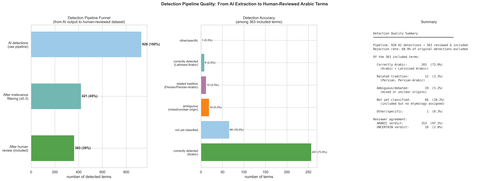
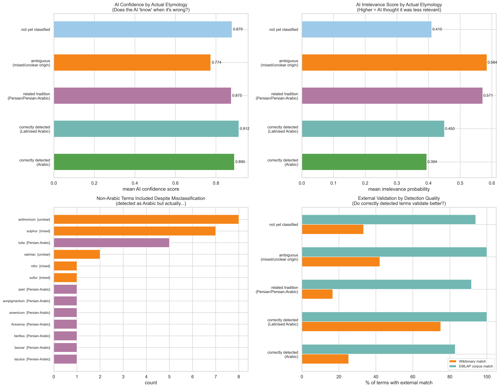
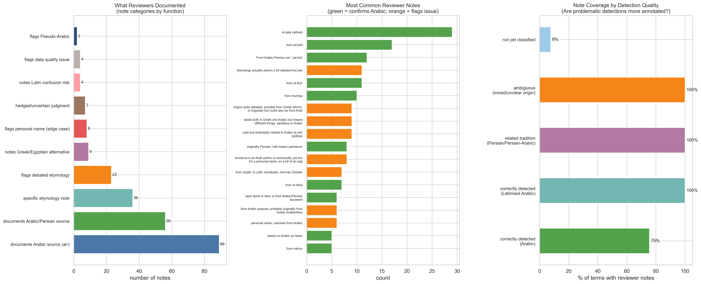
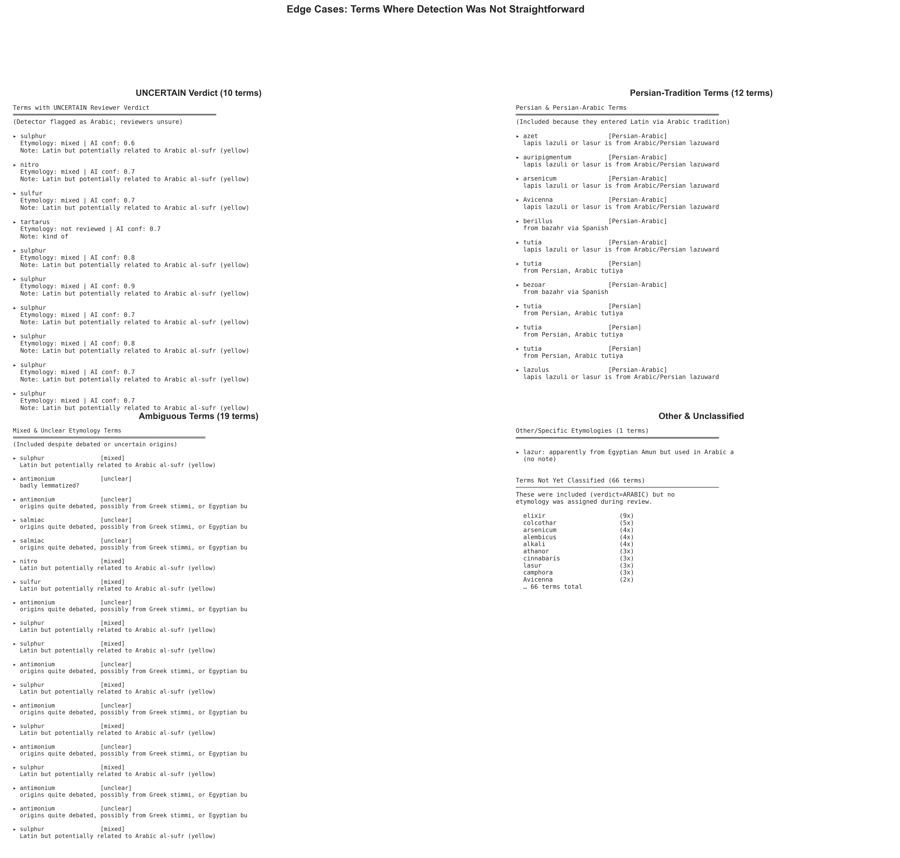
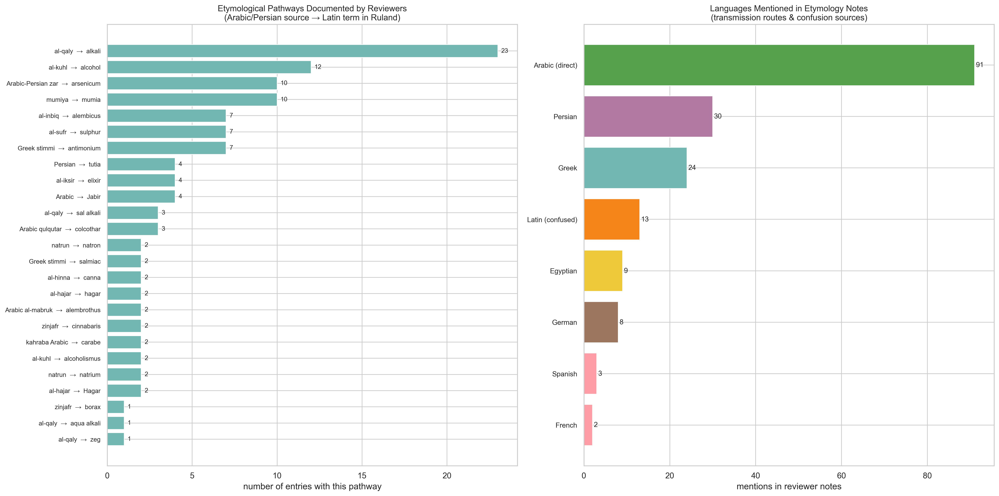
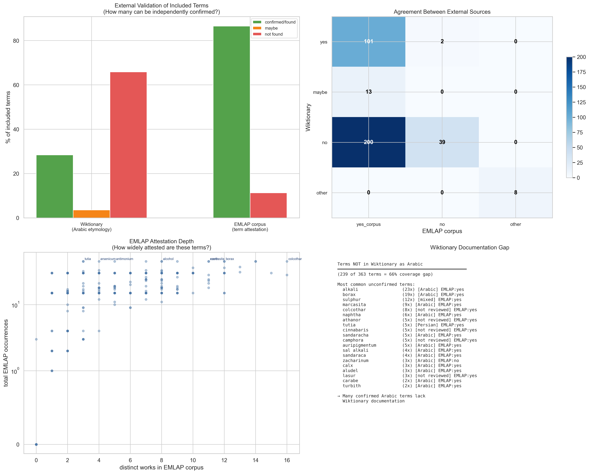
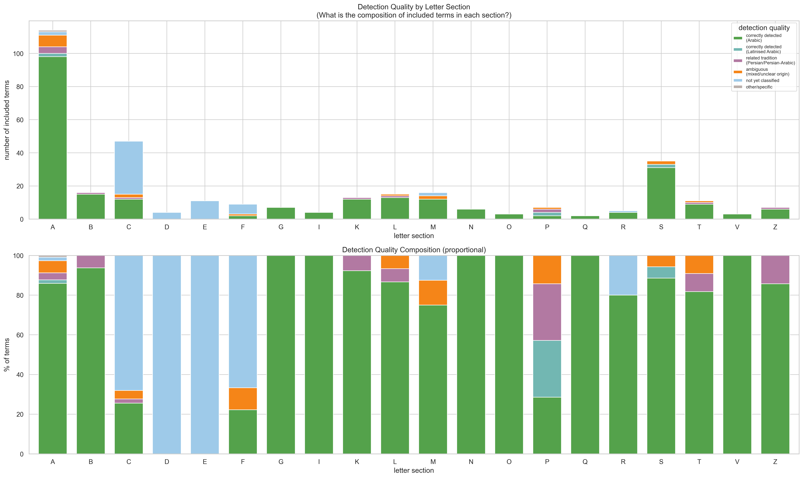
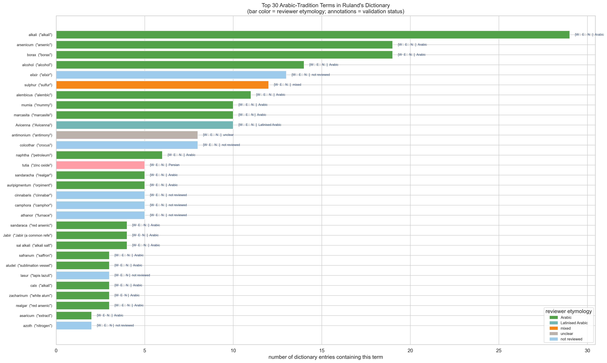
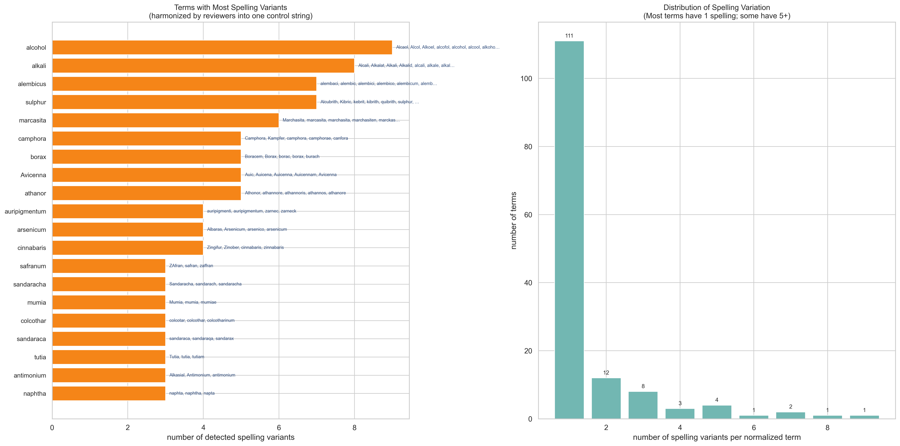
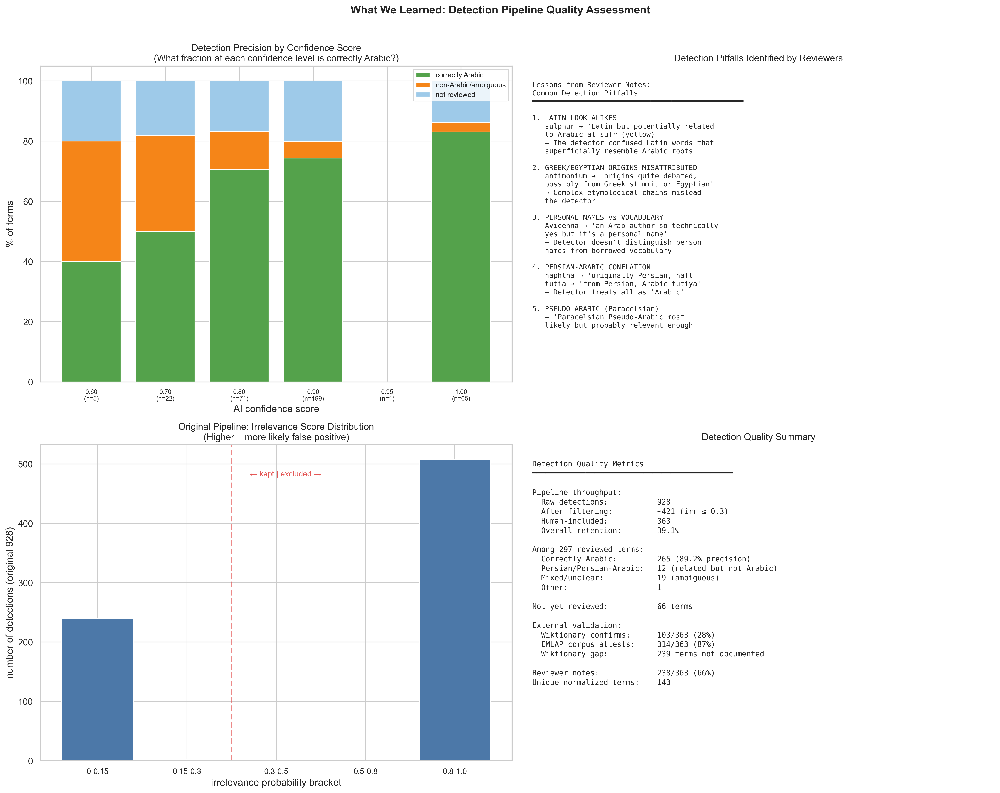

# 06 — Detection Quality & Reviewer Analysis (v2)

> **Date:** 2026-03-19
> **Script:** `explore_ruland_reviewer_v2.py`
> **Output directory:** `06_reviewer_analysis/`
> **Data sources:**
> - TSV reviewer file: `Final Single Sheet - 2026-01-27_reviewerCopy_reducedFinalSingleSheet.tsv` (363 rows)
> - Original pipeline CSV: `output_4ofixed_reviewed_with_entries.csv` (928 rows)

---

## Important Note on Dataset Interpretation

This analysis corrects an earlier version (v1) that misinterpreted the reviewer dataset. The key insight:

- **The 928 rows in the raw CSV** are terms that an AI detection pipeline flagged as potentially Arabic or Arabic-tradition terms in Ruland's *Lexicon Alchemiae* (1612).
- **The 363 rows in the TSV** are the terms that survived human review — the reviewers decided these were worth including.
- **The Etymology field** does **not** simply describe the term's origin. When it says something other than "Arabic" (e.g., "Persian", "mixed", "unclear"), it means **the AI detector was partially or fully wrong** — the term has a different actual origin than what the detector assumed.
- **The Include field** (`y`/`n`) indicates the reviewer's judgment on whether the term is a legitimate Arabic-tradition match.
- **The verdict field** records the consensus of 3 human reviewers: ARABIC (97.2%) or UNCERTAIN (2.8%).

This means the dataset tells us two stories simultaneously:
1. **About Ruland's dictionary**: What Arabic-tradition terms appear, how they entered Latin, and how they're used
2. **About detection quality**: How well the AI pipeline performed, where it failed, and what patterns cause misclassification

---

## Detection Quality Categories

Each of the 363 included terms was assigned a **detection quality category** based on the reviewer's Etymology field:

| Category | Meaning | Count | % |
|----------|---------|-------|---|
| **Correctly detected (Arabic)** | Reviewer confirms Arabic origin; AI was right | ~265 | ~73% |
| **Correctly detected (Latinised Arabic)** | Arabic but heavily Latinised form; AI was right | ~8 | ~2% |
| **Related tradition (Persian/Persian-Arabic)** | Actually Persian or Persian-Arabic; AI conflated with Arabic | ~12 | ~3.3% |
| **Ambiguous (mixed/unclear)** | Debated origins; AI may or may not have been correct | ~19 | ~5.2% |
| **Not yet classified** | Included (verdict=ARABIC) but no etymology assigned during review | ~66 | ~18.2% |
| **Other/specific** | Specific non-Arabic etymology (e.g., Egyptian) | ~1 | ~0.3% |

---

## Visualization 1: Detection Pipeline Funnel

### What it shows

Three panels depicting the full journey from AI output to human-reviewed dataset:

1. **Left — Pipeline Funnel**: A horizontal bar chart showing three stages:
   - **928 detections** (100%): Raw AI pipeline output — every term the detector flagged as potentially Arabic
   - **421 after irrelevance filtering** (45%): Terms with irrelevance probability ≤ 0.3 (the AI's own confidence filter)
   - **363 after human review** (39%): Terms that 3 human reviewers agreed to include

2. **Center — Detection Accuracy**: Among the 363 included terms, a breakdown by detection quality category (see table above). The largest bar is "correctly detected (Arabic)" at ~73%, showing most included terms are genuine Arabic terms.

3. **Right — Summary**: A text panel summarizing key numbers: 60.9% rejection rate, 97.2% ARABIC verdict rate.

### What it means

**For a technical audience:** The pipeline has a 60.9% false-positive rate at the raw detection stage, reduced by irrelevance filtering and human review. Among the 363 included terms, approximately 75% are correctly identified as Arabic or Latinised Arabic. The remaining 25% includes terms from related traditions (Persian), terms with debated origins, and terms not yet fully classified.

**For a humanities scholar:** The AI cast a wide net — flagging 928 terms as potentially Arabic — but human experts winnowed this to 363 genuine matches. This "generous detection, strict review" approach is standard in computational humanities: it's better to catch everything and filter manually than to miss genuine terms. The high reviewer agreement (97.2% ARABIC verdict) shows the final dataset is reliable, even though the original AI detections included many false positives.

---

## Visualization 2: Detection Accuracy by Features

### What it shows

Four panels examining whether the AI's own scores predicted detection quality:

1. **Top-left — AI Confidence by Actual Etymology**: Mean AI confidence score for each detection quality category. Correctly detected Arabic terms average ~0.890, while ambiguous terms average ~0.774.

2. **Top-right — Irrelevance Score by Actual Etymology**: Mean irrelevance probability by category. Ambiguous terms have the highest irrelevance scores (~0.584), while correctly detected Arabic terms have the lowest (~0.394).

3. **Bottom-left — Misclassified Terms**: A list of all non-Arabic terms that were nevertheless included (Persian, mixed, unclear). Shows terms like *antimonium* [unclear], *sulphur* [mixed], *tutia* [Persian-Arabic] — terms the AI flagged as Arabic but reviewers identified as having different or debated origins.

4. **Bottom-right — External Validation by Quality**: Wiktionary and EMLAP corpus match rates for each quality category. Correctly detected Arabic terms validate better externally than ambiguous or Persian terms.

### What it means

**For a technical audience:** The AI's confidence and irrelevance scores are partially predictive of detection quality. Correctly detected terms have slightly lower confidence (0.890) than "not yet classified" terms (0.879), suggesting confidence alone is insufficient for quality prediction. However, the irrelevance score is more discriminating: ambiguous terms have dramatically higher irrelevance scores (0.584 vs 0.394 for correct detections). External validation confirms the quality hierarchy: correctly detected Arabic terms have higher Wiktionary and EMLAP match rates.

**For a humanities scholar:** The AI "knows" when it's less sure — terms with debated origins tend to have higher "irrelevance" scores, suggesting the AI picked up on uncertainty signals in the text. But the AI can't reliably distinguish Arabic from Persian, because these traditions are closely intertwined in medieval Latin alchemy. The misclassified terms (bottom-left) are telling: terms like *antimonium* and *sulphur* have such complex, multi-language etymologies that even human experts debate their origins.

---

## Visualization 3: Reviewer Notes Analysis

### What it shows

Three panels analyzing the free-text notes that human reviewers wrote:

1. **Left — Note Categories**: Notes classified by function — what kind of information reviewers documented. The most common categories are:
   - "documents Arabic source (al-)" — 88 notes citing a specific Arabic source word (typically starting with *al-*)
   - "documents Arabic/Persian source" — 59 notes documenting the Arabic or Persian etymon
   - "specific etymology note" — 40 notes with detailed etymological information
   - "flags debated etymology" — 23 notes where reviewers flagged the etymology as contested

2. **Center — Most Common Notes**: The 18 most frequently recurring note texts, color-coded green (confirms Arabic) vs. orange (flags an issue). Common notes include "al-qaly (potassium)", "from al-kuhl", "from mumiya", etc.

3. **Right — Note Coverage by Quality**: What percentage of terms in each quality category have reviewer notes. 100% of ambiguous, related-tradition, and Latinised Arabic terms have notes, while only 75% of correctly detected Arabic terms and 8% of not-yet-classified terms do.

### What it means

**For a technical audience:** Note coverage inversely correlates with detection straightforwardness. All edge cases (ambiguous, Persian, Latinised) are annotated, while terms that are obviously Arabic often lack notes. The 66 "not yet classified" terms have almost no notes (8%), suggesting these were included without detailed review — a potential data quality concern.

**For a humanities scholar:** The reviewer notes are a rich etymological resource in themselves. They document specific Arabic source words (like *al-qaly* for alkali, *al-kuhl* for alcohol), trace transmission pathways through Persian and Greek, and flag terms where scholars disagree about origins. The pattern of note-writing reveals reviewer attention: unambiguous Arabic terms like *alkali* or *borax* needed little comment, while contested terms like *antimonium* or *sulphur* required detailed justification for inclusion.

---

## Visualization 4: Edge Cases Close-Up

### What it shows

Four text panels providing detailed information about every term where detection was not straightforward:

1. **Top-left — UNCERTAIN Verdict** (10 terms): All terms where the 3 reviewers reached an UNCERTAIN rather than ARABIC verdict. Each entry shows the term name, etymology classification, AI confidence score, and reviewer note. Examples include *sulphur* (mixed, conf 0.6), *certus* (mixed, conf 0.7), *nitro* (mixed, conf 0.95).

2. **Top-right — Persian-Tradition Terms** (12 terms): Terms that are actually Persian or Persian-Arabic rather than Arabic. These were included because they entered Latin *via* the Arabic tradition. Examples: *azoth*, *auripigmentum*, *arsenicum*, *tutia*, *naphtha*.

3. **Bottom-left — Ambiguous Terms** (19 terms): Terms with mixed or unclear origins, where etymological debates persist. Many entries involve terms that could be Arabic, Greek, Egyptian, or Latin depending on which scholarly tradition one follows.

4. **Bottom-right — Other & Unclassified**: One term with a specific non-Arabic etymology (*lazur* — apparently from Egyptian Amun), plus a list of the 66 terms that were included but never assigned an etymology during review.

### What it means

**For a technical audience:** The 10 UNCERTAIN verdicts represent genuine disagreement among reviewers — these are the hardest cases. The 12 Persian-tradition terms highlight a systematic limitation of the detector: it cannot distinguish Arabic from Persian because these linguistic traditions heavily overlap in alchemical vocabulary. The 66 unclassified terms are a gap in the review process, not a detection failure.

**For a humanities scholar:** These edge cases are among the most interesting terms in the dataset from a history-of-science perspective. Terms like *antimonium* (debated for centuries — Arabic? Egyptian? Latin?), *sulphur* (Latin word but potentially related to Arabic *al-sufr*), and *naphtha* (Persian word transmitted through Arabic) illustrate how alchemical vocabulary defies neat linguistic boundaries. The Arabic, Persian, Greek, and Latin traditions were so thoroughly intertwined in medieval alchemy that assigning a single "origin language" is often anachronistic.

---

## Visualization 5: Etymology Pathways

### What it shows

Two panels documenting how Arabic terms entered Latin, based on reviewer notes:

1. **Left — Etymological Pathways**: The 25 most frequently documented Arabic/Persian source → Latin term mappings. The top pathways are:
   - *al-qaly* → *alkali* (23 entries)
   - *al-kuhl* → *alcohol* (12 entries)
   - *Arabic-Persian zar* → *arsenicum* (10 entries)
   - *mumiya* → *mumia* (10 entries)
   - *al-inbiq* → *alembicus* (7 entries)
   - *al-sufr* → *sulphur* (7 entries)

2. **Right — Languages Mentioned**: A count of how often each language appears in reviewer notes, indicating transmission routes and confusion sources:
   - Arabic (direct): 91 mentions
   - Persian: 30 mentions
   - Greek: 24 mentions
   - Latin (confused): 13 mentions — cases where the reviewer noted that the term might be Latin rather than Arabic
   - Egyptian: 9 mentions
   - German: 8 mentions

### What it means

**For a technical audience:** The pathway data reveals the most prolific Arabic roots in the Latin alchemical lexicon. *Al-qaly* (alkali) appears in 23 different dictionary entries, meaning Ruland uses alkali-related terms across many headwords. The language distribution in notes shows that Persian (30 mentions) and Greek (24 mentions) are significant transmission languages — many Arabic terms entered Latin through Persian intermediaries or were confused with Greek terms.

**For a humanities scholar:** This visualization maps the "highways" of Arabic-Latin knowledge transfer. The dominance of *al-qaly* (alkali) and *al-kuhl* (alcohol) reflects the centrality of these concepts in alchemy. The Arabic definite article *al-* is preserved in many Latin forms (*al-kali*, *al-cohol*, *al-embic*), creating a distinctive linguistic signature. The 30 Persian mentions confirm that much of what medieval Latin scholars called "Arabic" actually passed through Persian intermediaries — the Arabo-Persian tradition was a single transmission pipeline rather than two separate ones.

---

## Visualization 6: External Validation

### What it shows

Four panels examining how well the included terms can be independently verified:

1. **Top-left — Overall Validation Rates**:
   - Wiktionary confirms 28% of terms as Arabic, with 4% "maybe" and 66% not found
   - EMLAP corpus attests 65% of terms, with ~10% not found

2. **Top-right — Agreement Matrix**: A heatmap showing how Wiktionary and EMLAP agree/disagree. The largest cell: 200 terms that are in EMLAP but NOT in Wiktionary — these are attested in early modern Latin texts but lack Wiktionary documentation of Arabic etymology.

3. **Bottom-left — EMLAP Attestation Depth**: A scatter plot of EMLAP occurrences vs. distinct works, showing how widely each term appears across the corpus. Some terms (*sulphur*, *tutia*, *colcothar*) appear in many works, while others are rare.

4. **Bottom-right — Wiktionary Documentation Gap**: A list of the 20 most common Arabic-tradition terms that Wiktionary does NOT document as Arabic. Many of these are confirmed Arabic by reviewers and attested in EMLAP — they simply haven't been documented in Wiktionary yet.

### What it means

**For a technical audience:** The two external sources have very different coverage profiles. EMLAP (a corpus of early modern Latin texts) covers 65% of terms, while Wiktionary (a crowd-sourced etymology resource) covers only 28%. The agreement matrix reveals that 200 terms are attested in EMLAP but undocumented in Wiktionary — representing a significant gap in publicly available etymological knowledge. The Wiktionary gap is not a quality issue with our dataset; rather, it reflects Wiktionary's incomplete coverage of specialized alchemical vocabulary.

**For a humanities scholar:** Wiktionary's 28% coverage rate is striking: it means that 72% of Arabic-tradition alchemical terms lack public documentation of their Arabic origins. This isn't because the terms aren't Arabic — many are confirmed by reviewers and attested across multiple early modern texts (EMLAP). It's because Wiktionary, despite its breadth, has limited coverage of specialized historical and alchemical vocabulary. This finding suggests that datasets like this one could contribute to improving public etymological resources.

---

## Visualization 7: Detection Quality by Letter Section

### What it shows

Two stacked bar charts showing detection quality composition across the alphabet:

1. **Top — Absolute counts**: How many terms of each quality category appear under each letter. "A" dominates with ~110 terms (as expected, since many Arabic terms begin with *al-*). Other letters with notable counts: C (~47), S (~33), B (~15), M (~15).

2. **Bottom — Proportional composition**: The same data as percentages. Most letter sections are predominantly green (correctly detected Arabic), but some show higher proportions of light blue (not yet classified) or orange (ambiguous).

### What it means

**For a technical audience:** The "A" section's dominance confirms the Arabic definite article *al-* as the primary signal the detector uses. The proportional view reveals that sections C, F, and M have higher rates of unclassified or ambiguous terms, suggesting the detector performs less reliably on terms that don't start with *al-*. Sections D, E, G, and I achieve near-100% correct detection rates, likely because the Arabic terms in these sections have very distinctive forms.

**For a humanities scholar:** The alphabet chart is a "map" of Arabic influence across the dictionary. The massive "A" cluster reflects the many terms that preserve the Arabic article *al-*: alkali, alcohol, alembic, amalgama, etc. But Arabic influence extends throughout the alphabet — terms like *borax* (B), *colcothar* (C), *elixir* (E), *marcasita* (M), *naphtha* (N), *sal ammoniac* (S), *tutia* (T), and *zircon* (Z) show that Arabic vocabulary permeated every corner of the alchemical lexicon. The letter sections without Arabic terms (H, J, U, W, X, Y) reflect the Latin alphabet's structure more than any absence of Arabic influence.

---

## Visualization 8: Top 30 Terms with Quality Context

### What it shows

A horizontal bar chart of the 30 most frequently occurring Arabic-tradition terms in Ruland's dictionary. Each bar is color-coded by the reviewer's etymology classification:
- **Green** = Arabic
- **Teal** = Latinised Arabic
- **Pink** = Persian
- **Orange** = mixed
- **Gray** = unclear
- **Light blue** = not reviewed

Annotations to the right of each bar show validation status:
- `W✓` / `W·` = Wiktionary match / no match
- `E✓` / `E·` = EMLAP corpus match / no match
- `N✓` / `N·` = has reviewer notes / no notes

The top 5 terms by frequency: alkali (~28 entries), arsenicum (~25), borax (~22), alcohol (~20), elixir (~17).

### What it means

**For a technical audience:** The top 30 terms are predominantly green (Arabic), with a few light-blue (not reviewed) entries. The validation annotations reveal that most top terms have both Wiktionary and EMLAP matches — these are well-established Arabic loanwords. Notable exceptions: *antimonium* (unclear etymology, highly debated) and *tutia* (Persian, not Arabic).

**For a humanities scholar:** These 30 terms are the core Arabic vocabulary of Ruland's alchemical dictionary. *Alkali*, *arsenicum*, *borax*, *alcohol*, and *elixir* appear in dozens of entries each, showing how deeply Arabic terminology was embedded in European alchemical practice by 1612. The presence of *Avicenna* (the Latinised name of Ibn Sina) among the top terms is interesting — it's not a substance but a person, reflecting how Arabic authorities were woven into the dictionary's fabric.

---

## Visualization 9: Spelling Harmonization

### What it shows

Two panels examining how spelling variants were harmonized by reviewers:

1. **Left — Terms with Most Variants**: The 20 terms with the most spelling variants in the raw detection data, now mapped to a single normalized control string. *Alcohol* leads with 8 variants (Alcoöl, Alcool, alcohol, alcohole, alcoholi, etc.), followed by *alkali* (7 variants), *alembicus* (6 variants).

2. **Right — Distribution of Variant Counts**: Most terms (111 out of ~150 unique normalized terms) have only 1 spelling in the detected data. 12 terms have 2 variants, 8 have 3, and a long tail extends to 8 variants.

### What it means

**For a technical audience:** Spelling harmonization was a necessary preprocessing step — without it, the same term would appear as multiple entries. The long-tailed distribution (most terms have 1 variant, few have many) is typical of historical text data. The most variable terms (*alcohol*, *alkali*, *alembicus*) are also the most frequent, suggesting that common terms accumulated more spelling variants as they were used across more dictionary entries.

**For a humanities scholar:** The spelling variation reveals something about Ruland's dictionary itself. In 1612, spelling was not yet standardized — the same Arabic loanword could be written as *Alcoöl*, *Alcool*, *alcohol*, or *alcohole* within the same book. The Arabic diacritical mark (the umlaut in *Alcoöl*) shows Ruland attempting to render unfamiliar sounds. The reviewer harmonization process — mapping all variants to one canonical form — is essential for any quantitative analysis but also obscures the rich orthographic diversity of early modern Latin.

---

## Visualization 10: Detection Pipeline Quality Assessment

### What it shows

Four panels synthesizing what we've learned about detection quality:

1. **Top-left — Precision by Confidence Score**: A stacked bar chart showing what fraction of terms at each AI confidence level were correctly Arabic (green), non-Arabic/ambiguous (orange), or not reviewed (light blue). Higher confidence scores generally correlate with higher Arabic precision, but the relationship is imperfect.

2. **Top-right — Detection Pitfalls**: A text summary of the 5 main failure modes identified by reviewers:
   1. **Latin look-alikes**: Terms like *sulphur* that resemble Arabic roots but are actually Latin
   2. **Greek/Egyptian misattribution**: Complex etymological chains (e.g., *antimonium*)
   3. **Personal names vs. vocabulary**: *Avicenna* is an Arabic name, not an Arabic loanword
   4. **Persian-Arabic conflation**: The detector can't distinguish Persian from Arabic
   5. **Pseudo-Arabic (Paracelsian)**: Terms coined by Paracelsus to sound Arabic but lacking genuine Arabic roots

3. **Bottom-left — Irrelevance Score Distribution**: The distribution of irrelevance probabilities across all 928 original detections. Most detections cluster at the low end (0–0.15), with a red dashed line marking the approximate filtering threshold.

4. **Bottom-right — Quality Summary**: Key metrics:
   - Pipeline: 928 → 421 (after irrelevance filter) → 363 (after human review)
   - Overall retention: 39.1%
   - Of 297 reviewed terms: 265 correctly Arabic (89.2% precision)
   - External validation: Wiktionary 103/363 (28%), EMLAP 314/363 (87%)
   - Reviewer notes: 236/363 (65%)

### What it means

**For a technical audience:** The detection pipeline achieves ~89% precision on reviewed terms (265 correctly Arabic out of 297 with assigned etymologies). The main precision losses come from Persian/Persian-Arabic conflation (12 terms) and ambiguous etymologies (19 terms). The irrelevance score is the most useful quality indicator — terms with scores above 0.3 are much more likely to be false positives. The 66 unreviewed terms represent a gap that could be addressed in future work.

**For a humanities scholar:** The AI detector is reasonably good at finding Arabic-tradition terms in a 17th-century Latin dictionary, but it has predictable blind spots. It can't tell Arabic from Persian (because these traditions are intertwined), it sometimes flags Latin words that merely look Arabic, and it treats person names the same as vocabulary words. These aren't flaws so much as inherent limitations of pattern-matching in a domain where linguistic boundaries are blurry. The 89% precision rate is quite good for a first pass — human review then catches the remaining errors. The detection pipeline is best understood as a *triage* tool: it identifies candidates for human expert review, not as a final arbiter of Arabic origin.

---

## Summary of Key Findings

### About Ruland's Dictionary
- **363 Arabic-tradition terms** confirmed by human reviewers in a dictionary of ~2,771 entries (~13% of the dictionary)
- **Alkali, arsenicum, borax, alcohol, elixir** are the most pervasive Arabic terms, each appearing in 15–28 entries
- The Arabic definite article *al-* is preserved in many Latin forms, creating a distinctive cluster in the A-section
- Persian and Arabic terms entered Latin through a shared transmission pipeline — the "Arabic tradition" is really an Arabo-Persian one
- 12 terms are actually Persian/Persian-Arabic, showing the intertwined nature of these scholarly traditions

### About Detection Quality
- The AI pipeline has a **60.9% false-positive rate** at the raw stage (928 → 363)
- Among reviewed and classified terms, **89.2% precision** (265/297 correctly Arabic)
- Main failure modes: Latin look-alikes, Greek/Egyptian misattribution, personal names, Persian conflation, Paracelsian pseudo-Arabic
- The irrelevance score is the best automated quality indicator
- **66 terms** (18%) remain unclassified — included but without etymology assignment

### About External Resources
- Wiktionary documents only **28%** of confirmed Arabic alchemical terms — a major coverage gap
- EMLAP corpus attests **87%** of terms, confirming their use in early modern Latin texts
- 200 terms are in EMLAP but NOT in Wiktionary — these represent an opportunity for crowdsourced documentation

---

## Data Quality Notes

- The 66 "not yet classified" terms (18.2%) have almost no reviewer notes (8%). These were included based on the ARABIC verdict but lack detailed etymological annotation. Future work should prioritize classifying these.
- Spelling harmonization mapped 363 detected strings to ~150 unique normalized terms. The harmonization process was done manually by reviewers.
- The AI confidence score ranges from 0.1 to 0.95 but is not a reliable predictor of detection quality on its own. The irrelevance probability is more discriminating.

---

## Files Produced

| File | Description |
|------|-------------|
| `detection_funnel.png` | Pipeline from 928 AI detections to 363 reviewed terms |
| `detection_accuracy.png` | AI confidence/irrelevance by actual etymology; misclassified terms; external validation |
| `reviewer_notes_v2.png` | Note categories, most common notes, note coverage by quality |
| `edge_cases.png` | UNCERTAIN verdicts, Persian terms, ambiguous terms, unclassified |
| `etymology_pathways_v2.png` | Arabic source → Latin form mappings; intermediary languages |
| `external_validation_v2.png` | Wiktionary/EMLAP validation rates, agreement matrix, attestation depth |
| `quality_by_letter.png` | Detection quality composition per alphabetical section |
| `top_terms_quality.png` | Top 30 terms with etymology color and validation annotations |
| `spelling_harmonization.png` | Spelling variant counts and harmonization |
| `detection_lessons.png` | Precision by confidence, pitfall patterns, quality summary |

All visualizations at 300 dpi print quality.
