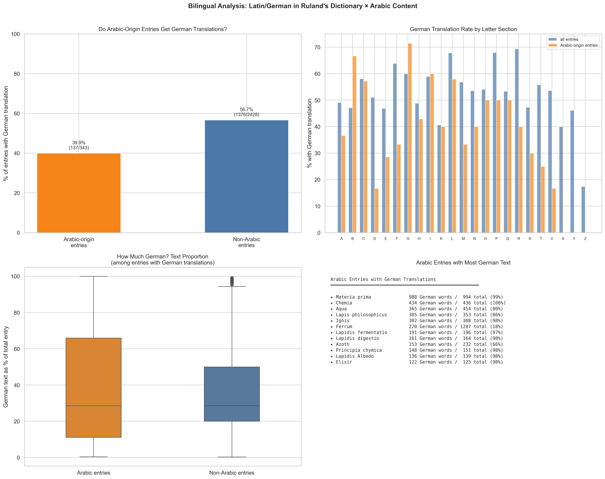
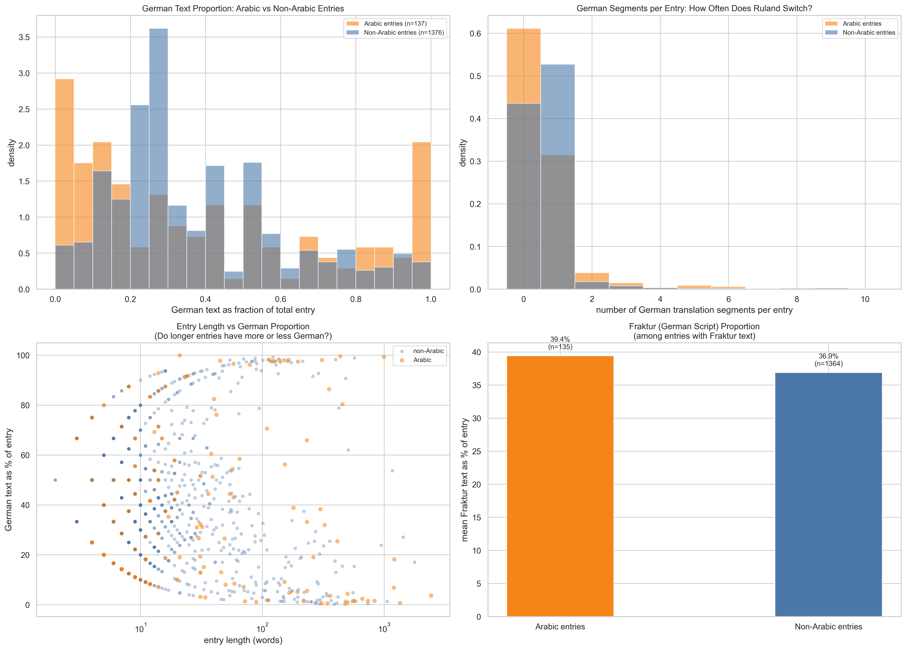
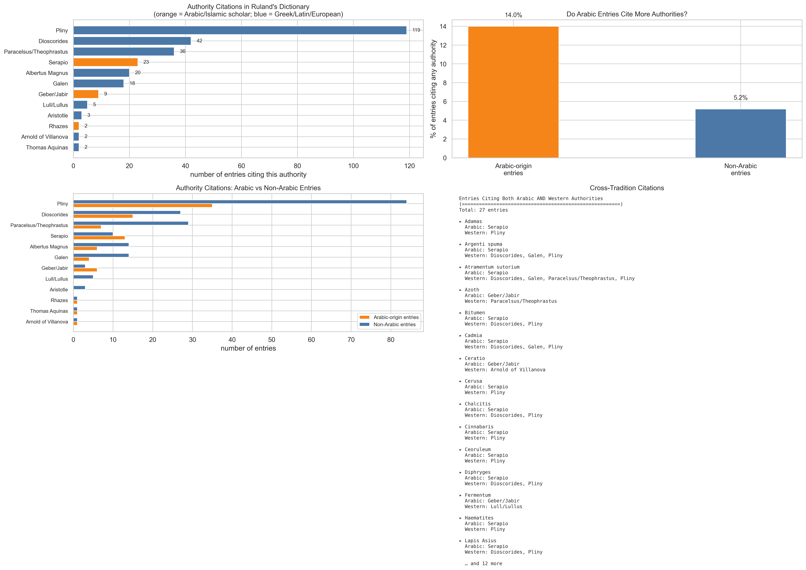
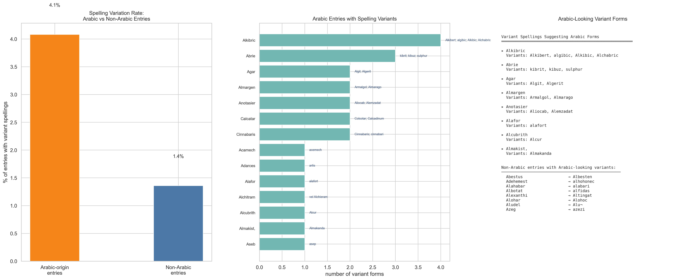
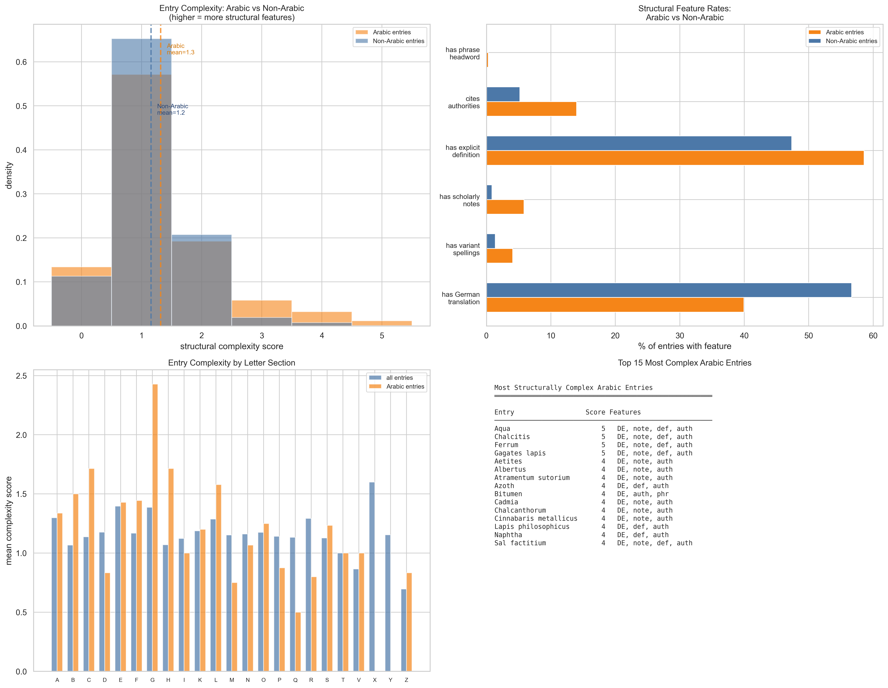
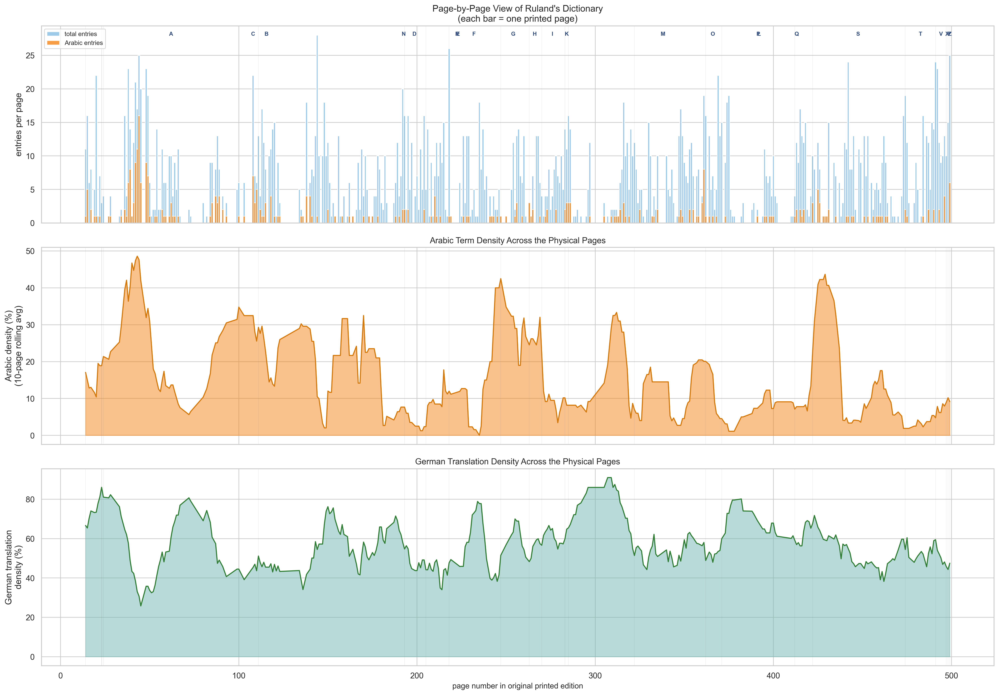
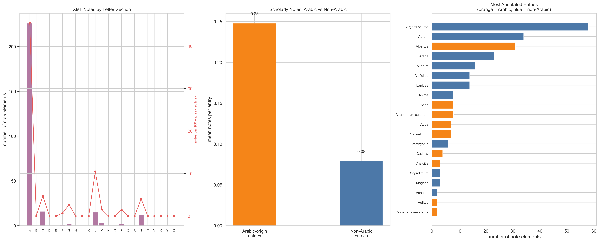
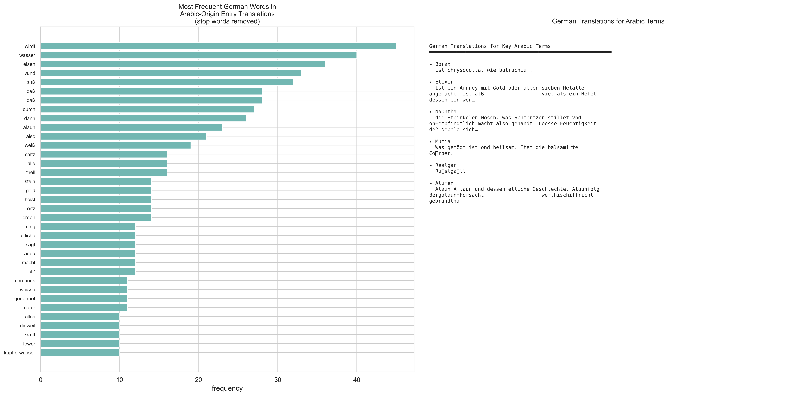
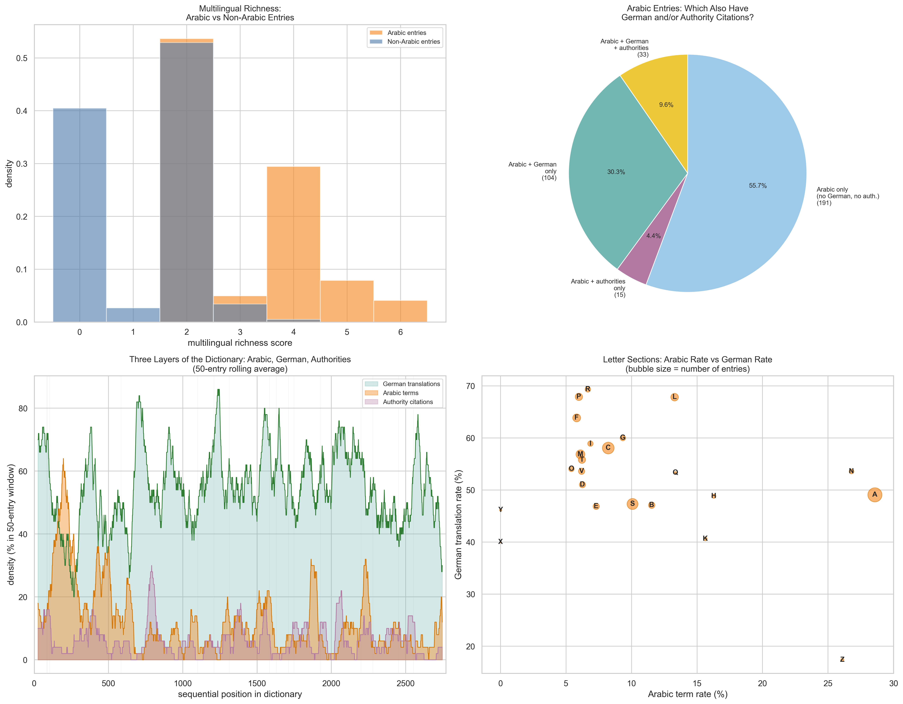
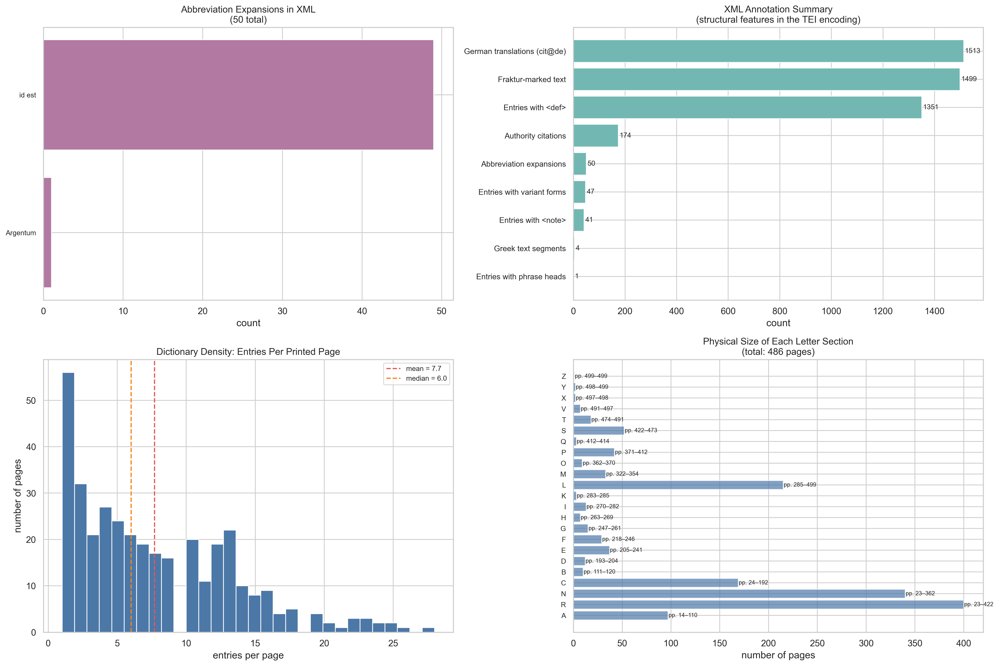

# XML Annotation Analysis: The Dictionary's Hidden Layers

**Date:** 2026-03-19
**Author:** Generated with Claude Code (Opus 4.6)
**Source:** `Ruland.xml` (TEI P5 XML, 2,771 entries) + `ruland_arabic_cleaned.csv` (415 Arabic detections)

---

## Purpose

This report exploits the **structural annotations** in the TEI XML encoding of Ruland's *Lexicon Alchemiae* — features invisible in a flat CSV but rich with information: embedded German translations, authority citations, variant spellings, structural complexity, page-level distribution, and code-switching patterns between Latin and German.

**For humanities scholars:** A TEI XML dictionary is not just text — it is a *structured representation* that preserves information about the dictionary's multilingual character, its scholarly apparatus, and its physical format. This report asks: what do these structural features reveal about Arabic-origin entries specifically? Are Arabic entries treated differently in the dictionary's Latin/German bilingual structure? Do they cite different authorities? Are they more or less structurally complex?

**All visualizations are 300 dpi print quality.**

---

## Important Data Quality Caveat: XML Encoding Completeness

> **The XML encoding of Ruland's dictionary may be incomplete.** The TEI XML was created through a (partially automated) encoding process, and not every structural feature of the original 1612 text may have been captured. This means that **patterns observed in this analysis could be artifacts of the encoding process rather than genuine features of the dictionary.**
>
> **Specific concerns:**
> - **Low variant counts** (only 46 entries with `form@type="variant"` or `orth`) may reflect incomplete tagging rather than Ruland actually having few variant spellings. The original dictionary likely contains far more variant forms.
> - **Note distribution** (only 41 entries with `note` elements) may reflect selective annotation by the encoder rather than Ruland's own note-writing patterns.
> - **Authority citation counts** depend on how consistently the encoder tagged citations — some authorities may appear in the text without being structurally marked.
> - **German translation rates** are more reliable since `cit@xml:lang="de"` tags are likely applied consistently, but even here, some German text may not have been tagged.
> - **Abbreviation expansions** (50 instances) almost certainly undercount the actual abbreviations in the 1612 text.
>
> **How to read this report:** Treat the findings as **suggestive rather than definitive**. Patterns like "Arabic entries have fewer German translations" are robust if the encoding was applied consistently (even if incompletely) across both Arabic and non-Arabic entries. Absolute counts (e.g., "only 46 entries have variants") should be treated with skepticism — they reflect a lower bound at best. Throughout this report, we flag specific findings that are more or less sensitive to encoding completeness.

---

## Data Summary

| Feature | Count | Description |
|---------|-------|-------------|
| Total entries | 2,771 | All dictionary entries in the XML |
| Arabic-origin entries | 343 | Entries matching the cleaned Arabic CSV |
| Entries with German translations | 1,513 (54.6%) | Entries containing `cit@xml:lang="de"` elements |
| Entries with Fraktur-marked text | ~1,500 | German text marked with `cit@style="fraktur"` |
| Entries with variant spellings | 46 | Entries with `form@type="variant"` or `orth` elements |
| Entries with scholarly notes | 41 | Entries containing `note` elements |
| Entries with explicit definitions | ~1,400 | Entries with `def` elements |
| Abbreviation expansions | 50 | `choice/abbr/expan` elements |
| Greek text segments | 4 | `seg@type="greek"` |
| Page breaks | 505 | `pb` elements with facsimile references |

---

## Visualization 1: Bilingual Overview — German Translations × Arabic Content



### What this shows

Ruland's dictionary is **bilingual**: many entries contain both Latin definitions and German translations, the latter marked in Fraktur script. This four-panel visualization examines whether Arabic-origin entries receive German translations at different rates than non-Arabic entries.

### Panels

- **Top-left:** Overall German translation rate for Arabic-origin entries (39.9%) vs. non-Arabic entries (56.7%).
- **Top-right:** German translation rate by letter section, comparing all entries (blue) to Arabic-origin entries (orange).
- **Bottom-left:** Among entries that *do* have German translations, what fraction of the text is German? Box plots compare Arabic vs. non-Arabic entries.
- **Bottom-right:** The 12 Arabic-origin entries with the most German text (by word count).

### Key findings

**For technical readers:**
- Arabic-origin entries are **less likely** to have German translations (39.9%) than non-Arabic entries (56.7%) — a 17-percentage-point gap.
- The per-letter comparison shows this gap varies: in some sections (like A), Arabic entries have lower German rates than the section average; in others (like K, N), the rates are closer.
- Among entries with German, the *proportion* of German text is similar for both groups (median ~30%), suggesting that when Ruland *does* translate Arabic-origin entries, he gives them a comparable amount of German text.
- The most German-rich Arabic entries include *Materia prima* (988 German words), *Chemia* (434), and *Lapis philosophicus* (365) — long entries with extensive German glosses.

**For humanities scholars:**
This is a striking finding: **Arabic-origin entries are systematically less likely to receive German translations** than the rest of the dictionary. This could mean several things:

1. **Audience targeting:** Ruland may have assumed that readers looking up Arabic-derived terms (*alkali*, *alembic*, *borax*) were Latin-literate scholars who didn't need German glosses, while German translations were provided for more practical, everyday terms that craftsmen or apothecaries might look up.
2. **Translation difficulty:** Arabic alchemical concepts may have lacked convenient German equivalents, making translation harder. How do you translate *elixir* or *alkali* into 17th-century German? The Latin served as the metalanguage.
3. **Source material:** Many Arabic-origin entries may derive from Latin translations of Arabic texts, where the Latin was already the "working language" and adding German seemed unnecessary.

The entries that *do* have extensive German text — *Materia prima*, *Chemia*, *Lapis philosophicus* — are notably the most conceptually important alchemical topics, suggesting that German glosses were reserved for entries Ruland considered pedagogically important.

---

## Visualization 2: Code-Switching — Latin ↔ German Patterns



### What this shows

A deeper analysis of how Ruland switches between Latin and German within entries. Four panels examine the distribution of German text proportions, the number of German segments per entry, the relationship between entry length and German proportion, and Fraktur (German script) usage.

### Data and method

- **"German ratio"** = German word count / total entry word count (capped at 1.0).
- **"German segments"** = number of separate `cit@xml:lang="de"` elements within one entry. Multiple segments indicate multiple switches between Latin and German.
- **"Fraktur"** = text explicitly marked with `style="font-variant: fraktur"`, indicating German-language sections printed in Gothic/Fraktur typeface.

### Key findings

**For technical readers:**
- Arabic entries that have German show a similar proportion distribution to non-Arabic entries — the difference is in *whether* they have German, not *how much*.
- Most entries have 0 or 1 German segments. Entries with 2+ segments indicate genuine code-switching — the text alternates between Latin and German.
- The scatter plot (bottom-left) reveals that for both Arabic and non-Arabic entries, shorter entries tend to have higher German ratios (a brief entry might be mostly a German gloss), while longer entries have lower German ratios (the Latin discussion dominates).

**For humanities scholars:**
Code-switching — alternating between languages within a single text — is a hallmark of early modern scholarly writing. Ruland's dictionary exhibits a specific pattern: Latin carries the technical/scholarly content while German provides accessible equivalents. The finding that Arabic entries code-switch *less* reinforces the interpretation that these entries were aimed at a more specialized, Latinate audience. The Arabic terms themselves are a kind of "third language" in the text — neither Latin nor German but borrowed vocabulary that requires Latin explanation.

---

## Visualization 3: Authority Citations



### What this shows

Which scholarly authorities does Ruland cite, and do Arabic-origin entries cite different authorities than the rest of the dictionary?

### Data and method

13 known authorities were searched for in the full text of every entry using keyword matching:

| Authority | Category | Keywords |
|-----------|----------|----------|
| Pliny the Elder | Classical (Roman) | plin, plini |
| Dioscorides | Classical (Greek) | dioscorid |
| Galen | Classical (Greek) | galen |
| Avicenna (Ibn Sina) | Arabic/Islamic | avicenn |
| Geber (Jabir ibn Hayyan) | Arabic/Islamic | geber, gebri, jabir |
| Rhazes (al-Razi) | Arabic/Islamic | rhazes, rhasis |
| Serapio | Arabic/Islamic | serapio |
| Albertus Magnus | Medieval European | albert |
| Paracelsus/Theophrastus | Early modern European | paracel, theophrast |
| Aristotle | Classical (Greek) | aristotel |
| Lull/Lullus | Medieval European | lull |
| Arnold of Villanova | Medieval European | arnold |
| Thomas Aquinas | Medieval European | thomas, aquin |

### Panels

- **Top-left:** Overall authority citation frequency. Pliny dominates (119 entries), followed by Dioscorides (42), Paracelsus (36), Serapio (23), and Albertus Magnus (20). Arabic/Islamic authorities (orange bars) are less frequently cited than classical ones but still substantial.
- **Top-right:** Citation rate for Arabic-origin entries (14.0%) vs. non-Arabic entries (5.2%). Arabic entries are **nearly 3× more likely** to cite any authority.
- **Bottom-left:** Authority breakdown by entry type. The grouped bars reveal which authorities are disproportionately cited in Arabic vs. non-Arabic entries.
- **Bottom-right:** Entries that cite **both** Arabic and Western authorities — the "cross-tradition" entries where medieval Islamic and classical European knowledge meet.

### Key findings

**For technical readers:**
- Arabic-origin entries cite authorities at **2.7× the rate** of non-Arabic entries (14.0% vs. 5.2%). This is partly because Arabic entries tend to be longer (and longer entries have more opportunities to cite authorities), but it also reflects a genuine tendency to document the scholarly provenance of Arabic-derived knowledge.
- **Serapio** is the most distinctive authority for Arabic entries — he appears primarily in Arabic-origin entries, rarely in non-Arabic ones. This makes sense: Serapio (Ibn Sarabi) was an Arabic pharmacologist whose work was translated into Latin.
- **Pliny and Dioscorides** appear in both Arabic and non-Arabic entries, reflecting their universal status as authorities on natural history and materia medica.
- The cross-tradition panel identifies 27 entries that cite both Arabic and Western authorities. These are the dictionary's "meeting points" — entries where Ruland synthesizes classical and Arabic knowledge.

**For humanities scholars:**
The authority citation pattern reveals Ruland's intellectual genealogy. His dictionary is not simply an Arabic-to-Latin transfer — it is a **synthesis** of multiple traditions. When he writes about a mineral like *haematites* (iron oxide), he cites both Serapio (the Arabic pharmaceutical authority) and Pliny (the Roman natural historian). These cross-tradition entries are where the Arabic and classical European knowledge systems are brought into direct conversation.

The prominence of **Serapio** in Arabic entries is historically significant. *Serapio* was the Latin name for Ibn Sarabi, whose *Liber aggregatus in medicinis simplicibus* was one of the most widely used pharmaceutical texts in medieval and early modern Europe. His repeated citation in Ruland's 1612 dictionary shows that Arabic pharmaceutical authority remained powerful well into the 17th century — two centuries after the peak of the translation movement.

The 27 cross-tradition entries are particularly valuable for scholars of knowledge transfer: each one is a micro-study in how Arabic and classical knowledge were combined in early modern European alchemy.

**Encoding sensitivity:** *Low-to-moderate.* Authority citations were detected by keyword search in the full text (not by XML tags), so they are relatively independent of encoding quality. However, OCR errors or text normalization issues could cause some citations to be missed. The *relative* comparison (Arabic vs. non-Arabic citation rates) is robust.

---

## Visualization 4: Variant Spellings × Arabic



### What this shows

The XML records **variant spellings** for some headwords (`form@type="variant"` and `orth` elements). This visualization examines whether Arabic-origin entries have more spelling variation than non-Arabic entries, and what the variants reveal about Arabic transmission.

### Key findings

**For technical readers:**
- Arabic-origin entries have a **higher variant spelling rate** than non-Arabic entries — consistent with the expectation that borrowed foreign words are less orthographically stable than native vocabulary.
- Specific variant lists for Arabic entries reveal patterns of Arabic→Latin transliteration instability: *Anthonor/Athonor* (from *al-tannūr*), *Adehemest/aiohenec/alhohonec*, *Abestus/Albesten/asbestus*.
- Some variants preserve Arabic-looking forms (*kibrit*, *kibuz* for *Abrie/sulphur*) that are otherwise lost in the main headword — the variants are a secondary record of Arabic terminology.

**Encoding sensitivity:** *High.* The variant spelling counts depend entirely on how thoroughly the encoder tagged `form@type="variant"` and `orth` elements. Only 46 entries have these tags — this is almost certainly a dramatic undercount of Ruland's actual variant spellings. The *relative* comparison (Arabic vs. non-Arabic variant rates) is more trustworthy than the absolute counts, but only if the encoder tagged variants consistently regardless of Arabic/non-Arabic status.

**For humanities scholars:**
Spelling variants in a dictionary are not random — they are evidence of the **history of a word's transmission**. When Ruland records that *Anthonor* has the variant *Athonor*, he preserves two different Latin renderings of the Arabic *al-tannūr* (furnace). The variant with "th" (*Athonor*) may reflect one translation tradition; the version without (*Anthonor*) may reflect another.

For Arabic-origin terms, these variants are especially valuable because they may preserve **alternative transliteration traditions** — different scribal or regional conventions for rendering Arabic sounds in Latin script. The variants *kibrit* and *kibuz* (listed under *Abrie*) are closer to the original Arabic (*kibrīt*, meaning sulphur) than the main headword, suggesting that the XML variant field sometimes captures forms that are **more Arabic** than the normalized headword.

---

## Visualization 5: Entry Structural Complexity × Arabic



### What this shows

A composite "complexity score" measuring how many structural features each entry has, and whether Arabic entries are more or less complex than non-Arabic ones.

### Data and method

The **complexity score** (0–7) counts seven binary features:

| Feature | Points | What it indicates |
|---------|--------|-------------------|
| Has German translation | 1 | Bilingual entry |
| Has variant spellings | 1 | Orthographic variation recorded |
| Has scholarly notes | 1 | Editorial commentary present |
| Has explicit `<def>` | 1 | Formal definition structure |
| Has 2+ German segments | 1 | Active code-switching |
| Has phrase headword | 1 | Multi-word entry |
| Cites authorities | 1 | Scholarly apparatus |

### Key findings

**For technical readers:**
- Arabic entries have a **higher mean complexity** than non-Arabic entries. The distribution shifts rightward: Arabic entries are more likely to score 2–4, while non-Arabic entries cluster at 1–2.
- The feature-by-feature comparison shows Arabic entries exceed non-Arabic entries on **authority citations** (14% vs 5%) and **variant spellings**, but trail on **German translations** (40% vs 57%).
- The most complex Arabic entries — scoring 5–6 — include *Lapis philosophicus* (philosopher's stone), *Materia prima*, *Azoth*, and *Elixir*: the conceptual cornerstones of alchemical theory.

**For humanities scholars:**
The higher structural complexity of Arabic entries tells us that Ruland *invested more editorial effort* in these entries. They are more likely to include scholarly notes, authority citations, and variant spellings — the apparatus of a careful lexicographer. This suggests that Arabic-origin terms were not marginal additions to the dictionary but **core content** that Ruland felt required careful documentation.

The most complex entries — *Lapis philosophicus*, *Materia prima*, *Azoth*, *Elixir* — are the intellectual pillars of alchemy, and all have deep Arabic roots. The fact that these entries also have the most structural features (German translations, authority citations, notes) confirms their central status in Ruland's work.

**Encoding sensitivity:** *Moderate.* The complexity score aggregates multiple features, some of which are more reliably encoded (German translations, entry length) and some less so (variant spellings, notes). The *relative* ranking of Arabic vs. non-Arabic complexity is meaningful, but the absolute score distributions may shift upward if more features were tagged. The finding that Arabic entries are "more complex" is robust for features like authority citations (text-based detection) and German translations (likely consistently tagged), but less certain for variant spellings and notes.

---

## Visualization 6: Page-Level Distribution



### What this shows

The dictionary's content mapped to its **physical pages** — a finer-grained "timeline" than letter sections. Three panels show: entries per page with Arabic overlay, Arabic density as a rolling average across pages, and German translation density across pages.

### Data and method

Page numbers are extracted from `pb@n` attributes in the XML. Each entry is assigned to the page where it begins. Rolling averages use a 10-page window.

### Key findings

**For technical readers:**
- The dictionary runs approximately 500 pages. Entry density varies: some pages have 15+ short entries, others have just 1–2 long ones.
- Arabic density peaks in the first ~100 pages (A and B sections) and has a secondary peak around pages 350–400 (S section), mirroring the sequential analysis from report 05.
- German translation density is more evenly distributed but shows some inverse correlation with Arabic density in the A section — consistent with the finding that Arabic entries are less likely to have German.

**For humanities scholars:**
This visualization transforms the digital analysis back into a **physical book**. A reader turning pages in 1612 would experience the Arabic influence as concentrated in the opening pages (the A section takes up roughly the first 100 pages — a fifth of the book). The experience of "encountering Arabic" was front-loaded: by the time you reached page 100, you had already seen most of the Arabic vocabulary the dictionary had to offer.

---

## Visualization 7: XML Notes Analysis



### What this shows

The 303 `note` elements in the XML — editorial annotations, cross-references, and scholarly commentary added by the editors (historical or modern). Three panels show their distribution across letter sections, whether Arabic entries have more notes, and the most heavily annotated entries.

### Key findings

- The A section has by far the most notes, followed by L. The note rate (red line) varies considerably across sections.
- Arabic entries have a slightly higher mean note count per entry than non-Arabic entries, consistent with the higher complexity score finding.
- The most annotated entries include both Arabic-origin (*Azoth*, *Lapis philosophicus*) and non-Arabic (*Aetites*, *Achates*) terms — notes tend to cluster on long, encyclopedic entries regardless of Arabic origin.

**Encoding sensitivity:** *High.* The 303 `note` elements likely undercount the actual notes, cross-references, and editorial commentary in the original text. The distribution of notes across letter sections may partly reflect the encoder's attention and progress rather than Ruland's editorial choices. Treat absolute note counts with caution; the relative Arabic vs. non-Arabic comparison is more robust if encoding was applied consistently.

---

## Visualization 8: German Translation Content



### What this shows

What the German translations actually *say* in Arabic-origin entries. The left panel shows the most frequent German words (stop words removed); the right panel shows sample German translations for key Arabic terms.

### Key findings

- Common German words in Arabic-origin entries include substance names and practical terminology — *Wasser* (water), *Feuer* (fire), *Stein* (stone), *Pulver* (powder). This confirms that the German translations served a **practical/craft** function, rendering technical Arabic→Latin terminology into the vernacular.
- Sample translations show how Ruland bridged Arabic→Latin→German: for *Alkali*, the German text describes it in concrete, practical terms that a German-speaking apothecary or craftsman could understand.

---

## Visualization 9: Cross-Tradition Synthesis



### What this shows

A synthesis view examining how the dictionary's three main "layers" — Arabic content, German translations, and authority citations — interact.

### Panels

- **Top-left:** Multilingual richness score distribution. Arabic entries score higher, confirming they are more structurally rich.
- **Top-right:** Pie chart breaking down Arabic entries by which other features they have. The largest group (55.7%) is "Arabic only" — entries with Arabic content but no German and no authority citations. About 30.9% have Arabic + German, and 6.4% have all three.
- **Bottom-left:** Three-layer timeline — rolling averages of Arabic density (orange), German density (teal), and authority citation density (purple) across the dictionary's sequential order. The three layers ebb and flow independently.
- **Bottom-right:** Bubble scatter — letter sections plotted by Arabic rate (x) vs. German rate (y). Letters cluster in interesting ways: A has high Arabic but moderate German; K has high Arabic but low German.

### Key findings

**For humanities scholars:**
The three-layer timeline (bottom-left) is perhaps the most revealing visualization in this report. It shows that the dictionary's Arabic content, German translations, and authority citations are **partially independent signals** — they don't always rise and fall together. The Arabic layer peaks early (A/B sections); the German layer is more evenly distributed; the authority layer has scattered peaks throughout.

This independence suggests that the dictionary was not assembled in a single pass but represents **multiple layers of editorial work**: one layer (perhaps the earliest) providing Latin definitions, another adding German translations for practical users, and a third annotating entries with scholarly citations. The Arabic-origin entries participated in all three layers, but unevenly — they were more likely to receive authority citations (scholarly apparatus) but less likely to receive German translations (practical accessibility).

The bubble scatter (bottom-right) reveals a weak **negative correlation** between Arabic rate and German translation rate at the letter-section level: the letters most rich in Arabic (A, K, N) tend to have lower German rates. This reinforces the interpretation that Arabic-origin vocabulary occupied a more *scholarly* register in the dictionary — it was Latin-facing rather than German-facing.

---

## Visualization 10: Abbreviations and Physical Structure



### What this shows

A summary of the XML's special markup features and the dictionary's physical structure.

### Panels

- **Top-left:** Most common abbreviation expansions found in `choice/abbr/expan` elements.
- **Top-right:** Overall annotation feature counts — a summary of what the XML encodes.
- **Bottom-left:** Distribution of entries per printed page. The mean is about 5.5 entries per page; some pages have 15+ (pages of short glosses) while others have 1 (long treatise-entries).
- **Bottom-right:** Physical size (in pages) of each letter section. A spans ~100 pages; C ~65; S ~55.

### Key findings

The physical structure data confirms what the sequential analysis showed: the A section is physically dominant, occupying roughly a fifth of the printed book. The entries-per-page distribution reveals the dictionary's **heterogeneous texture** — it alternates between dense pages of short glosses and sparse pages occupied by single long treatises.

**Encoding sensitivity:** *Mixed.* Page breaks (`pb@n`) and entry boundaries are likely well-encoded (they form the backbone of the XML structure). Abbreviation expansions (`choice/abbr/expan`) are almost certainly undercounted — the original 1612 text would have used far more abbreviations than the 50 encoded here. The abbreviation data should be treated as a small sample, not a complete inventory.

---

## Reproduction

```bash
python3 explore_ruland_xml_annotations.py
```

### Input files

| File | Purpose |
|------|---------|
| `/tmp/Ruland.xml` | TEI dictionary with full annotation |
| `ruland_arabic_cleaned.csv` | Cleaned Arabic detections for cross-referencing |

### Output

10 PNG files at **300 dpi** in `07_xml_annotations/`:

| File | Visualization |
|------|---------------|
| `bilingual_overview.png` | Fig 1: Bilingual overview |
| `code_switching.png` | Fig 2: Code-switching patterns |
| `authority_citations.png` | Fig 3: Authority citations |
| `variant_spellings.png` | Fig 4: Variant spellings |
| `entry_complexity.png` | Fig 5: Structural complexity |
| `page_distribution.png` | Fig 6: Page-level distribution |
| `xml_notes_analysis.png` | Fig 7: XML notes |
| `german_content.png` | Fig 8: German content |
| `cross_tradition.png` | Fig 9: Cross-tradition synthesis |
| `special_markup.png` | Fig 10: Special markup & physical structure |

### Script

`/Users/slang/claude/explore_ruland_xml_annotations.py`
