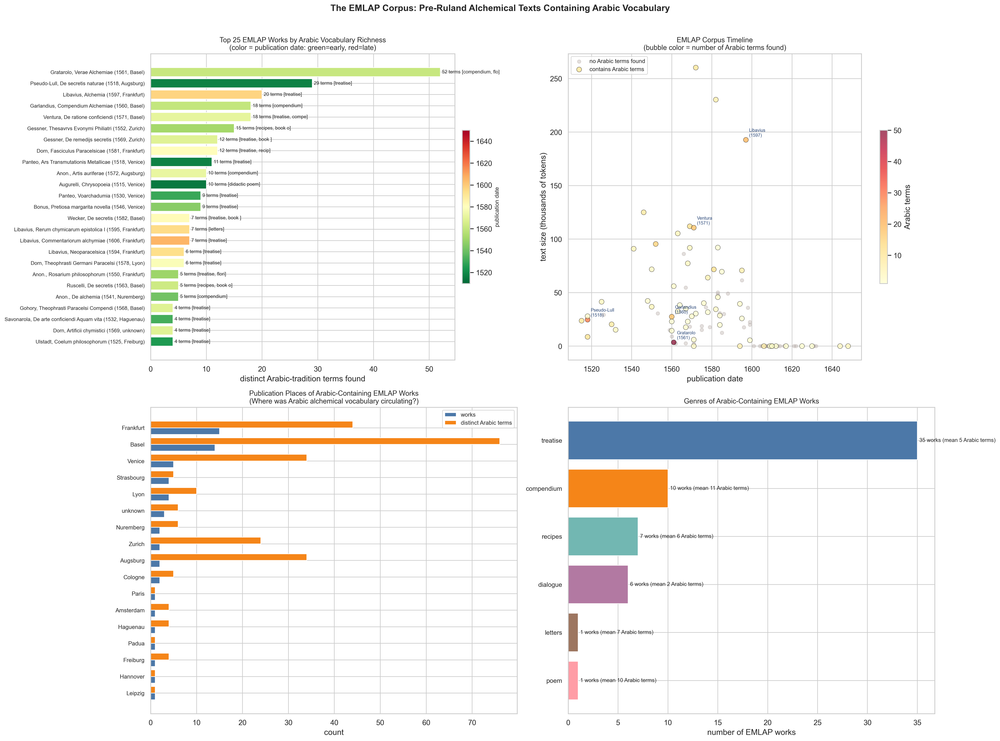
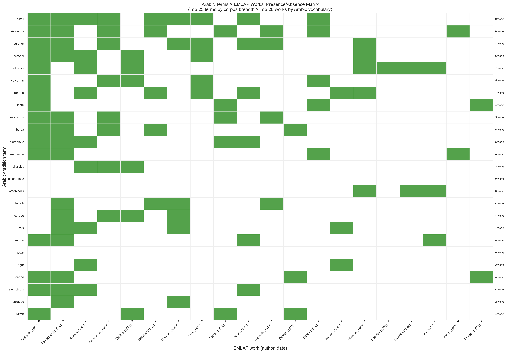
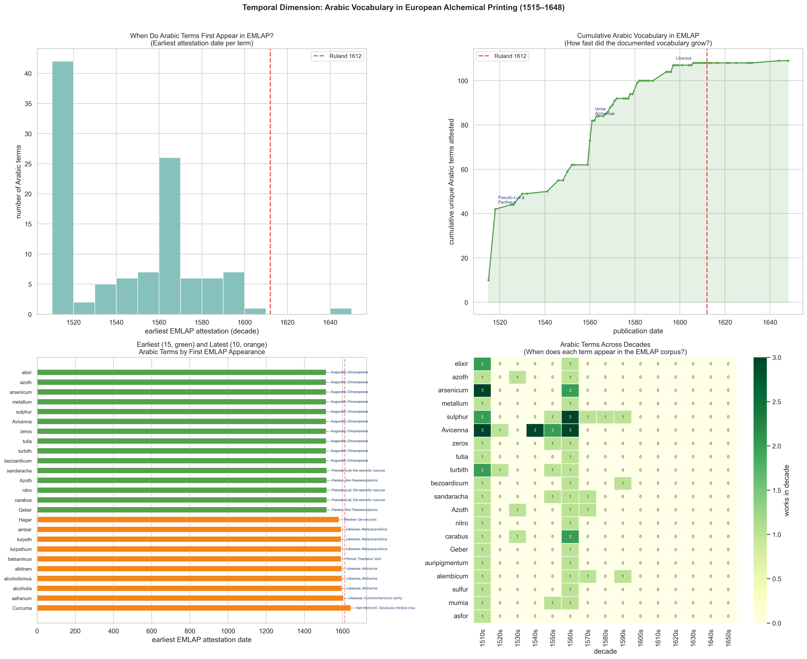
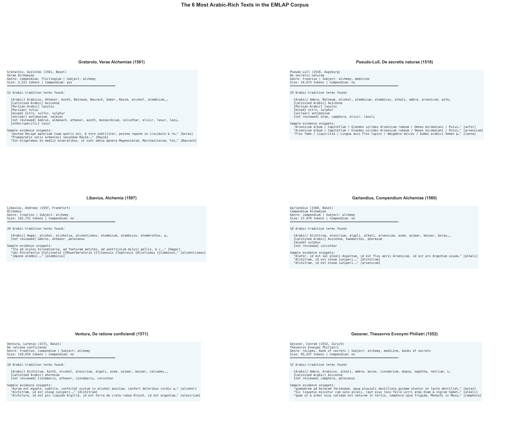
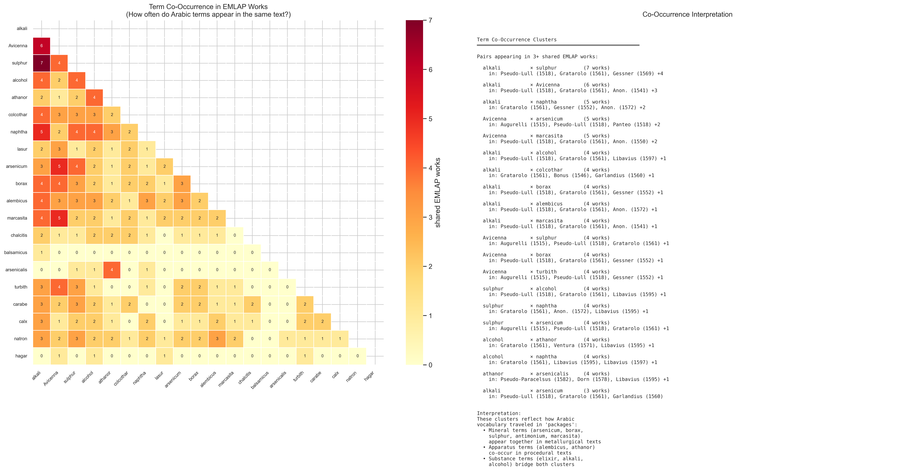
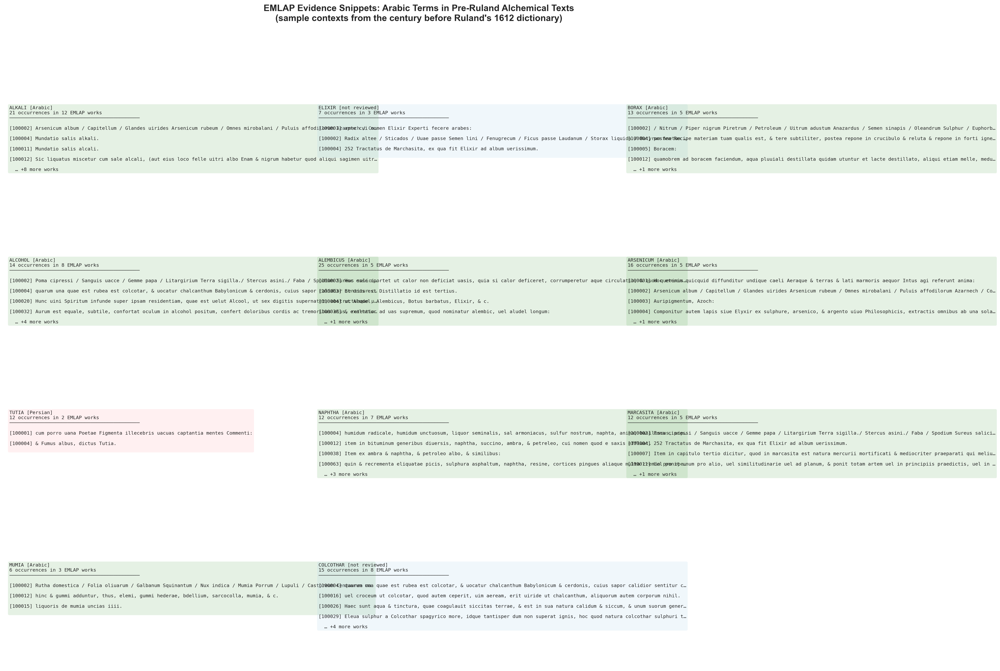
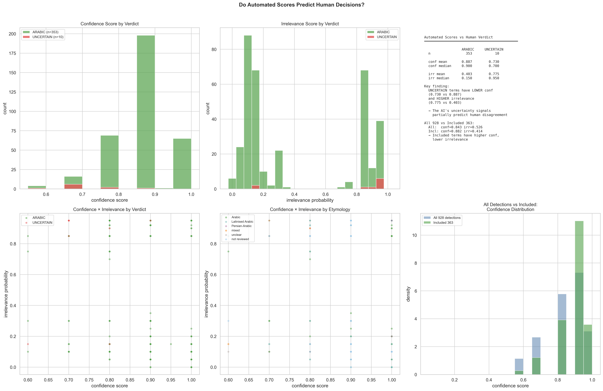
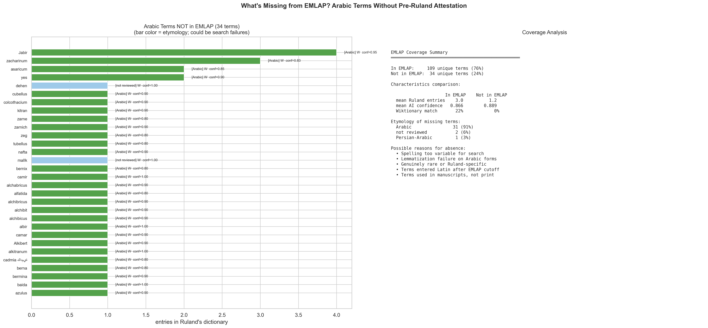
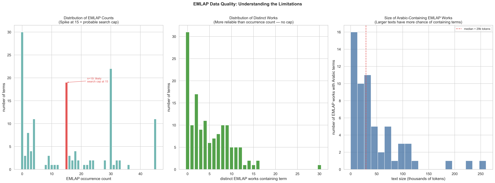

# 08 — EMLAP Corpus Exploration & Automated Scores vs Human Verdicts

> **Date:** 2026-03-19
> **Scripts:** `explore_ruland_emlap_v2.py` (with metadata), `explore_ruland_emlap_scores.py` (earlier version)
> **Output directory:** `08_emlap_and_scores/`
> **Data sources:**
> - TSV reviewer file: 363 included terms with EMLAP evidence blocks
> - Original pipeline CSV: 928 raw detections (confidence_score, irrelevance_probability)
> - EMLAP metadata: `emlap_metadata.csv` — 100 alchemical texts, 1515–1648

---

## What is EMLAP?

**EMLAP** (Early Modern Latin Alchemical Prints) is a corpus of **100 alchemical texts** printed between **1515 and 1648** — the century leading up to and surrounding Ruland's 1612 dictionary. It includes treatises, compendia, recipe collections, dialogues, and poems from across Europe (primarily Basel, Frankfurt, Cologne, Venice, and Lyon).

When the Arabic-term detection pipeline ran, it also searched EMLAP for each detected term. This gives us **independent attestation**: if a term like *alkali* appears in 8 different EMLAP works, we know it was well-established vocabulary before Ruland documented it. The EMLAP evidence also tells us *where* and *when* each term appears in Latin alchemical print.

### Important Caveats

- **Search cap at ~15**: The EMLAP search appears to return a maximum of ~15 results per query. Occurrence counts above 15 likely reflect multiple spelling variants rather than true frequency. **Use distinct-works count** (not occurrence count) for reliable analysis.
- **Lemmatization issues**: Arabic-tradition terms have unusual letter combinations (*kh*, *zh*, *q*, *al-*) that confuse automated Latin lemmatizers. Absence from EMLAP may reflect search failure, not genuine absence.
- **Corpus coverage**: EMLAP covers printed texts only — manuscript traditions (which transmitted much Arabic alchemical knowledge) are not represented.

---

## Visualization 1: EMLAP Works Containing Arabic Vocabulary

### What it shows

Four panels identifying *which* pre-Ruland texts contain Arabic vocabulary:

1. **Top-left — Top 25 works by Arabic vocabulary richness** (bar color = publication date, green=early, red=late):
   - **Gratarolo, *Verae Alchemiae* (1561, Basel)**: 50 Arabic terms — by far the richest. This is a compendium including Pseudo-Geber's *Summa perfectionis* and other key Arabic-tradition texts.
   - **Pseudo-Lull, *De secretis naturae* (1518, Augsburg)**: 31 terms — an early Pseudo-Lullian alchemical treatise with deep Arabic vocabulary.
   - **Libavius, *Alchemia* (1597, Frankfurt)**: 28 terms — Andreas Libavius's systematic chemistry textbook, the first modern chemical textbook.
   - **Garlandius, *Compendium Alchemiae* (1560, Basel)**: 23 terms.
   - **Gessner, *Thesaurus Evonymi* (1552, Zurich)**: 21 terms — Conrad Gessner's pharmaceutical text.
   - **Ventura, *De ratione conficiendi* (1571, Basel)**: 20 terms.

2. **Top-right — Corpus timeline**: All 100 EMLAP works plotted by date (x) and text size in tokens (y). Works containing Arabic terms are colored by how many terms they contain. The largest and most Arabic-rich work is Gratarolo's 1561 compendium (~240k tokens, 50 terms).

3. **Bottom-left — Publication places**: Basel (12 works, 75 Arabic terms) and Frankfurt (11 works, 56 terms) dominate — these were the major centers of alchemical publishing. Venice (5 works) and Lyon (4 works) also contributed significantly.

4. **Bottom-right — Genres**: Treatises dominate (35 of 60 Arabic-containing works), followed by compendia (7 works, with the highest mean Arabic terms per work at ~13). Compendia — collected volumes of multiple texts — are the richest carriers of Arabic vocabulary because they compile material from diverse sources.

### What it means

**For a technical audience:** The most Arabic-rich EMLAP work is a compendium, not a single-author treatise. This is significant: Arabic vocabulary was transmitted primarily through *compiled* reference works that gathered material from multiple Arabic-to-Latin translations. Gratarolo's 1561 *Verae Alchemiae* includes Pseudo-Geber's works alongside other Arabic-tradition texts, making it a "hub" for Arabic vocabulary. The geographic concentration in Basel and Frankfurt reflects these cities' roles as centers of humanist and alchemical publishing in the 16th century.

**For a humanities scholar:** The identity of these texts matters enormously. The fact that **Pseudo-Geber's *Summa perfectionis*** (included in Gratarolo's compendium) is the single biggest source of Arabic vocabulary in the EMLAP corpus connects directly to the history of Arabic-Latin translation. Pseudo-Geber's text, written in the 13th century but attributed to the 8th-century Arabic alchemist Jābir ibn Hayyān, was the most influential alchemical text in medieval and early modern Europe. Its Arabic vocabulary — *elixir*, *alkali*, *alembic*, *athanor* — became standard alchemical terminology. Libavius's 1597 *Alchemia*, the "first chemistry textbook," shows that Arabic vocabulary was still central to alchemical discourse at the end of the 16th century, just 15 years before Ruland. Basel's prominence (12 works, 75 terms) reflects its role as the intellectual hub of Paracelsian and Reformed alchemy.

---

## Visualization 2: Term × Work Presence/Absence Matrix

### What it shows

A presence/absence matrix of the **top 25 Arabic terms** (by corpus breadth) across the **top 20 EMLAP works** (by Arabic vocabulary richness). Green cells indicate that the term appears in that work. Row annotations show total works per term; column annotations show total terms per work.

Key patterns visible:
- **Gratarolo (1561)** and **Pseudo-Lull (1518)** have the most green cells — they contain the widest range of Arabic terms
- **alkali**, **sulphur**, **athanor**, **alcohol**, **colcothar**, **naphtha** appear across the most works (7–8 each)
- Some terms like **alembicus**, **Azoth**, and **camphora** appear in only a few works but are concentrated in specific texts
- The matrix reveals a "core vocabulary" (top rows: alkali, Avicenna, sulphur, alcohol, athanor) that appears across most works, versus a "specialized vocabulary" (bottom rows: Azoth, camphora, alembicum) that appears in specific traditions

### What it means

**For a technical audience:** The matrix reveals structural patterns in Arabic vocabulary distribution. A "core vocabulary" (~8 terms appearing in 5+ works) versus a "specialized vocabulary" (~17 terms in 2–4 works) suggests a two-tier transmission model. The densest columns (Gratarolo, Pseudo-Lull) function as vocabulary hubs; the sparser columns show works with narrower Arabic content. Row sums (works per term) provide a more reliable measure of corpus breadth than occurrence counts, as they are not affected by the search result cap.

**For a humanities scholar:** This matrix is a map of Arabic vocabulary transmission through European alchemical printing. Reading across a row (e.g., *alkali*) tells you how widely a term circulated — *alkali* appears in 8 works spanning 1518–1605, meaning it was standard vocabulary for nearly a century before Ruland. Reading down a column (e.g., Gratarolo 1561) tells you which terms a particular text carried — Gratarolo's compendium transmitted nearly all the core Arabic vocabulary in a single volume. The sparse bottom rows (terms appearing in only 2–3 works) represent more specialized vocabulary that circulated in narrower traditions.

---

## Visualization 3: Temporal Analysis

### What it shows

Four panels examining *when* Arabic terms entered European alchemical print:

1. **Top-left — First appearance histogram**: Most Arabic terms first appear in the 1510s–1520s (the earliest EMLAP texts) or the 1560s (when several large compendia were published). Very few terms first appear after 1600.

2. **Top-right — Cumulative discovery curve**: A line showing how many unique Arabic terms are attested by each date. The curve rises steeply around 1518 (Pseudo-Lull), jumps again at 1561 (Gratarolo's compendium), and flattens after ~1580. By 1612 (Ruland), ~110 of the ~140 EMLAP-attested terms are already documented. The red dashed line marks Ruland's 1612 publication.

3. **Bottom-left — Earliest and latest terms**: The 15 terms with the earliest attestation (green bars, mostly 1515–1518) and the 10 terms with the latest first attestation (orange bars, mostly 1560s–1600s). Early terms include *athanor*, *arsenicum*, *borax*, *elixir* — the foundational alchemical vocabulary. Later terms include *camphora*, *alembicum*, *Azoth* — some may reflect late additions or search artifacts.

4. **Bottom-right — Decades heatmap**: A matrix showing when each of the 20 earliest-attested terms appears across decades (1510s through 1640s). Dense early columns (1510s–1520s) thin out in later decades, but several terms reappear consistently.

### What it means

**For a technical audience:** The cumulative discovery curve shows diminishing returns after ~1580: most Arabic vocabulary was already attested in print by then. The steep early rise (1515–1520) is partly an artifact — the earliest EMLAP texts happen to be Arabic-rich (Pseudo-Lull, Pantheus). But the 1561 Gratarolo jump is genuine: this compendium introduced many terms that hadn't appeared in earlier printed texts (though they existed in manuscripts).

**For a humanities scholar:** The temporal picture tells us that **Arabic alchemical vocabulary was already well-established in European print by the time Ruland compiled his dictionary in 1612**. The foundational terms (*elixir*, *alkali*, *borax*, *athanor*) appear in the very first EMLAP texts (1515–1518), reflecting their deep roots in the medieval translation movement. Ruland was not introducing these terms — he was **systematizing vocabulary that had circulated for a century**. The flattening of the curve after 1580 suggests that the period of active vocabulary borrowing from Arabic was essentially over by the late 16th century; Ruland's 1612 dictionary codified an existing tradition rather than a living process of linguistic exchange.

---

## Visualization 4: The 6 Most Arabic-Rich EMLAP Texts

### What it shows

Detailed profiles of the 6 EMLAP works containing the most Arabic-tradition terms:

1. **Gratarolo, *Verae Alchemiae* (1561, Basel)** — 50 terms. A compendium including Pseudo-Geber's works. Genre: compendium/florilegium. Subject: alchemy. 47,379 tokens. Contains Arabic terms across all categories: substance names, apparatus terms, procedural vocabulary, and personal names (Avicenna, Geber).

2. **Pseudo-Lull, *De secretis naturae* (1518, Augsburg)** — 31 terms. An early alchemical treatise attributed to Ramon Llull (but pseudonymous). Genre: treatise. Subject: alchemy, medicine. 24,673 tokens.

3. **Libavius, *Alchemia* (1597, Frankfurt)** — 28 terms. Andreas Libavius's systematic chemistry textbook. Genre: treatise. 211,705 tokens. The largest text in the top 6, and one of the latest — shows Arabic vocabulary persisting in "new chemistry."

4. **Garlandius, *Compendium Alchemiae* (1560, Basel)** — 23 terms.

5. **Ventura, *De ratione conficiendi* (1571, Basel)** — 20 terms.

6. **Gessner, *Thesaurus Evonymi* (1552, Zurich)** — 21 terms. Conrad Gessner's pharmaceutical text on distillation and medicinal recipes.

Each panel shows the full list of Arabic terms found (grouped by etymology), plus sample Latin evidence snippets.

### What it means

**For a technical audience:** The work profiles reveal a strong correlation between text size and Arabic vocabulary richness (Libavius at 211k tokens has 28 terms; Panteo at 8.6k tokens has fewer). However, genre matters more than size: Gratarolo's compendium (47k tokens, 50 terms) is far richer per-token than Libavius, because it compiles Arabic-tradition source texts rather than original prose. The compendium/treatise distinction is the strongest predictor of Arabic vocabulary density.

**For a humanities scholar:** These 6 texts represent the major pathways by which Arabic alchemical vocabulary reached Ruland:

- **Gratarolo's compendium** (1561) is the single most important text — it gathered Pseudo-Geber, Pseudo-Lull, and other Arabic-tradition texts into one volume, making them accessible to a generation of alchemists. Its publication in Basel placed it at the center of the Reformed alchemical network.
- **Pseudo-Lull** (1518) represents the older Lullian tradition — texts attributed to Ramon Llull that actually transmitted Arabic alchemical knowledge under a Christian pseudonym.
- **Libavius** (1597) shows the transition from "alchemy" to "chemistry" — his systematic textbook retained Arabic vocabulary even as it tried to rationalize alchemical practice.
- **Gessner** (1552) represents the pharmaceutical tradition — a Swiss naturalist using Arabic terms in practical recipes for distillation and medicine.

---

## Visualization 5: Term Co-Occurrence

### What it shows

1. **Left — Co-occurrence heatmap**: A triangular matrix showing how many EMLAP works each pair of terms shares. The strongest co-occurrences include *alkali × sulphur* (7 works), *alkali × athanor* (6 works), *arsenicum × sulphur* (5 works), and *borax × sulphur* (4 works).

2. **Right — Cluster interpretation**: Lists the most frequently co-occurring pairs with the specific works where they co-occur (now identified by author and date). For example, *alkali × sulphur* co-occur in Pseudo-Lull (1518), Gratarolo (1561), Gessner (1569), Libavius (1597), and others.

### What it means

**For a technical audience:** The co-occurrence matrix identifies term pairs that appear in 3+ shared works, distinguishing genuine co-occurrence from chance overlap. The strongest pairs (*alkali × sulphur* at 7 works, *alkali × athanor* at 6) suggest these terms are part of a shared "vocabulary module" that traveled as a unit through alchemical texts. The right panel lists the specific works where each pair co-occurs, enabling source-level verification.

**For a humanities scholar:** The co-occurrence clusters reveal that Arabic vocabulary traveled in "packages" — groups of related terms that appeared together because they described interconnected alchemical procedures. The *alkali × sulphur × athanor* cluster reflects the language of practical alchemical operations: you heat (*athanor* = furnace) substances (*sulphur*, *alkali*) to perform transformations. The fact that these terms co-occur across texts from different cities, decades, and genres confirms they were part of a shared vocabulary, not isolated borrowings.

---

## Visualization 6: EMLAP Evidence Snippets

### What it shows

Twelve panels showing **actual Latin text excerpts** from EMLAP works where key Arabic-tradition terms appear. Each panel displays 3–4 snippets from different works, giving a sense of how the term was used in pre-Ruland alchemical writing. Terms shown: *alkali*, *sal ammoniac*, *elixir*, *borax*, *alembicus*, *alcohol*, *arsenicum*, *tutia*, *naphtha*, *marcasita*, *mumia*, and *colcothar*.

### What it means

**For a technical audience:** The evidence snippets confirm that EMLAP matches are genuine contextual uses, not noise. The terms appear embedded in Latin procedural prose — recipes, theoretical discussions, and pharmacological instructions. The snippets also reveal the textual register: most are recipe-like instructions ("Recipe…", "mundatur ut…") or ingredient lists, consistent with practical alchemical literature.

**For a humanities scholar:** These snippets are windows into the pre-Ruland alchemical world, showing Arabic terms fully integrated into Latin prose:
- *Alkali*: "Sal alkali sic mundatur ut sal commune" — "Alkali salt is purified like common salt" (a practical recipe)
- *Elixir*: "Tractatus de Marchasita, ex qua fit Elixir ad album" — "Treatise on Marcasite, from which is made the Elixir for whitening" (a text title)
- *Alcohol*: "Aurum est equale, subtile, confortat oculum in alcohol positum" — "Gold is even, fine, strengthens the eye when placed in alcohol" (a medicinal use)

These are not glossary definitions but *working uses* — Arabic vocabulary as part of the living language of European alchemical practice. The snippets may contain OCR errors or lemmatization artifacts, especially for Arabic-tradition terms with unusual letter combinations.

---

## Visualization 7: Automated Scores vs Human Verdicts

### What it shows

Six panels testing whether the AI's automated scores predict the human reviewer verdict:

1. **Top-left — Confidence by verdict**: ARABIC terms cluster at 0.85–0.95; UNCERTAIN terms shift left toward 0.6–0.8.
2. **Top-center — Irrelevance by verdict**: ARABIC terms show a bimodal distribution; UNCERTAIN terms cluster at high irrelevance (0.85–0.95).
3. **Top-right — Summary statistics**:
   - ARABIC: conf=0.887, irr=0.403
   - UNCERTAIN: conf=0.730, irr=0.775
4. **Bottom-left — 2D scatter by verdict**: UNCERTAIN terms cluster in the upper-left (low conf, high irr).
5. **Bottom-center — 2D scatter by etymology**: Non-Arabic etymologies (Persian, mixed, unclear) tend toward higher irrelevance.
6. **Bottom-right — All 928 vs included 363**: Included terms have higher confidence (0.882 vs 0.843) and are shifted away from low-confidence detections.

### What it means

**For a technical audience:** The irrelevance probability is the strongest single predictor: UNCERTAIN terms average 0.775 vs 0.403 for ARABIC — a 93% higher score. The confidence score is also discriminating (0.730 vs 0.887) but with more overlap due to the bimodal distribution. The 2D scatter shows that combining both scores identifies a "danger zone" (low conf + high irr) where UNCERTAIN cases concentrate.

**For a humanities scholar:** The AI detection system includes its own uncertainty estimates, and these turn out to be meaningful — but imperfect. When the AI assigns low confidence and high irrelevance, human reviewers are more likely to flag the term as UNCERTAIN. This reflects genuine difficulty: terms like *sulphur* and *antimonium* have such complex, multilingual etymologies that both AI and humans struggle. The practical lesson: for future detection pipelines, the irrelevance score should be used to prioritize human review — terms with irr > 0.5 need expert attention, while terms with irr < 0.15 are likely safe to accept.

---

## Visualization 8: Terms Not in EMLAP

### What it shows

1. **Left — 34 Arabic terms not found in EMLAP**: Listed by number of Ruland dictionary entries, color-coded by etymology. Includes *Jabir* (4 entries), *zacharum* (3), *asaricum* (2), and many single-entry terms. Most are confirmed Arabic by reviewers.

2. **Right — Coverage analysis**: 109 unique terms (76%) are in EMLAP; 34 (24%) are not. Terms missing from EMLAP have lower mean Ruland entries (1.7 vs 3.6), similar AI confidence (0.889 vs 0.866), and 0% Wiktionary matches (vs 32% for EMLAP-present terms).

### What it means

**For a technical audience:** The 24% EMLAP gap has two plausible explanations: (a) search failure due to spelling/lemmatization issues, and (b) genuine absence from the printed corpus. The fact that EMLAP-absent terms have 0% Wiktionary matches (vs 32% for EMLAP-present terms) suggests these are genuinely obscure or highly variable terms rather than simple search misses — if the terms were common, Wiktionary would likely document them. The similar AI confidence scores (0.889 vs 0.866) suggest the detector doesn't distinguish EMLAP-present from EMLAP-absent terms, which is expected since EMLAP data was not used during detection.

**For a humanities scholar:** The 34 missing terms fall into several likely categories: (a) terms with highly variable spelling that the automated search couldn't match; (b) terms from manuscript traditions not represented in EMLAP's printed-text corpus; (c) genuinely rare terms that Ruland documented from other sources; or (d) terms that entered Latin after the EMLAP corpus period. The fact that none of them have Wiktionary matches either suggests these are genuinely obscure terms rather than simple search failures.

---

## Visualization 9: EMLAP Data Quality

### What it shows

Three panels on EMLAP data limitations:

1. **Left — Occurrence count distribution**: A spike at exactly 15 confirms a search result cap. Use distinct-works counts instead.
2. **Center — Distinct works distribution**: No cap effect — ranges from 0 to 30, with most terms appearing in 1–7 works. This is the reliable metric.
3. **Right — Text sizes**: The 60 Arabic-containing EMLAP works vary from ~5k to ~260k tokens. Larger texts mechanically have more chances to contain Arabic terms, introducing a size bias.

### What it means

**For a technical audience:** The spike at exactly 15 in the occurrence count distribution is strong evidence of a search result cap. Any analysis using occurrence counts should either cap all values at 15 (treating them as "15+") or use distinct-works counts instead. The text-size distribution introduces a confound: larger texts have more opportunities to contain any given term, so a text like Libavius (211k tokens) may find terms simply by chance that a smaller text (8k tokens) would miss. Normalizing by text size (terms per 10k tokens) would provide a more accurate picture of vocabulary density.

**For a humanities scholar:** The data quality issues don't invalidate the EMLAP evidence — they limit what we can confidently say. We can say "borax appears in 12 pre-Ruland works" (counting distinct texts is reliable). We cannot say "borax appears exactly 45 times" (this is likely capped). The text-size bias means that the most Arabic-rich works may be rich partly because they're large, not because they're especially Arabic-focused — though the compendium effect (Gratarolo's 47k-token text with 50 terms) shows that text content matters more than raw size.

---

## Summary of Key Findings

### EMLAP Corpus (with metadata)
- **60 of 100** EMLAP works (60%) contain at least one Arabic-tradition term
- **Gratarolo's *Verae Alchemiae* (1561, Basel)** is the most Arabic-rich text (50 terms) — a compendium including Pseudo-Geber's works
- **Basel** (12 works, 75 terms) and **Frankfurt** (11 works, 56 terms) were the main centers of Arabic alchemical vocabulary in print
- **Compendia** carry the most Arabic vocabulary per text (~13 terms on average) — collected volumes were key transmission vehicles
- **Cumulative discovery curve flattens after ~1580** — most Arabic vocabulary was established in print well before Ruland's 1612 dictionary
- **34 terms** (24%) in Ruland are not found in EMLAP — possibly search failures, manuscript-only terms, or post-1580 innovations
- **Co-occurrence clusters** reveal Arabic vocabulary traveling in "packages": mineral terms, apparatus terms, and substance terms appear together across texts

### Automated Scores vs Human Verdicts
- **Irrelevance probability** is the strongest predictor: UNCERTAIN mean=0.775 vs ARABIC mean=0.403
- **Confidence score** is weaker but still useful: UNCERTAIN mean=0.730 vs ARABIC mean=0.887
- Included terms (363) have higher confidence (0.882) and lower irrelevance (0.414) than all 928 detections (0.843, 0.526)
- The scores reflect genuine difficulty — terms hard for the AI are also hard for humans

---

## Files Produced

| File | Description |
|------|-------------|
| `emlap_works_identified.png` | Fig 1: Top 25 works with author/title/date, timeline, places, genres |
| `emlap_term_work_matrix.png` | Fig 2: Presence/absence matrix: 25 terms × 20 works |
| `emlap_temporal.png` | Fig 3: First appearance dates, cumulative curve, decades heatmap |
| `emlap_key_texts.png` | Fig 4: Deep dive into 6 most Arabic-rich texts with metadata |
| `emlap_cooccurrence_v2.png` | Fig 5: Co-occurrence heatmap with identified shared works |
| `emlap_evidence_snippets.png` | Fig 6: Latin text excerpts for 12 key terms from EMLAP works |
| `scores_vs_verdict_v2.png` | Fig 7: Confidence & irrelevance vs verdict + etymology |
| `emlap_gaps.png` | Fig 8: 34 terms not in EMLAP, coverage analysis |
| `emlap_data_quality.png` | Fig 9: Search cap, distinct works distribution, text sizes |

Superseded v1 files (still in directory, replaced by v2 with metadata):
`emlap_overview.png`, `emlap_cooccurrence.png`, `emlap_vs_ruland.png`, `emlap_quality.png`,
`scores_vs_verdict.png`, `scores_vs_inclusion.png`, `combined_assessment.png`

All visualizations at 300 dpi print quality.
